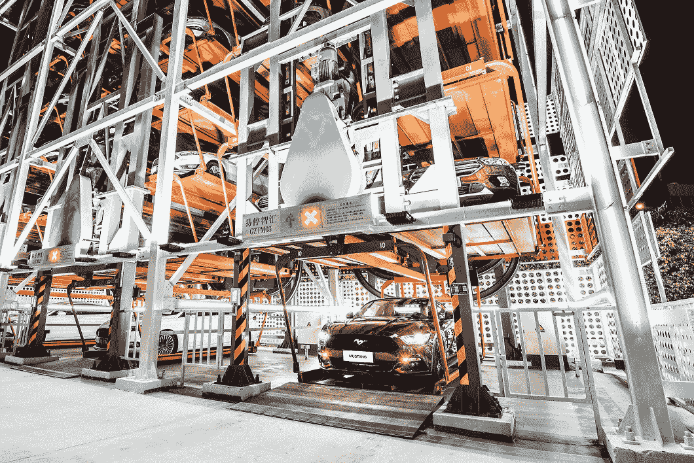

# 福特和阿里巴巴推出汽车自动售货机 

> 原文：<https://web.archive.org/web/https://techcrunch.com/2018/03/25/ford-and-alibaba-unveil-car-vending-machine/>

# 福特和阿里巴巴推出汽车自动售货机

中国广州的购车者现在可以使用智能手机应用程序和汽车自动售货机购买或试驾汽车。该设施源于福特和阿里巴巴两年前签署的合作协议。

这个名为超级试驾中心的中心在多层建筑中容纳了几十辆福特汽车。用户只需通过 Tmail 应用程序选择他们想要的汽车，并选择进行为期三天的试驾。

显然，这项服务利用阿里巴巴的服务和供应商，根据他们在阿里巴巴生态系统中的使用情况，提供折扣和激励措施。

将汽车存放在机械设备中的概念几乎和汽车本身一样古老。第一个系统出现在 1905 年，并发展到容纳数千辆汽车，尽管早期的机械故障导致兴趣减弱。以这种方式储存汽车有它的好处，因为它几乎消除了盗窃，损坏，并经常导致在更小的空间储存更多的汽车。

Carvana 在美国各地经营类似的汽车自动售货机。这家位于亚利桑那州坦佩的初创公司甚至允许用户插入一枚新奇的硬币，让他们的汽车从机器中被送出来。这很可爱，有时你需要可爱才能有优势。

超级试驾中心的优势似乎来自于对潜在买家的深刻理解。阿里巴巴提供的数据应该会带来有趣的购物体验，特别是如果像广告所说的那样，它会根据一个人的感知生活方式来提供交易。如果没有别的，这应该是一个有趣的广告策略，因为没有什么像一个巨大的猫耳朵的汽车自动售货机。