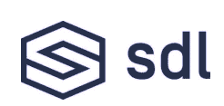

# 福特和丰田成立联盟，帮助开发者开发车载应用 

> 原文：<https://web.archive.org/web/https://techcrunch.com/2017/01/03/ford-and-toyota-team-up-to-launch-the-smartdevicelink-consortium/>

司机希望他们的汽车和智能手机能够无缝协作。苹果和谷歌都提供各自的服务，将手机连接到汽车的信息娱乐系统，但汽车行业还没有准备好将中控台完全让给硅谷。长期以来，福特和丰田在这一领域不太可能结盟。几年前，通过 [AppLink](https://web.archive.org/web/20220930234656/https://developer.ford.com/pages/applink) ，福特开始让一些移动应用程序开发者能够将他们的智能手机应用程序与其 Sync 信息娱乐系统相集成。然后在 2013 年，它以 SmartDeviceLink 的名字开源了它，丰田是第一批在其汽车上采用它的第三方汽车制造商之一。

现在，这两家公司已经成立了 SmartDeviceLink (SDL)联盟，继续开发这项技术。除了福特和丰田，马自达、PSA 集团、富士重工和铃木也加入了该集团。其他成员包括伊莱比特、Luxoft 和 Xevo，而哈曼和 QNX 已经签署了加入该集团的意向书。

 当福特第一次开源智能设备链接时，它[将该技术捐赠给了天才联盟](https://web.archive.org/web/20220930234656/https://media.ford.com/content/fordmedia/fna/us/en/news/2013/02/26/37736.html)。但是，如果您今天查看[genvi Alliance 的主页](https://web.archive.org/web/20220930234656/https://www.genivi.org/)，您将不会看到[福特或丰田](https://web.archive.org/web/20220930234656/https://www.genivi.org/genivi-members)成为会员。“以前，GENIVI 可能不是世界上最中立的机构，”当我被问及发生了什么时，福特全球移动应用经理大卫·哈顿告诉我。事实上，正如福特在 SDL 财团董事会的代表 Doug VanDagens 在我们的谈话中多次提到的，该集团的目标是让所有成员都有发言权，但保持中立。这也是这些公司决定建立自己的治理结构，而不是去 Linux 基金会或类似机构寻求帮助的原因之一。“福特、丰田和单个原始设备制造商都不会有控制力，”他补充道，并指出，对于原始设备制造商如何将 SDL 融入他们的汽车和产品，该财团本身是真正的不可知论者。

SDL 联盟将在 GitHub 上托管其代码，并将接受任何人的贡献(当然，在接受新代码之前，技术委员会将评估所有这些变化)。不过，最终还是要由各个汽车制造商和原始设备制造商来执行他们自己的测试(联盟将只执行基本的验证)和管理他们自己的开发者项目。因此，虽然开发人员将能够编写一个应用程序，然后在所有 SDL 兼容的汽车上运行，但这取决于制造商和原始设备制造商来决定这种集成在汽车上的外观。例如，SDL 没有规定汽车中的实际用户体验是什么样的。

凡达金斯和哈顿认为这正是汽车制造商所寻求的。例如，虽然福特为 SDL、Android Auto 和苹果的 CarPlay 提供支持(因为这是司机们想要的)，但它和其他汽车制造商肯定更喜欢一个他们仍能控制的世界。

对于开发者来说，这个联盟开启了一种可能性，从长远来看，他们为 SDL 编写的应用程序现在将得到更多汽车的支持。同样，对于相关的汽车制造商来说，这意味着他们可以投资于一个单一的平台，并(可能)与库比蒂诺和山景城的创新保持同步。

哈顿告诉我，这个联盟已经设计出了新功能的路线图，很快就会进入 SDL。例如，这些功能包括语音传递，改进的无线投影和与移动导航服务的更深层次集成，以及为汽车增加更多智能的新功能，用哈顿的话说，这将带来“更丰富的驾驶体验”。