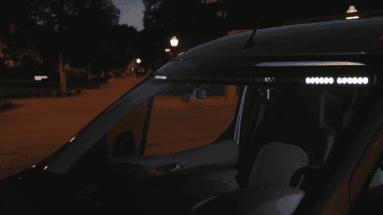

# 福特将一名男子伪装成汽车座椅研究自动驾驶 

> 原文：<https://web.archive.org/web/https://techcrunch.com/2017/09/13/ford-disguised-a-man-as-a-car-seat-to-research-autonomous-driving/>

是的，你没看错:福特将一名男子伪装成汽车座椅，这样福特全顺就可以伪装成真正的自动驾驶汽车。为什么？评估路人、路上的其他司机和骑自行车的人对与自动驾驶汽车共享道路的反应。

这项由弗吉尼亚理工大学交通研究所进行的试验还利用了安装在挡风玻璃顶部的灯条来提供关于汽车正在做什么的信息，包括让行、自动驾驶或从完全停止加速。

[gallery ids="1540394，1540395，1540396，1540397，1540398，1540399，1540400"]

那么，为什么要进行如此精心的装扮呢，尤其是现在还不是万圣节。主要是因为你实际上仍然需要有人在真实世界的测试中驾驶，也因为为了这个实验的目的，福特和 VTTI 实际上并不需要自动驾驶汽车——他们只是需要人们全心全意地相信他们正在使用一辆汽车。

用于试验的 Transit Connect 面包车将使用信号指示其行为，包括缓慢的白色脉冲表示让步，快速闪烁表示从停止加速，如果它处于自动驾驶模式，则保持稳定。酒吧的位置大致在司机视线的位置，试图吸引周围人的注意力。

福特为该项目选择的信号很简单，但它们旨在做到这一点，它们的设计不仅仅是复制现有的车辆信号装置，如刹车灯和转向灯，而是填补我们目前通过微妙的手势、眼神交流和其他不太明显的机制进行交流的空白。

福特和 VTTI 进行了虚拟现实测试，发现这些肯定是需要学习的——人们需要一些不同的接触才能得到线索。但是，只要经常不断地重复，它们就有可能被广泛接受。

测试只是一个开始，尽管福特和 VTTI 已经在他们的城市测试场进行了 150 小时的测试，覆盖了大约 1800 英里，行人、其他司机和骑自行车的人非常集中。最终目标是继续光信号研究，然后与包括国际标准化组织和 SAE 国际在内的行业标准组织合作，使这些在汽车和运输公司之间共享。

前面还有很多工作要做——我希望座椅服装是舒适的，因为之前类似的例子表明耐磨的室内装潢并不舒适。

