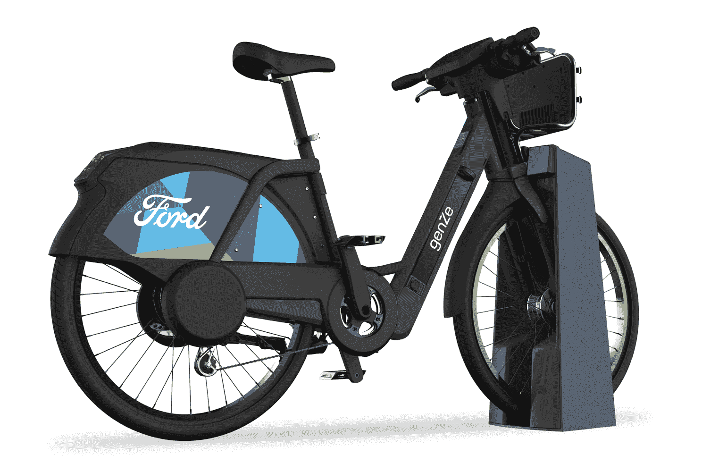
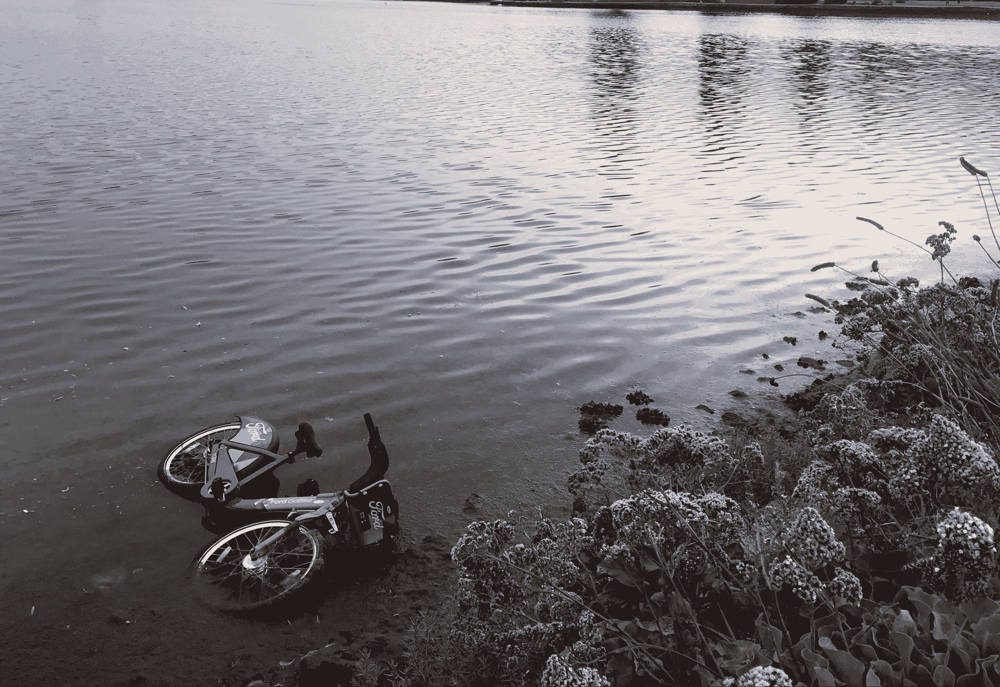

# 旧金山的福特 GoBikes 将会电动化

> 原文：<https://web.archive.org/web/https://techcrunch.com/2018/01/08/ford-gobikes-by-motivate-are-going-electric-in-san-francisco/>

旧金山 Yay (Bay)地区自行车共享系统背后的公司，今年 4 月将在其车队中增加踏板辅助电动自行车。该公司今天宣布，为期一年的试点将在旧金山推出 250 辆这种电动自行车。

这种自行车由初创公司 GenZe 开发，旨在帮助骑车人踩踏板，从而减少骑车时对大量能量的需求——尤其是上坡时。该试点项目将成为现有福特 GoBike 网络的一部分。GenZe 也是 Scoot Networks 的踏板车提供商，Scoot Networks 是一家在旧金山运营的踏板车共享初创公司。

大都会交通委员会副执行主任 Alix Bockelman 在一份声明中说:“电动自行车将使旧金山湾区的居民和游客在旧金山旅行时多一个选择，这将有助于使旧金山更宜居，减少拥堵和家庭交通成本。”。“我们期待着福特 GoBike 电动自行车试点项目扩展到其他福特 GoBike 城市。”

从 4 月份开始，骑手们将能够使用标准的福特 GoBike 应用程序来定位电动自行车。这些自行车最高时速可达 18 英里，这意味着在自行车道上骑行是合法的。试点项目的想法是收集反馈，并与湾区城市合作，使电动自行车永久成为福特 GoBike 系统的一部分。

目前，旧金山湾区有 262 个福特 GoBike 站，有 2600 多辆自行车。此外，对于那些认为自行车站占用了太多停车位的居民来说，自行车系统的扩张还没有结束。到今年年底，将有 546 个站点提供 7000 辆福特 GoBikes，这将使其成为北美第二大自行车共享系统。

当这些自行车首次推出时，湾区居民对这些自行车占用的空间及其对中产阶级化的影响提出了相当大的争议和强烈抗议。为了表示抗议，人们做了各种各样的事情，从把自行车扔进奥克兰的梅里特湖，在圣弗朗西斯科的米申社区的一个摊位上把所有的轮胎压扁，[把它们的零件剥掉，把一个挂在树上](https://web.archive.org/web/20230225043104/http://sanfrancisco.cbslocal.com/2017/08/07/ford-gobike-bicycle-sharing-mission-district-backlash-vandalism/)，以及用涂鸦破坏它们。

自行车共享已经成为创始人和风投的热门领域。在旧金山，有许多自行车共享初创公司，其中一家已经在运营电动踏板辅助自行车。这家初创公司是 Social Bicycles，它最近在 Bayview 社区进行了一项试点计划，该社区历史上从未由科技行业提供服务。

在中国，Ofo 和 T2 的摩拜单车都已经成为各自自行车共享创业公司的独角兽。在美国，投资者向 lime bike 投入了 6200 万美元，向 Spin 投入了 800 万美元，因为两家初创公司都旨在与 Motivate 竞争，Motivate 也在纽约市运营 CitiBikes。