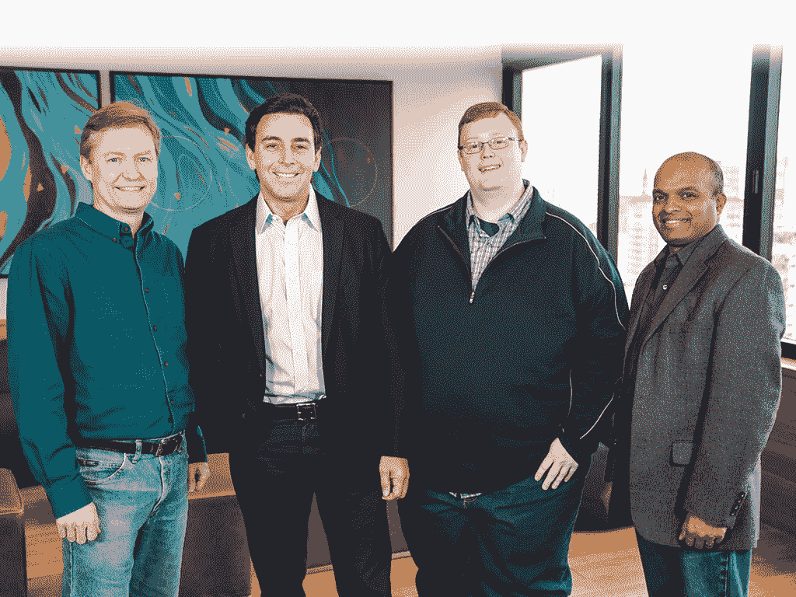

# 福特向总部位于匹兹堡的 Argo AI 投资 10 亿美元，到 2021 年制造自动驾驶汽车 

> 原文：<https://web.archive.org/web/https://techcrunch.com/2017/02/18/ford-invests-in-pittsburgh-based-argo-ai-to-build-self-driving-cars-by-2021/>

# 福特向总部位于匹兹堡的 Argo AI 投资 10 亿美元，到 2021 年制造自动驾驶汽车

福特已经投资 10 亿美元与总部位于匹兹堡的与卡内基梅隆大学有联系的 Argo AI 建立合资企业。目标是让福特汽车完全配备自动驾驶技术。有趣的是，这不是一家大公司简单地雇佣人才的案例，而是一家拥有独立股权结构的完全独立的公司的创建。

福特是“最大的利益相关者”，但将“基本独立”运营。员工将获得公司的股权。这项投资将在五年内完成。

“人工智能制造商知道，你基本上需要一个汽车制造商来制造汽车，”一位熟悉该交易的人士在评论福特决定与该公司合作时表示。

“Argo AI 将开发和部署人工智能、机器学习和计算机视觉方面的最新进展，以帮助构建安全高效的自动驾驶汽车，实现这些转变和更多，”首席执行官布莱恩·萨勒斯基写道。“挑战是巨大的，但我们是一个相信解决困难、有意义的问题来改善世界的团队。只有我们愿意与他人合作，并对如何解决问题保持开放的心态，我们的抱负才能实现。”

Salesky 曾在卡耐基梅隆大学国家机器人工程中心工作，并于 2011 年在谷歌领导自动驾驶硬件。

其他团队领导包括布雷特·布朗宁博士和彼得·兰德尔博士。两人都离开 CMU 去了优步，最近又转到了阿尔戈。该公司的目标是到 2021 年实现“完全自主”。在那家公司[从 CMU 雇佣机器人教员两年后，这两人是从优步](https://web.archive.org/web/20230107063041/https://techcrunch.com/2015/02/02/uber-opening-robotics-research-facility-in-pittsburgh-to-build-self-driving-cars/)慢慢离开的研究人员的一部分。

可以说，福特对一家成立仅两个月的公司投资 10 亿美元是相当大胆的。消息人士称，现有团队在为卡特彼勒和其他公司制造自动驾驶汽车方面拥有丰富的经验，这似乎是福特获得自动驾驶人才的最佳和最快方式。

【YouTube = https://www . YouTube . com/watch？v=bVv6Nzj9gF0]