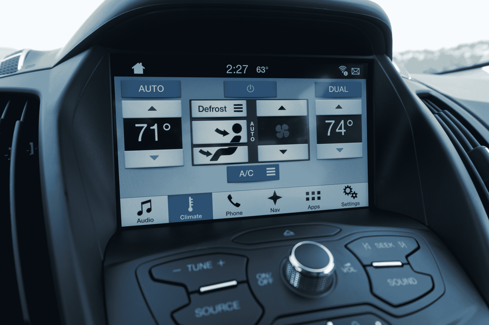
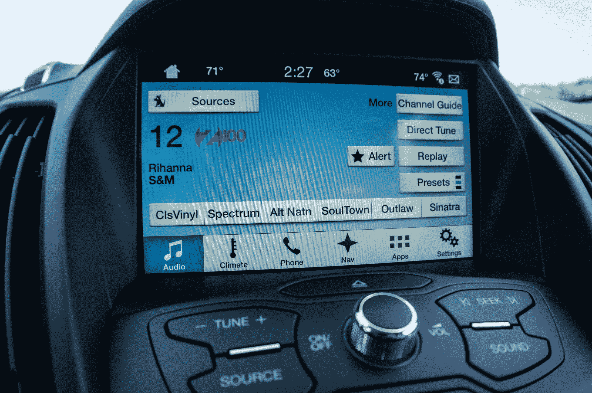
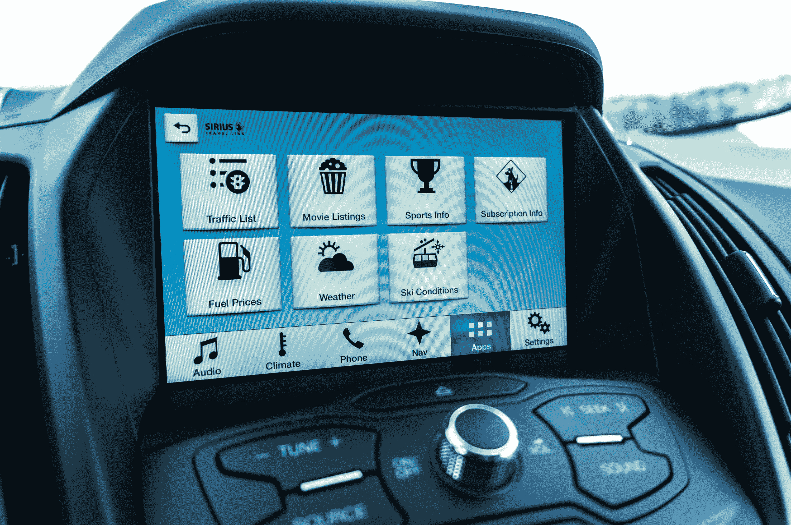
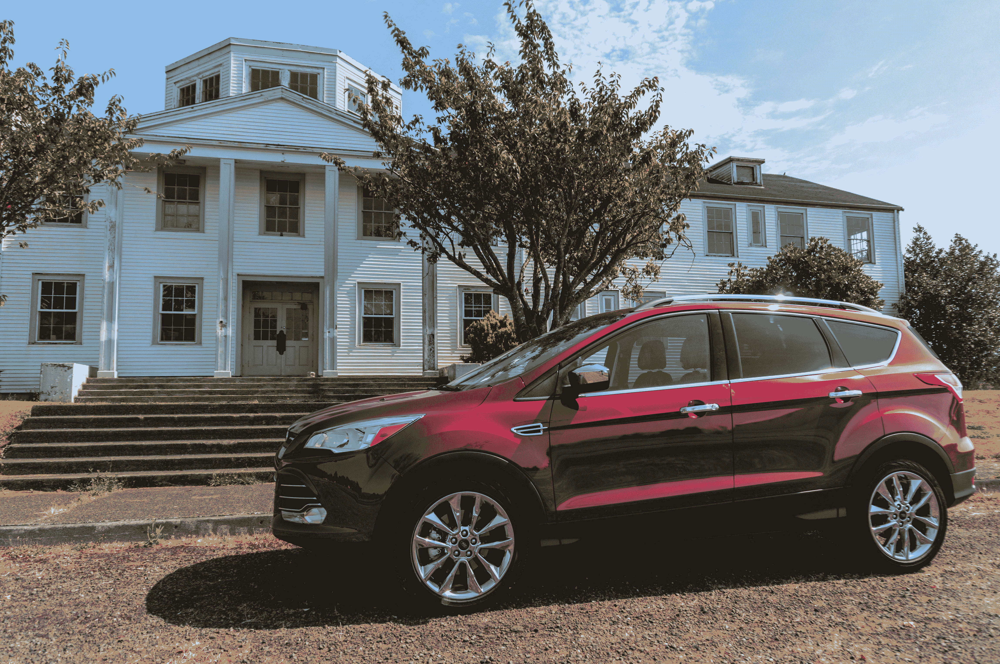

# 亲身体验福特的 Sync 3 

> 原文：<https://web.archive.org/web/https://techcrunch.com/2015/08/22/ford-sync-3-review/>

[福特](https://web.archive.org/web/20221006150714/http://ford.com/)是最早在 2007 年通过 Sync 将联网汽车技术引入其产品线的主要汽车制造商之一，但尽管其 Sync 和后来的 MyFord Touch 信息娱乐系统的第一次迭代领先于他们在汽车世界的时代，但它们也相当缓慢、混乱和笨重。

[Sync 3](https://web.archive.org/web/20221006150714/https://beta.techcrunch.com/2014/12/11/ford-ditches-microsoft-for-qnx-in-latest-in-vehicle-tech-platform/) ，现已在 2016 款福特 Escape 紧凑型 SUV 和嘉年华微型车上推出，是对所有这一切的一个可喜突破。Sync 3 没有为了创新而创新，而是回归基础，为驾驶者提供一个不碍事、简单实用的信息娱乐系统。

本月早些时候，福特借给我一辆 [2016 款 Escape](https://web.archive.org/web/20221006150714/http://www.ford.com/suvs/escape/gallery/photos/) ，让我亲身体验一下新系统。

Sync(技术)和 MyFord Touch(基于触摸屏的界面)的最后两次迭代都是基于微软 Auto。在评论家和消费者对第一个版本进行了严厉批评后，该公司决定让司机有机会将他们的汽车更新到下一个版本。然而，这意味着福特能够进行大量的软件更改，使最后一个版本明显优于第一个版本(尽管仍然远远谈不上伟大)，但仍坚持使用同样缓慢的硬件以确保兼容性。

福特为 Sync 3 改用了黑莓的 QNX，虽然切换屏幕和缩放内置导航系统的感觉不如在 iPad 上那么流畅，但一切都感觉很快。在早期版本中，有时感觉你在与系统对抗——现在它与你一起工作。

Sync 3 是对早期版本的完全重新设计。它对大图标和易读文本的关注使得使用该系统就像开车时使用 8 英寸触摸屏一样容易。

在很大程度上，所有最常用的功能，如气候和音量控制，仍然在中控台和方向盘上有物理对应物(至少在我驾驶的 Escape 中)。就改变音量而言，这些物理旋钮总是比屏幕更容易使用，但当涉及到导航或与应用程序交互时，福特对实用设计的关注超过了想象的华丽，这有助于你快速完成任务，并让你的眼睛回到路上。

当然，语音控制也是一种选择(也可能是更安全的选择)。多年来，福特在这方面做得越来越好，但不要指望会有类似 Siri 或谷歌的体验。不能刚开始用 Sync 聊天。“好的同步，请将温度设置为 72 度”不会让你走得太远(但如果你有 iPhone，Sync 3 集成了 Siri 的[裸眼](https://web.archive.org/web/20221006150714/http://www.cnet.com/news/what-siris-eyes-free-feature-means-for-cars/)功能)。Sync 仍然需要你坚持一小组[预编程的语音命令](https://web.archive.org/web/20221006150714/http://owner.ford.com/how-tos/sync-technology/myford-touch/in-vehicle-settings/explore-climate-by-voice.html)。语音识别工作得非常好，但我倾向于发现使用语音比只手动改变温度更分散注意力。

和系统的其他部分一样，导航功能(需要额外支付 795 美元)做了它应该做的事情(当你在家时，你可以通过 wifi 获得更新)。它现在具有车道导航功能，这在我们去俄勒冈海岸的旅途中并不太有用，但当你开车穿过一个新城市时，它会带来很大的不同。

不像其他汽车制造商，福特总是打赌司机会把他们自己的连接[和应用](https://web.archive.org/web/20221006150714/https://beta.techcrunch.com/2015/01/12/fords-applink-will-soon-support-third-party-navigation-apps/)带到车上。Sync 3 也不例外。与之前的版本一样，Pandora、Spotify、Glympse 和 iHeartRadio 等少数经批准的应用程序可以直接与 Sync 交互，并让你使用触摸屏和物理控制与它们交互。我可信赖的旧 Nexus 5 起初在通过蓝牙连接时有些问题，但一旦连接上了，一切都像宣传的那样工作了。

[gallery ids="1199374，1199373"]

随着 Sync 3 的推出，福特终于发布了一个信息娱乐系统，该系统将过去几年开发的所有不同技术(Sync——实际上于 2007 年首次亮相，MyFord Touch 和用于将汽车连接到手机应用程序的 AppLink)整合到一个平台上。虽然它是最早提供这些技术的公司之一，但其他汽车制造商现在也提供类似的功能。福特表示，Sync 3 未来可能会支持苹果的 CarPlay 和 Android 汽车，但尚不清楚这何时/是否会发生。

就目前而言，有一点是明确的:如果你想买新车，Sync 3 是让福特另眼相看的一个理由——这不是我会对其第一次迭代说的话。

