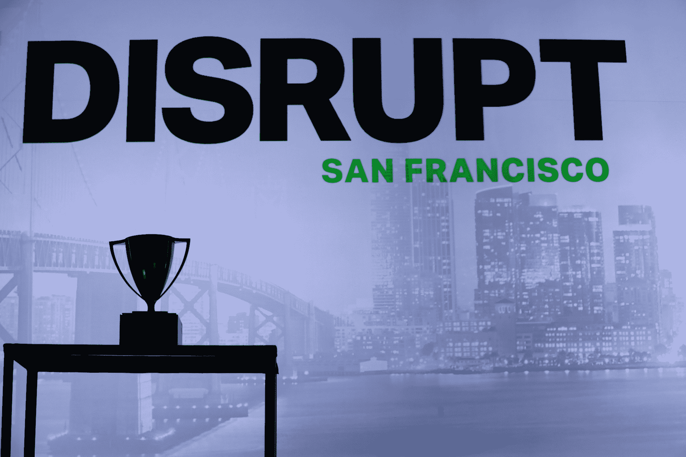

# Disrupt SF 2018 创业战场的获胜者是……深谋远虑

> 原文：<https://web.archive.org/web/https://techcrunch.com/2018/09/07/forethought-wins-startup-battlefield-at-disrupt-sf-2018/>

# Disrupt SF 2018 创业战场的获胜者是……深谋远虑

最开始的时候，有 21 家创业公司。经过三天异常激烈的竞争，我们现在有了赢家。

参与[创业战场](https://web.archive.org/web/20230316161112/https://techcrunch.com/startup-battlefield/)的创业公司都是经过精心挑选，参加我们竞争激烈的创业竞赛的。他们都在担任评委的多组风投和技术领袖面前展示，有机会赢得 10 万美元和梦寐以求的 Disrupt Cup。

经过几个小时的审议，TechCrunch 的编辑仔细研究了评委的笔记，将名单缩小到五个决赛选手:CB Therapeutics、Forethought、Mira、Origami Labs 和 Unbound。

这些初创公司进入了决赛，在我们的最终评委面前进行演示，其中包括: [Cyan Banister](https://web.archive.org/web/20230316161112/https://www.crunchbase.com/person/cyan-banister) (创始人基金) [Roelof Botha](https://web.archive.org/web/20230316161112/https://www.crunchbase.com/person/roelof-botha) (红杉资本)[杰夫·克拉维尔](https://web.archive.org/web/20230316161112/https://www.crunchbase.com/person/jeff-clavier)(Uncork Capital)[柯尔斯顿·格林](https://web.archive.org/web/20230316161112/https://www.crunchbase.com/person/kirsten-green)(forerune Ventures)[艾琳·李](https://web.archive.org/web/20230316161112/https://www.crunchbase.com/person/aileen-lee) (Cowboy Ventures)和[马修·潘扎里诺](https://web.archive.org/web/20230316161112/https://www.crunchbase.com/person/matthew-panzarino) (TechCrunch)。

现在，来认识一下 TechCrunch Disrupt SF 2018 的创业战场获胜者。

## 赢家:深谋远虑

[深谋远虑](https://web.archive.org/web/20230316161112/https://techcrunch.com/2018/09/05/forethought-looks-to-reshape-enterprise-search-with-ai/)对企业搜索有一个现代的愿景，即使用人工智能来呈现工作环境中最重要的内容。它的第一个用例涉及客户服务，但它有一个更广泛的目标，即在整个企业中工作。

在我们的独立文章中阅读更多关于深谋远虑的内容。

## 亚军:未绑定

制造时尚向前的振动器，他们的最新产品是帕尔马。新设备伪装成一个戒指，提供多种速度，并且完全防水。该团队计划增加加速度计功能。

在我们的独立文章中阅读更多关于自由的信息。

