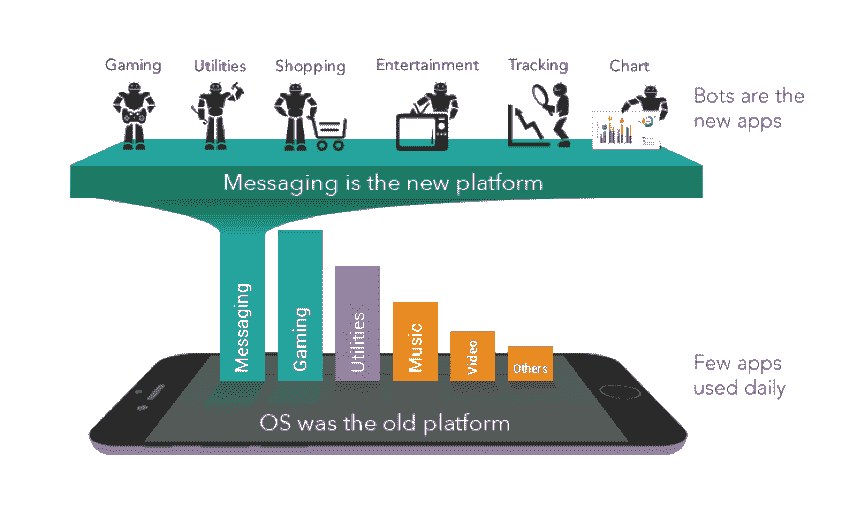

# 忘记应用程序，现在机器人接管了 

> 原文：<https://web.archive.org/web/https://techcrunch.com/2015/09/29/forget-apps-now-the-bots-take-over/>

随着移动应用数量的增加，而我们的移动屏幕尺寸却在减小，我们正在达到移动“操作系统+应用”范式的极限。在我们的移动设备上下载、设置、管理和切换如此多的应用变得越来越困难。大多数移动用户每天只使用少数应用程序。

作为替代，通讯应用正在成为新的平台，取代移动操作系统的角色。这类似于 90 年代中期的趋势，当时浏览器取代桌面操作系统成为新的平台。就像那时网站取代了客户端应用程序一样，现在消息机器人将取代移动应用程序。因此，机器人是新的应用程序。机器人商店是新的应用商店。

微信、Line、脸书、Slack 和 Telegram 都是消息平台，可以在消息界面内与第三方服务进行交互。这些平台中的每一个都使开发人员能够构建消息传递机器人，通过消息传递接口提供自动化服务——脸书 M 就是一个很好的例子。这意味着我们正处于一个主要新兴趋势的早期阶段:即时通讯机器人的崛起。

信息机器人可以像人类一样读写信息。机器人可以被编程来执行自动操作。机器人既可以发起行动，也可以响应其他用户的请求。机器人也有不同的种类；它们使对话、交易或工作流程自动化。

电子商务机器人可以购买商品和服务。食品机器人订购晚餐。内容机器人与您分享相关内容(如新闻、天气)。当特定事件发生时，观察机器人会通知你(例如，你的航班延误，这辆车需要维修)。银行和交易机器人提供金融服务。工作流机器人自动化销售、人力资源、运营、管理、财务等方面的业务工作流。图表机器人在适合小屏幕的图表中汇总数据。物联网机器人将我们与智能家居、汽车和设备连接起来。礼宾机器人提供由其他机器人实现的广泛服务。当所有这些机器人变得太多时，你的私人助理机器人会为你管理与其他机器人的通信，只升级你训练过的高优先级请求。

然而，为了让机器人在不同的用例下运行，消息传递需要重新架构。目前的消息格式仅限于纯文本，这要求机器人具有自然语言处理能力，以便与人类交流。然而，基于计算机的自然语言处理的精度或效率是有限的。

自然语言不是捕捉订单、旅行预订、批准、发票、调查、登记表或任何其他结构化内容的最佳方式。如果消息格式仍然是纯文本，它要么限制了 bot 的能力，要么需要多次迭代来精确地指定请求。

因此，现在我们有了“智能”信息来构建内容，如迷你网页，以实现机器人和人类之间精确有效的交流。机器人可以定制智能消息来呈现结构化信息，捕捉用户响应并对其采取进一步行动。

僵尸工具的框架，加上智能消息，几乎可以将任何网站或应用程序复制到平台上。几乎任何事务或工作流都可以映射到消息传递框架。

消息机器人也有好处。机器人让我们的移动体验不再杂乱。当我们需要了解或回应某些事情时，机器人会向我们发送信息，但在其他情况下会保持隐形。机器人驻留在云中，并通过新功能进行自我升级——无需任何用户操作。机器人可以相互作用，并可以链接在一起，按顺序执行一系列动作。机器人可以监督其他机器人，导致机器人层次结构。

> 这是一个充满机器人的勇敢新世界，有新的可能性和新的风险。

你的私人机器人将根据你的个人喜好代表你管理其他机器人。你可以选择授权给代表你自主行动的机器人。您的购物、日程安排、跟踪、监控和信息传递可以根据个人喜好实现自动化。你的机器人甚至可以过滤发送给你的广告信息——事实上，在一个完全知情的机器人世界里，传统广告的作用可能会减弱。这是一个充满机器人的勇敢新世界，有新的可能性和新的风险。

机器人目前可以在机器人商店(在 Teamchat 上)买到，与今天的应用商店没有什么不同。与机器人开始对话就像与朋友开始聊天一样——不需要下载。

机器人的用户界面是一条信息。你只是发送和接收来自机器人的信息。无需学习、理解和浏览不同的界面或语言。用户将能够与机器人互动，就像他们与其他人互动一样。这是最自然的交流和交易方式。

二十年前，我们的电脑从“桌面操作系统+客户端”应用程序到“浏览器+网站”的模式转变导致了科技行业的巨大转变。我们正处于移动设备上类似转变的边缘，这将带来更大的后果——因为事实上没有人能离开它们而生活。