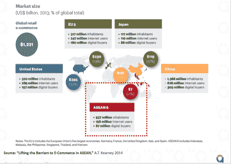
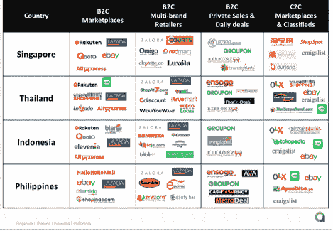
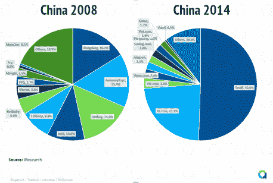
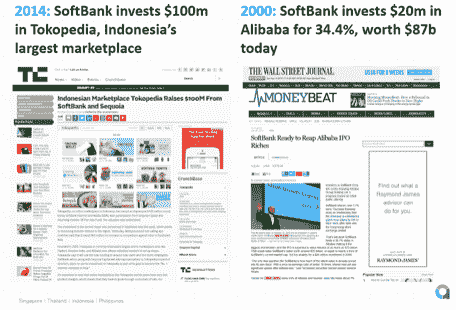

# 忘记中国吧，东南亚正掀起一场电子商务淘金热

> 原文：<https://web.archive.org/web/https://techcrunch.com/2015/06/22/forget-china-theres-an-e-commerce-gold-rush-in-southeast-asia/>

More posts by this contributor

菲利西亚·穆尔萨连撰稿人

Felicia Moursalien 是该公司的地区通信主管兼首席研究员

[aCommerce](https://web.archive.org/web/20230316161059/http://www.acommerce.asia/)

.

More posts by this contributor

有一种短视使电子商务玩家对东南亚的机会现实视而不见。每个人都在中国对经济前景投下的阴影下看待亚洲经济体，这不禁模糊了画面。

中国是当今电子商务最发达的市场之一，凭借微信的移动商务、支付宝的主导地位和根深蒂固的在线购物行为，中国可以说比西方市场更发达。

然而，企业实际上是在浪费时间和资源，向中国和东南亚扩张将是下一个淘金热。原因如下:

# 对中国来说太晚了

*   **中国 b2c 电子商务市场已经饱和。只有财力最雄厚的玩家才有机会**

在中国的电子商务竞赛中，市场巨头在中国已经领先太久了。

随着阿里巴巴的[天猫](https://web.archive.org/web/20230316161059/http://www.tmall.hk/)和[京东](https://web.archive.org/web/20230316161059/http://www.jd.hk/)主导[B2C 领域](https://web.archive.org/web/20230316161059/http://www.chinainternetwatch.com/7478/b2c-market-share-2014q1/)(分别占中国 B2C 总销售额的 51%和 23%)，淘宝拥有超过 95%的 C2C 领域，只有那些有长远眼光的人(即资金最雄厚的人)才有生存的机会，因为他们可以超越任何人。

这在很大程度上是因为 B2C 电子商务与纯科技公司不同，仍然受益于规模经济。

> 由于天猫和京东拥有中国 B2C 电子商务市场近四分之三的份额，1 号店、苏宁、亚马逊和唯品会等“较小”的全球和本土企业没有太多竞争空间。

这些公司在这个世界上人口最多的国家凭借其先发优势所拥有的庞大规模和数量，意味着它们通过降低媒体成本和口碑营销，在品牌和营销方面享有高效率，并通过优惠价格和更强的议价能力，在全国范围内仓储和运输货物，享受物流和采购。

进入市场的“较小”参与者，如亚马逊、T2、乐天和内曼马库斯，由于国内资源较少、缺乏对中国市场的了解以及执行速度较慢而难以竞争。最近的例子包括 [Macys 和 Neiman Marcus 关闭了他们在中国的电子商务计划](https://web.archive.org/web/20230316161059/http://www.wsj.com/articles/SB10001424052702304441404579119182457984334)和[亚马逊认输并在中国最大的 B2C 市场天猫](https://web.archive.org/web/20230316161059/http://blogs.wsj.com/digits/2015/03/06/amazon-opens-store-inside-alibabas-tmall-in-china/)上开店。

由于天猫和京东拥有中国 B2C 电子商务市场近四分之三的份额，对于一号店、苏宁、亚马逊和唯品会等“较小”的全球和本土企业来说，竞争空间并不大。他们无法利用市场领导者享有的规模经济。B2C 电子商务是一个赢家通吃的市场，富人变得更富。

*   **跨境贸易炙手可热，但其潜力将很快枯竭**

受食品和健康丑闻困扰，中国消费者越来越多地转向国外，以避免购买假冒美容产品、受污染奶粉或假冒药品的风险。

与此同时，“跨境电子商务”已经成为中国当前的商业趋势。这是一种避开主要参与者在国内主导地位的战略，旨在不仅让用户在海外网站上无缝购物，而且提供比传统进口产品更优惠的价格。

一号店对一个受欢迎的奶粉品牌进行了案例研究，最终通过跨境电子商务比传统进口便宜 40%。

“跨境是中国电子商务的最后一片蓝海，”1 号店高级经理杨上个月在上海举行的亚洲跨境会议上自信地说道。作为中国领先的 B2C 网站之一，由沃尔玛控股，

一号店当然有资格评论下一个大的收入来源。但她是对的吗？很遗憾，没有，或者说，不完全是。

根据沈凌引用的中国电子商务研究中心的数据，入境跨境市场估计为 1550 亿人民币(250 亿美元)，预计到 2018 年底将增长至 1 万亿人民币(1640 亿美元)。但当我们问一号店他们的新跨境业务占公司总销售额的比例有多大时，结果只有 2%，预计未来五年将上升至 10%。

10%仍然是一个很小的数字。实现这一目标将是一场艰苦的战斗，因为由于政府压力和监管的增加，国内产品的质量和安全性无疑将在未来几年内提高。随着质量的提高，中国消费者将没有必要放眼海外。

在许多方面，中国的跨境电子商务可以被视为应对国内市场正在达到饱和的绝望之举。尽管大肆宣传，但与国内电子商务市场相比，这仍是一项非常小的业务。

# 下一次淘金热在东南亚

*   **与其他市场不同，东南亚是唯一一个原材料充足的市场**

中国(和全球)互联网公司应该把东南亚电子商务视为他们下一个潜在的淘金热。

如果在中国挖掘电子商务的黄金为时已晚的假设是真的——而且印度也因为投入巨资进行竞争而饱和，那么或许是时候去亚洲其他地方看看了。

东南亚支付系统的匮乏本身就是一个很好的例子。多亏了阿里巴巴和微信，中国的货到付款从 2008 年占总支付额的 70%以上下降到了去年光棍节期间(想想中国的网络星期一/黑色星期五)，占 T2 总支付额的不到 21%。

然而，东南亚还没有一个阿里巴巴或微信。由于其规模和覆盖范围，阿里巴巴和腾讯能够将其在线支付方式转变为中国电子商务事实上的标准。

东南亚仍然是支离破碎的。在当地金融机构和/或电子商务公司在支付平台方面采取一致行动之前，货到付款仍将是占总支付额 80%以上的主要支付方式。

*   **没有明确的市场赢家**

像 2008 年的中国一样，东南亚电子商务市场仍然是分散的，待价而沽。的确，有像 Rocket Internet 的 Lazada 这样的玩家引起轰动，估计有 20%的市场份额。

以当当和亚马逊这样的网站为例。根据艾瑞咨询 2008 年的研究，2008 年他们在中国 B2C 市场的份额仍然是 16%和 15 %,但是快进到 2014 年，在天猫(51 %)和 JD.com(23 %)主导的市场中，他们已经分别下降到 T2 的 2%和 2.1%。

现在断定谁会赢还为时过早。像 MatahariMall [这样的本地公司最近举起了战旗，承诺投资 5 亿美元](https://web.archive.org/web/20230316161059/https://www.techinasia.com/indonesia-lippo-group-mataharimall/)建立印度尼西亚最大的电子商务网站。像阿里巴巴及其 2 . 49 亿美元的 SingPost 投资以及中国电子零售商唯品会通过投资 Ensogo(前身为 LivingSocial)也在进入这个市场。

消费者对消费者的电子商务也在转型。与中国不同，C2C 电子商务领域不会像淘宝那样由一家主要企业主导。阿里巴巴搭上了中国制造业和出口繁荣的顺风车，这让淘宝受益匪浅，让后者成长为如今的 C2C 巨头。

在 C2C 领域的高端，Lazada 和 T2 Tokopedia 试图模仿 T-mall 的模式，追逐欧莱雅、宝洁和三星等高端品牌。

在低端，乐天、卡斯库斯和 OLX 更像是长尾版的淘宝或数字跳蚤市场。此外，还有流行的消息应用 Line 等新进入者，它们正试图在移动市场领域建立立足点。

不要因为 Lazada 在市场上花了 5 亿美元，就认为他们在市场上拥有永久的权利。在这个原始的生态系统中，Lazada 的进步扮演了一个探险家的角色，为电子商务的未来清除了结构性的过度增长，而不是巩固他们作为征服者的地位。

今天，Lazada 估计的 20%的市场份额可能看起来令人生畏，但还记得当当网和亚马逊在中国的领先发生了什么吗？在东南亚这样一个充满活力的市场，任何事情都可能发生。

*   **像中国一样，东南亚跳过了 Web 1.0，这将导致电子商务的类似高速增长**

因为这两个市场都缺乏高质量、开放的长尾出版清单，中国的在线广告生态系统从未发展到新浪和搜狐等主要门户网站之外。

这对中国电子商务的发展速度至关重要，因为它迫使互联网公司探索基于非广告的盈利方式，如增值服务(VAS)和电子商务，作为赚钱的方式。

腾讯今天近 80%的收入来自增值服务和电子商务。相比之下，在美国，谷歌、脸书和 Instagram 等公司一直是广告第一的企业。所有这些从供应商的角度加速了中国电子商务的发展。

我们在东南亚的电子商务中也看到了类似的情况。当互联网在东南亚(不包括新加坡)开始起飞时，这里的市场已经处于 Web 2.0 浪潮的末端。这些市场的用户从未经历过 Web 1.0 甚至 2.0。当人们最终上网时，像脸书或 Instagram 这样的社交媒体平台已经主导了市场，并从 web 1.0 广告收入模式中分走了一部分(我们广泛地写了 [SEA 跨越 Web 1.0，这里是](https://web.archive.org/web/20230316161059/http://www.acommerce.asia/southeast-asia-leapfrogged-web-1-0-marketing-wrong/))。

随着东南亚缺乏在线广告资金，大多数出版商被迫寻找其他在线赚钱的方式。在泰国，Line 的主要收入来源是销售数字贴纸和品牌页面——这是一款拥有 6000 万用户的消息应用。该公司还通过产品[如 LINE Flash Sale](https://web.archive.org/web/20230316161059/https://www.techinasia.com/line-pulled-55-million-interested-shoppers-flash-sales-thailand-infographic/) 、LINE Hot Deal 和 LINE Shop 积极尝试电子商务。

这种压力对加速当地企业采用电子商务作为收入来源产生了显著影响。

似曾相识？

*   **移动电子商务在东南亚的采用将比在中国更快。**

在上海，淘宝合伙人“帮助品牌在天猫上运营店铺，处理从营销、商品销售、店铺设计，以及履行和物流的一切事务。一些人表示，他们正在将战略从天猫商城转向微信商店。

微信的崛起全是因为该公司的移动商务平台，它彻底扰乱了电子商务空间。中国的消费者可以在一个应用程序中订餐、预定出租车、支付账单、转账、洗衣服和销售产品。

东南亚的移动商务正朝着同一个方向发展。这种加速发展的最大原因是东南亚确实是一个移动优先的市场。早在 2008 年，大多数(如果不是全部的话)中国电子商务是通过台式机或笔记本电脑完成的。

相比之下，对于东南亚的许多消费者来说，智能手机是第一次也是唯一一次涉足互联网和电子商务。根据谷歌的一项研究，在中国，8%的用户只通过智能手机上网，而在马来西亚和越南，这一数字分别为 31%和 21%。

我们已经看到了移动商务在 SEA 中的潜力，因为有一个巨大的影子电子商务市场，交易发生在 Instagram、脸书和 Line 上。此外，Line 还尝试了移动商务计划并取得了成功，如 [Line 闪购](https://web.archive.org/web/20230316161059/https://www.techinasia.com/line-pulled-55-million-interested-shoppers-flash-sales-thailand-infographic/)和 [Line 杂货](https://web.archive.org/web/20230316161059/https://techcrunch.com/2015/02/01/line-groceries-southeast-asia/)。

*   **开放与封闭系统&社交媒体“影子市场”的隐藏潜力**

中国是一个封闭的系统。过去，中国的长城把入侵者挡在了中央王国之外。今天，“中国防火长城”将外国互联网和电子商务公司拒之门外，著名的受害者包括易贝、谷歌、Groupon 和亚马逊。海洋是一个开放的系统，有着多孔的边界。因此，SEA 对外资进入的宽松政策将导致过度竞争。

虽然在中国被禁，但 Instagram、脸书和 Line 是东南亚最受欢迎的社交媒体平台。它们的受欢迎程度加上当地的企业家精神和独创性，使得这些[平台被非正式地用于电子商务](https://web.archive.org/web/20230316161059/https://www.techinasia.com/line-instagram-ecommerce-thailand/)。

仅在泰国，2014 年，GMV 在 Instagram 和脸书等社交媒体网站上的收入估计为 5.1 亿美元。这相当于泰国电子商务 GMV 总额的三分之一([官方报告称，2013 年不包括“影子市场”的 GMV 贡献为 9 亿美元](https://web.archive.org/web/20230316161059/http://www.atkearney.it/documents/10192/5540871/Lifting+the+Barriers+to+E-Commerce+in+ASEAN.pdf/d977df60-3a86-42a6-8d19-1efd92010d52))。由于其主导地位和影响力，这些平台应该被视为任何试图扰乱东南亚电子商务市场游戏的人的严重竞争对手。