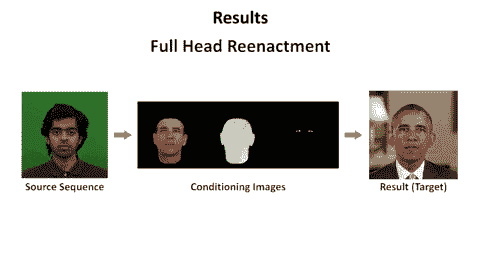

# 忘记 DeepFakes 吧，深度视频肖像更好(也更差)

> 原文：<https://web.archive.org/web/https://techcrunch.com/2018/06/04/forget-deepfakes-deep-video-portraits-are-way-better-and-worse/>

今年早些时候，奇怪、令人毛骨悚然的“deepfakes”视频(通常是露骨的)世界几乎在所有地方都敲响了警钟。如果你认为这种事情已经消失，因为人们发现它[不道德](https://web.archive.org/web/20221025222812/https://techcrunch.com/2018/05/29/students-confront-the-unethical-side-of-tech-in-designing-for-evil-course/)或不可信，这种做法又回来了，具有高度说服力的“深度视频肖像”，它完善和改进了技术。

需要澄清的是，我不想把这项有趣的研究和把名人的脸放在成人电影明星身上的令人厌恶的做法混为一谈。它们也是基于深度学习的图像处理的完全不同的实现。但是这种技术的应用显然已经存在，而且只会越来越好——所以我们最好跟上它的步伐，这样我们才不会感到意外。

[深度视频肖像](https://web.archive.org/web/20221025222812/https://arxiv.org/pdf/1805.11714.pdf)是今年 8 月在 SIGGRAPH 提交审议的一篇论文的标题；它描述了一种使用另一个人的面部来再现一个人的动作、面部表情和言语运动的改进技术。这里有一个温和的例子:

这项技术的特别之处在于它的综合性。它使用一个目标人物的视频，在这种情况下是奥巴马总统，来掌握面部、眉毛、嘴角、背景等的构成，以及它们如何正常移动。

然后，通过仔细跟踪源视频上的相同地标，它可以对总统的脸进行必要的扭曲，使用他们自己的动作和表情作为视觉信息的来源。

因此，不仅身体和面部像源视频一样移动，而且每个细微的表情都使用目标人自己的表情来捕捉和再现！如果你仔细看，甚至人(如果存在的话)背后的阴影都是准确的。

[https://web.archive.org/web/20221025222812if_/https://www.youtube.com/embed/qc5P2bvfl44?feature=oembed](https://web.archive.org/web/20221025222812if_/https://www.youtube.com/embed/qc5P2bvfl44?feature=oembed)

视频

研究人员通过比较一个人在视频上实际说话的视频和深度学习网络使用相同视频作为来源产生的视频，验证了这一点的有效性。“我们的结果与真实视频几乎没有区别，”一名研究人员说。这是真的。

因此，虽然你可以用它来让任何出现在镜头前的人的视频看起来像是在说你想让他们说的任何话——应该提到的是，用你的声音——但它也有实际应用。该视频展示了如何通过将角色的表情与配音演员正确同步来改善电影或节目的配音。

然而，没有办法让一个人做一些事情或做出一个与他们在镜头前做的太不一样的表情。例如，如果这个人一直看起来不开心，系统就不能合成一个大大的笑容(尽管它可能会尝试，但会失败得很开心)。而且自然还有各种小 bug 和神器。所以现在 hijinks 是有限的。

但是你可以从之前的尝试中看到，科学正在飞速发展。去年的车型和今年的车型之间的差异显而易见，2019 年的车型将更加先进。当老鹰叼起孩子的视频在网上流传时，我就告诉过你这一切会发生。

“我知道这涉及到伦理问题，”合著者贾斯特斯·泰斯[告诉《纽约时报》。“这也是我们公布研究结果的原因之一。我认为让人们了解操纵技术的可能性是很重要的。”](https://web.archive.org/web/20221025222812/https://www.theregister.co.uk/2018/06/04/ai_neural_network_fake_faces/)

如果你曾经想过创办一家视频取证公司，现在可能是时候了。或许一个检测基于深度学习的图像处理的深度学习系统正是入场券。

描述深度视频人像的论文来自 Technicolor、斯坦福大学、巴斯大学、马普信息学院和慕尼黑工业大学的研究人员，你可以在 Arxiv 上阅读[。](https://web.archive.org/web/20221025222812/https://arxiv.org/pdf/1805.11714.pdf)