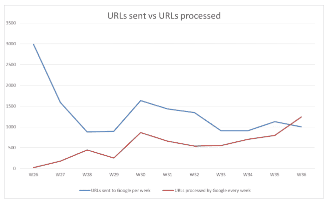

# 谷歌收紧了欧洲搜索除名申请流程 

> 原文：<https://web.archive.org/web/http://techcrunch.com/2014/09/23/forget-me-rtbf-data/>

为希望向搜索引擎提交除名请求的欧洲人提供的在线服务，要求将过时或不相关的个人信息编入索引，该服务公布了它正在帮助处理的请求的性质的新细节——为这个处于萌芽阶段的相对封闭的过程提供了更多的信息。

这里的操作黑暗主要是因为所谓的“被遗忘权”(rtbf) [法院裁决](https://web.archive.org/web/20230131001952/https://techcrunch.com/2014/05/13/forget-me-not/)，要求搜索引擎接受和处理私人个人的除名请求，是如此之新，只是在 5 月份才被宣布(尽管它引用的数据保护立法可以追溯到 1995 年)。因此，不同的参与者仍在[研究如何最好地执行裁决的细节](https://web.archive.org/web/20230131001952/https://techcrunch.com/2014/09/19/rtbf-appeals-guidelines/)。

该裁决要求谷歌和其他搜索引擎接受和处理个人的请求，这些个人希望旧的/不相关的/不准确的信息从对他们名字的搜索中被索引。它要求作为数据控制者的搜索引擎在考虑个人的隐私权与一些因素之间取得平衡，这些因素包括该个人是否有任何公共角色，因此继续暴露他们试图掩盖的任何个人信息是否会有更广泛的公共利益。

注意:想要从谷歌除名的欧洲人不需要使用第三方服务，如 Forget.me，但可以通过谷歌的[网络表单](https://web.archive.org/web/20230131001952/https://techcrunch.com/2014/05/30/right-to-be-forgotten-webform/)直接提出请求。

Forget.me 的母公司 Reputation VIP 在 6 月公布了一些更早的数据，关于通过其 rtbf 牵手服务提交的请求。当时，它已经获得了 13000 个注册，其中 1106 个用户提交了被遗忘权申请——要求删除总共 5218 个链接。

它的最新数据记录了其服务推出三个月后的 21000 个注册，以及通过提交给谷歌的 15061 个网址，忘了。我来自 30 个不同的国家。

查看提交的网址，Reputation VIP 注意到大多数(56%)尚未被谷歌处理。在收到回复的 44%中，大多数人(59%)的除名请求被谷歌拒绝。超过三分之一(36%)的人当时的除名请求得到了批准，只有 5%的人被要求向谷歌提供更多信息，以便谷歌评估他们的请求。

该公司指出，自从 rtbf 请求流程启动以来，谷歌的决策发生了变化，这是基于对其每周决策的跟踪——注意到山景城更有可能批准在流程的第一周而不是 9 月初提出的请求。

根据其数据，使用 Forget.me 提交的 rtbf 请求中有 57%在 6 月份被谷歌批准，而在 9 月的第一周只有 28%被批准。(当然，谷歌收到的请求的性质/类型在这三个月里也可能发生了变化。)

它还跟踪了在此期间做出决定所需的平均时间，并注意到随着新流程的建立，平均时间显著减少，从流程开始时的平均 44 天减少到 9 月初的 4 天。数据还表明，随着时间的推移，谷歌通常需要处理更少的网址，减轻了其 rtbf 的工作量。

显然，谷歌最初被大量的请求淹没，不得不处理积压的工作。但是根据 Forget.me 的数据，它现在处理的请求比每周收到的都多(见下图)。

所有这些都表明，谷歌可能没有那么严格地评估最初请求的价值，以快速处理积压的工作，从而掌握整个过程——但此后，或许已经收紧了评估，现在它没有面临这么多的请求。(但是同样，如果不知道正在处理的请求的内容，以及它们的复杂性如何随着性质发生变化，就很难做出明确的判断。)

在申请被拒绝的情况下，Reputation VIP 整理了个人从 Google 收到的拒绝类型(列于下表)。

到目前为止，最常见的拒绝原因(占被拒绝 URL 的 26%)是与提交者的职业生活有关的信息。接下来最常见的是它被故意放在公共场所(22%)。第三，谷歌的拒绝是基于它认为这些信息仍然是“相关的和公共利益的”。

确定谁确切地具有公共角色，谁不具有公共角色，应该是谷歌等评估流程的一个关键部分，以确定何时对个人隐私的除名请求是公平的，应该予以批准，而何时不掩盖一条信息符合公共利益，因此应该拒绝请求。

拒绝是基于提交者拥有谷歌确定的“公共生活中的角色”, Reputation VIP 检查了列出的职业——并发现了以下工作类型，这为谷歌如何在这一点上进行这些公共角色评估提供了一些启示:

*   电视主持人
*   新闻工作者
*   政客
*   商业领袖
*   著名艺术家

rtbf 申请人被要求向谷歌提供更多信息，以便谷歌处理他们的除名申请，Reputation VIP 表示，最常见的问题涉及以下主题:

*   你的要求和假名有关吗？
*   你的请求中有一个错误，你能改正它吗？
*   你能证明你与有关国家的联系吗？
*   为什么 URL 不合适或不再相关？
*   你能证明你没有被指控的罪行吗？
*   你能证明你被指控的罪名不再相关吗？

上述问题的范围之广暗示了基于个人观点做出决策的复杂性——这是谷歌根据欧洲数据保护法不得不应对的复杂性。