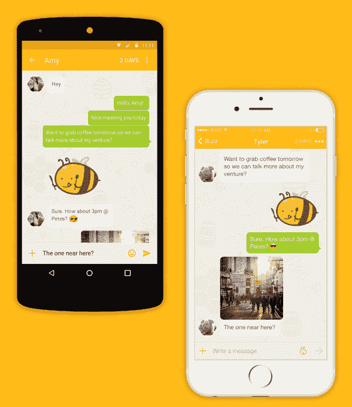

# 忘记自毁信息吧，Buzz 的新应用提供自毁连接 

> 原文：<https://web.archive.org/web/https://techcrunch.com/2015/10/30/forget-self-destructing-messages-buzzs-new-app-offers-self-destructing-connections/>

如今，如果你只想私下与朋友聊天，甚至打电话，而不必给出真实的电话号码，有多种应用可供选择——例如，谷歌语音、Burner、kik、Viber、Whatsapp 等都是热门选择。但是这些应用并不是完全私有的。用户在创建帐户时仍然需要提供电话号码或电子邮件，或者在某些情况下，那些与你聊天的人仍然可以通过你的永久用户名随时找到你。

一个新推出的名为 [Buzz](https://web.archive.org/web/20221207195826/http://buzzmessenger.co/) 的应用程序有一个不同的想法——Buzz 的重点是自毁连接，而不是提供自毁消息。

也就是说，你在 Buzz 上建立的连接将在 72 小时后自动失效，除非*和*双方都选择继续聊天。

这个概念对于那些初次见面的人来说很有意义，比如你在酒吧遇到的人，或者你在网上约会时想与之聊天的人。

通常，约会网站的用户会询问你的号码，以便在约会平台之外继续你们的对话。但并不是每个人都准备好交出自己的真实电话号码，这就是 Burner 或 kik 等应用程序派上用场的原因。

但是 Burner 的虚拟电话号码不是免费的，它们会在一段有限的时间后过期，除非你购买更多的点数或者选择[订阅 Burner 的自动续费服务](https://web.archive.org/web/20221207195826/https://beta.techcrunch.com/2015/10/08/burner-gets-business-ready-with-auto-renewing-lines-connections-to-slack-dropbox-evernote-more/)。此外，如果你在与通过在线约会认识的多个新朋友聊天时使用同一个电话号码，你不能“烧毁”该号码(即销毁它)来结束与那个没有被淘出的连接的联系，而是继续使用该号码与他人交谈。

与此同时，尽管大多数聊天应用程序提供了一种无需给别人你真实电话号码的交流方式，但你仍然可以通过你的用户名被发现。这意味着，如果有人想跟踪你，他们可以创建新的帐户，在服务上再次找到你，因为他们知道你的身份。

然而，巴兹要私密得多。用户只需在注册时添加一张照片、姓名和性别。然后，您会得到一个临时的唯一标识符，即您的蜂音代码。别人就是这样在 app 里加你的。

连接后，您的对话将只持续 72 小时，除非双方用户都表示他们想继续聊天。如果只有一方说“是”，那么这个连接和对话就自毁了，对方就再也没有办法联系你了。然而，如果双方都表示希望继续通话，那么对话可以在应用程序中继续进行。(我们应该注意，如果事情变得令人毛骨悚然，你也可以随时结束对话。)

此外，与竞争对手的消息应用不同，你的 Buzz 代码不是永久的，你可以随时更改。该公司表示，它可能很快会提供一次性的“虚荣”代码作为应用内购买，因此你可以通过名字、昵称或其他你自己创造的名字来添加。出于隐私原因，您也可以随时更改这些信息。

[gallery ids="1231313，1231312，1231311，1231310，1231309"]

这款应用的创意来自于联合创始人马修·格罗夫斯、布莱恩·奥尔布赖特和汉娜·徐——他们三人之前在即时通讯应用 Tango 工作时见过面。格罗夫斯和奥尔布赖特是质量保证工程师，徐是设计师。

该团队在一家酒吧闲逛，观察一对一直在调情的男女之间的互动后，首先想到了 Buzz。“Matt 和 Brian 开玩笑说‘她可能给了他一个假号码，’”Xu 解释道。“但是在使用聊天应用程序时，我们看到了很多这种情况——人们不想把他们的联系信息给陌生人……那么为什么不开发一个应用程序，让你的联系信息保密，并且是结束对话的一种非常简单的方式呢？，”创始人意识到。

格罗夫斯和奥尔布赖特在 1 月份离开 Tango 去开发 Buzz，徐后来加入了他们，尽管这家总部位于桑尼维尔的初创公司直到 7 月份才正式成立。得益于他们的移动消息背景，该团队决定构建自己的基础设施，而不是依赖第三方 API，如 Layer、Twilio 或 Sinch，后者[在 TechCrunch Disrupt 旧金山 2014 黑客马拉松](https://web.archive.org/web/20221207195826/http://devpost.com/software/breeze-kwi8b)期间测试了他们的 API。

虽然该团队在推出之前对 100 名用户进行了小规模测试，但真正的市场测试正在发生，因为这款应用已经面向公众推出。希望用户对维护隐私的兴趣增加，加上使用替代消息应用程序时面临的挑战，将使 Buzz 在拥挤的消息领域建立自己的一席之地。

[Buzz](https://web.archive.org/web/20221207195826/http://buzzmessenger.co/) 是在 [iOS](https://web.archive.org/web/20221207195826/https://itunes.apple.com/us/app/buzz-chat-safely/id1036622113) 和 [Android](https://web.archive.org/web/20221207195826/https://play.google.com/store/apps/details?id=com.fortywings.buzz) 上免费下载的。