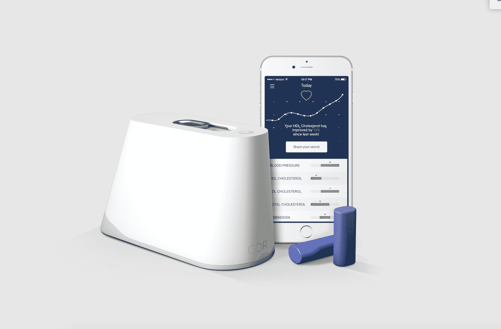

# 前苹果高管推出在家验血初创公司 

> 原文：<https://web.archive.org/web/https://techcrunch.com/2016/03/23/former-apple-exec-launches-at-home-blood-test-startup/>

Bob Messerschmidt 对健康与保健技术知之甚少，在苹果于 2010 年悄悄地收购了他的光谱学公司稀有之光之后，他花了三年时间帮助设计苹果手表平台。(条款未披露。)

梅塞施米特在离开苹果公司去创建一家新公司时也知道，公司将再次涉足智能手机领域。毕竟，他推断，它们开始帮助我们不仅跟踪我们的总体健康状况，还跟踪我们对药物和其他治疗的反应。更大的问题是他会解决哪种慢性病，不久，他选择了 Cor(T1)，这是一家总部位于旧金山、面向消费者、成立两年的初创公司，致力于测量心脏健康状况，只需要一滴血。

在您开始担心 Cor 是一家年轻的 Theranos(四面楚歌的血液检测公司)之前，值得注意的是，这两家公司之间存在许多有意义的差异。一方面，科尔希望人们在自己的家里测试自己，使用一个电动牙刷大小的电器和一次性墨盒。然后，他们的血液化学信息会被发送到“云中”，进行分析，结果会在五分钟内发送回用户，同时还会提供一些关于如何改进这些信息的帮助提示。

这引出了另一个重要的问题:科尔并没有试图告诉它的用户任何决定性的东西。“Theranos 试图提供诊断数字，”Messerschmidt 指出。“我们不是。我们不是医疗设备公司。我们正在提供生活方式指导。”

它也试图尽可能透明地展示[与 Theranos](https://web.archive.org/web/20221208105405/http://www.wsj.com/articles/theranos-has-struggled-with-blood-tests-1444881901) 的不同之处。也就是说，尽管 Cor 的产品不是医疗设备，但 Cor 已在由第三方临床研究机构运行的临床试验中验证了其模型和方法。Cor 现在正在公布这些结果，以允许同行评议，并促进对其方法的理解。

当然，各公司的资金情况也大相径庭。据报道，Theranos 已经筹集了 4 亿美元。Cor 只有三名员工，但有一个令人印象深刻的顾问委员会，其中包括长期投资者[鲍勃·波兹曼](https://web.archive.org/web/20221208105405/https://www.linkedin.com/in/bobbozeman)和斯坦福大学心血管医学教授托马斯·克特莫斯(Thomas quertmous)——已经筹集了 103 万美元的种子资金。(至于估值，今天上午[开始的 Indiegogo 宣传活动](https://web.archive.org/web/20221208105405/https://www.indiegogo.com/projects/cor-the-gold-standard-health-tracker--2#/)应该会帮助 Cor 和潜在投资者更多地了解其价值以及该公司是否在正确的轨道上。)

尽管 Messerschmidt 的背景，科尔的成功是远远没有保证。首先，这款设备 299 美元的价格并不便宜，此外还有每月 10 美元的墨盒费。(其 Indiegogo 活动的早期用户被要求支付 149 美元，包括三个月的墨盒供应。)

这也是一个悬而未决的问题，即人们希望了解自己健康状况的频率有多高，以及他们每周抽血的热情有多高。这是一个比戴上 FitBit 这样的可穿戴健身追踪器更大的承诺。

Messerschmidt 说，Cor 的产品有一个“非常细的针”，可以戳进一个人的手臂，说它“类似于你用于葡萄糖[测试]的针”。真的一点都不疼。”

Messerschmidt 承认，人们对自身健康的矛盾心理是另一个需要克服的问题。尽管如此，他说，“对于想尝试的人，我们提供支持，”包括通过 Cor 的其他客户的反馈，他们将被要求回答偶尔的匿名调查问题，这些问题涉及他们的结果和他们正在改进的方式。(Cor 希望，一旦它有了一个更大的这种见解的数据库，它们可以用来帮助通知其他用户的生活方式选择。)

当然，这是 Cor 瞄准的一个巨大市场。大约 25%的成年人有心脏病的早期预警信号。与此同时，一小部分超级健康的人可能会被吸引到这款设备上，尽可能多地发挥自己的性能。

例如，Cor 为用户提供了一个纤维蛋白原 T2 值，这对正在进行高强度健身训练的人特别有帮助。其他与心血管相关的血液化学物质包括高密度脂蛋白和低密度脂蛋白胆固醇水平(意味着用户的“好”和“坏”胆固醇)以及血液中一种称为甘油三酯的脂肪。

Cor 衡量这些数字，但不会向用户报告。相反，它根据分析给他们提供见解，这样他们就可以在补充剂、饮食和锻炼方面做出更好的选择。

Messerschmidt 说:“如果你只是报告数字，一旦(某人的)数字没有改善，该设备就会被放进袜子抽屉。”

Messerschmidt 希望他们能把 Cor 的设备放在浴室柜台上。

要了解更多信息，你可以在这里找到 Cor 的 Indiegogo 活动[。](https://web.archive.org/web/20221208105405/https://www.indiegogo.com/projects/cor-the-gold-standard-health-tracker--2#/)