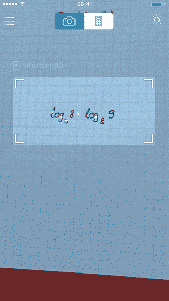

# 前战地决赛选手 Photomath 的应用程序现在可以解决你手写的数学问题 

> 原文：<https://web.archive.org/web/https://techcrunch.com/2016/09/21/former-battlefield-finalist-photomaths-app-can-now-solve-your-handwritten-math-problems/>

# 前战场决赛选手 Photomath 的应用程序现在可以解决你手写的数学问题

学习任何新的学科都具有挑战性——对许多学生来说，这个学科就是数学。幸运的是，Photomath 是来帮忙的。Photomath 是 Disrupt Europe 2014 上[初创企业战场的决赛选手，是一款使用智能手机摄像头解决复杂数学问题的应用。](https://web.archive.org/web/20221006165939/https://beta.techcrunch.com/2014/10/20/microblink-launches-photomath-to-solve-math-equations-with-a-phone/)

自从 Disrupt 以来，Photomath 创始人兼首席执行官 Damir Sabol 告诉 TechCrunch，该应用程序在 Android 和 iOS 上的下载量已超过 3600 万次，一直是美国前五大教育应用程序之一。

本周，Photomath 在 iOS 应用商店发布了其热门应用的 3.0 版本，带来了一个重大的新更新，应该可以让 iOS 用户更容易解决数学问题。该应用程序以前只能阅读印刷文本，即教科书中的文本；然而，新的应用程序现在可以立即识别手写，因此用户可以写下问题，并让 Photomath 通过简单地将相机对准纸张来解决问题。

此次更新还带来了一个新的数学专家系统 Photomath+，它可以像人类一样解决问题，并通过一个丰富多彩且有用的分步指南指导用户如何自己解决问题。这个系统似乎解决了让应用做作业和让应用帮你学习之间的矛盾。

Photomath+服务在 11 月 30 日之前是免费的，但之后将收取额外费用。Sabol 告诉我们，该公司仍在最终确定 Photomath+的定价和订阅模式，更多价格细节将于今年晚些时候公布。该应用的核心服务，比如用相机解决问题，将永远免费。

这些新功能现在可以在 iOS 上使用，并将于本月底在 Android 上使用。你可以下载 iOS 版的 Photomath 应用[或者安卓版](https://web.archive.org/web/20221006165939/https://itunes.apple.com/us/app/photomath-camera-calculator/id919087726?mt=8&ign-mpt=uo%3D2)的[。](https://web.archive.org/web/20221006165939/https://play.google.com/store/apps/details?id=com.microblink.photomath)

*我们很高兴看到前战地决赛选手在 Disrupt 后表现如此出色，我们迫不及待地想在 Disrupt London 2016 上看到下一批战地公司。扰乱伦敦的战场申请现在已经开放，所以如果你有兴趣参加战场并且符合[的资格标准](https://web.archive.org/web/20221006165939/http://apply.beta.techcrunch.com/eligibility)，你可以[在这里申请战场](https://web.archive.org/web/20221006165939/http://apply.beta.techcrunch.com/)。*

*[Disrupt London 2016](https://web.archive.org/web/20221006165939/https://beta.techcrunch.com/event-info/disrupt-london-2016/) 将于 12 月 5 日至 6 日在伦敦铜箱竞技场举行。我们希望在那里见到你们。*