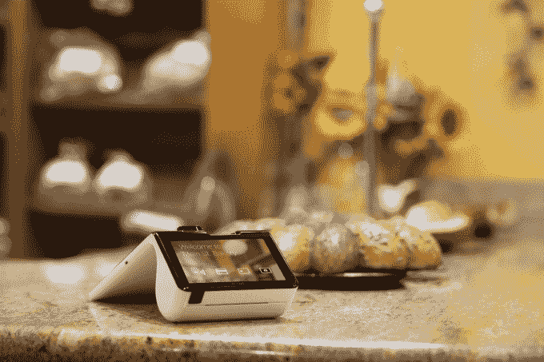
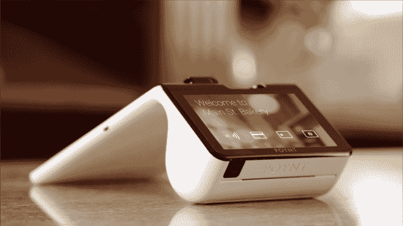

# 前谷歌钱包负责人推出 Poynt，这是一款“经得起未来考验”的支付终端 

> 原文：<https://web.archive.org/web/https://techcrunch.com/2014/10/29/former-google-wallet-head-launches-poynt-a-future-proofed-payment-terminal/>

谷歌钱包的前负责人和 PayPal 的长期高管，[奥萨马·贝迪耶](https://web.archive.org/web/20221207005105/https://www.linkedin.com/in/obedier)，今天早上展示了他的新公司 [Poynt](https://web.archive.org/web/20221207005105/http://www.getpoynt.com/developers) ，这是一个“面向未来”的支付终端，结合了基于安卓系统的平板电脑和硬件扩展坞，并包括对所有现代支付技术的支持，包括传统的[磁条](https://web.archive.org/web/20221207005105/http://en.wikipedia.org/wiki/Magnetic_stripe_card)卡， [EMV](https://web.archive.org/web/20221207005105/http://en.wikipedia.org/wiki/EMV) (芯片和密码)，NFC(谷歌钱包和 Apple Play)，蓝牙，二维码和 beacon 技术，在一个以成本价出售的一体化设备中

总部位于帕洛阿尔托的 Poynt 已经筹集了由 Matrix Partners 牵头的 A 轮融资，参与投资的包括 Webb Investment Network(由 Visa 董事会成员 Maynard Webb 创建)、Nyca Partners(由前 Visa 副总裁 Hans Morris 创建)和其他天使投资人。这一轮的规模没有透露。

Bedier 解释说，他看到了自己进入支付市场的机会，因为美国最终同意向 EMV 过渡，从 2015 年 10 月起，支付终端不支持更安全的技术的商户将承担责任。

“在支付基础设施史上，该国 1600 万台终端中的每一台都将转换到不同的设备上，这是第一次……在支付终端的历史上，这是前所未有的。Bedier 说:“以前从来没有人能够改变这些事情。”他指的是商家采用新技术的方式充其量是漫无目的的，通常包括很多阻力。

如果说有什么不同的话，那就是现在众多的支付卡违规事件已经促使零售商改变了态度。他们现在意识到，坚持支付终端升级已经将他们自己的客户置于风险之中，并威胁到他们的底线。

通过 [Poynt](https://web.archive.org/web/20221207005105/https://getpoynt.com/) ，该公司正在与银行合作伙伴合作，以成为他们首选的支付终端推荐。银行通常为商户提供一系列价格选择，Poynt 的价格为 299 美元，极具竞争力，很有可能成为首选。

该公司表示，它已经与美国五大银行中的至少两家达成了交易，但目前还不能透露它们的名称。

[gallery ids="1076291，1076290，1076287，1076286"]

## 硬件

至于支付终端本身，Poynt 平板电脑运行 Android 的分叉版本，使其对开发者友好，并在两侧包括屏幕——一个用于消费者，一个用于商家，以防止商家需要旋转终端。对于塑料支付卡，该系统提供了一种混合读卡器，可以同时读取卡的两面，并接受磁条或 EMV。如上所述，消费者也可以点击屏幕进行 NFC 支付，或者将他们的二维码放在指定区域下方。

前面的打印机(圆形部分，如图)提供收据，还有一个以太网端口，支持 Wi-Fi，3G 和 4G，以及一个 USB 扩展，用于像现金抽屉或秤这样的东西。Beacon 技术是内置的，可用于客户忠诚度计划或向移动设备发送优惠信息。8 小时的电池支持便携性，例如在销售代表在地板上漫游的情况下，或者设备可以通过坞站插入并固定在登记区。

平板电脑中有两个不同的四核处理器，一个是保存银行加密密钥的安全区域，这样任何支付数据一进入硬件就被加密——这是 EMV 过渡后 Poynt 兼容的要求。

商家不必为了开始使用 Poynt 的硬件而更换他们现有的涉及钱箱或打印机的设置，这可能使它对那些担心他们先前硬件投资的人具有吸引力。然而，该公司主要针对小企业主，那里的转换成本可能更低。

## 软件

与此同时，在软件方面，Poynt 配备了三个应用程序，一个终端应用程序，一个注册应用程序和第三个“副驾驶”应用程序，该应用程序提供对商业数据的见解，包括进来的交易，忠诚度计划的表现等。(该应用程序还可以在商家的智能手机上运行，以便远程访问这些数据。)

这些应用程序可以根据商家的选择进行交换，由于软件平台( [Poynt OS](https://web.archive.org/web/20221207005105/https://getpoynt.com/developers) )和连接性，它可以根据需要接收更新。Poynt 还与第三方开发者合作伙伴合作，包括 Vend、Kabbage、Swarm、Boomtown、Bigcommerce 和 Intuit，他们将为 Poynt 生态系统构建补充解决方案。一个 [SDK](https://web.archive.org/web/20221207005105/https://getpoynt.com/developers) 现在也对其他感兴趣的团体开放。

这也是 Poynt 商业模式的切入点。因为它以成本价向银行出售硬件，并通过其网站，希望获得大规模分销，所以软件是 Poynt 赚钱的地方。“我们从[软件提供商]收取的订阅费中抽取 20%，然后我们与收购方分享这笔钱，”Bedier 说。

然而，Poynt 并没有参与从支付中收取任何费用。此外，他补充说，Poynt 的目标是利用目前在美国销售支付处理的数千名销售代表，他们现在可以销售软件。“在过去的十年里，这已经成为一种商品服务…他们都在互相销售，客户流失已经变得很荒谬了，”Bedier 说。“我们认为他们在销售软件方面可以做得更好。”