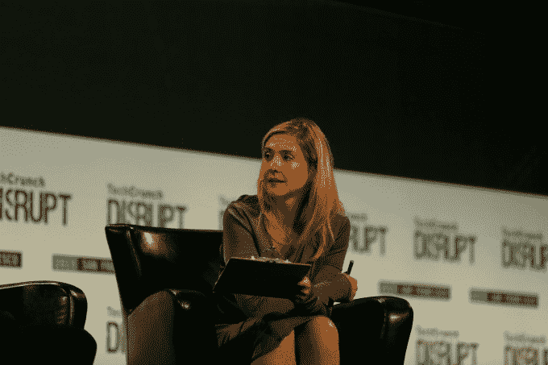

# 前记者 Alexia Bonatsos 推出她的新风险基金，梦想机器 

> 原文：<https://web.archive.org/web/https://techcrunch.com/2018/05/25/former-journo-alexia-bonatsos-takes-the-wraps-off-her-new-venture-fund-dream-machine/>

五年前，née Tsotsis 的 Alexia Bonatsos 是 TechCrunch 的联合编辑，这份工作让她在创业圈子里声名鹊起，并熟悉许多创业公司及其创始人。事实上，她真正渴望做的是投资其中一些。

“我是第一批写 Pinterest 和 Wish——当时它还被称为 context logic——以及优步、Instagram 和 WhatsApp 的人之一，”Bonatsos 说。“我开始怀疑我是否在正确的时间出现在了正确的地方——所以，是运气——或者我是否处于正确的信息流中。我很好奇:如果我一直在写支票呢？”

她偶尔和风险投资公司谈一谈，但合适的工作并没有实现。所以她开始着手创造自己梦想的工作。她的第一步是在 2015 年从 TechCrunch 的职位上退下来，进入斯坦福大学商学院的一个为期一年的速成[硕士学位项目](https://web.archive.org/web/20230121190330/https://www.gsb.stanford.edu/programs/msx)。(“我希望能够和其他风投用同样的语言交流”，她耸耸肩说道。)与此同时，在随后的一年里，她与创始人讨论如何讲述他们的故事，如何撰写他们的社论，如何让拥有大量追随者的人相信他们值得追踪——这是博纳索斯作为记者磨练出来的技能。

她不仅仅是为了保持联系而建立自己的关系网；她还慢慢地将个人投资者的支票拼凑在一起，成立了一只首次亮相的风险基金。为此，去年 12 月，她在美国证券交易委员会注册了她的旧金山公司[梦想机器](https://web.archive.org/web/20230121190330/https://www.dreammachine.vc/)，目标金额为[2500 万美元](https://web.archive.org/web/20230121190330/https://www.sec.gov/Archives/edgar/data/1714487/000171448717000002/xslFormDX01/primary_doc.xml)。

如果她已经达到或接近这个数字，出于对证券监管的谨慎，她不会说出来。(这就是商业记者成为风投的下场。不过，当我们最近采访她时，她透露自己已经进行了七项投资，包括一项象征性出售的一部分。她还分享了一些他们的共同点，这些共同点似乎集中在两件事上:他们都涉及不断增长的共享经济，他们都利用了去中心化的总体趋势。

例如，其中一个赌注是信任，我们在本周早些时候已经写了关于 T2 的文章。TruStory 最近由比特币基地和安德森·霍洛维茨基金的一名校友创建，为用户创建了一个平台，用于研究和验证人们在网上发表的言论，无论是在博客帖子、白皮书、网站还是社交媒体帖子中。Bonatsos 说，它正在创建一个“区块链的真正的信息层级系统”，bona tsos 的公司联合投资者包括 True Ventures 和比特币基地联合创始人 Fred Ehrsam 等人。

梦想机器的另一张支票给了 [Omni](https://web.archive.org/web/20230121190330/https://www.beomni.com/) ，这是一家成立四年的总部位于旧金山的按需存储公司，它使人们家中的每一件物品都可以出租——让会员有机会在这个过程中从他们未充分利用的物品中赚钱。举例来说，Bonatsos 最近租了一件衣服，一位投资伙伴穿过一次，然后收藏起来。Omni 为每一件物品拍照，并允许用户指定可以租借它们的朋友。如果用户愿意，他们还可以将自己的物品出租给陌生人。

第三项投资是在[寓言工作室](https://web.archive.org/web/20230121190330/https://fable-studio.com/)的投资，这或许最能凸显博纳索斯投资“将科幻小说变成非虚构小说的创始人”的雄心这家初创公司由 Oculus Story Studio 团队的前成员创建，今年在圣丹斯(Sundance)揭开了本质上是一个增强和虚拟现实内容工作室的面纱，并在那里首映了其首批项目之一:一部名为“墙中的狼”的三集动画系列。(你可以在这里查看预告片。)

该公司尚未披露迄今已筹集了多少资金，但其他投资者包括 Shasta Ventures 和创始人兼投资者乔·朗斯代尔(Joe Lonsdale)。

当被问及她是如何吸引交易流时，Bonatsos 表示，她并不羞于像疯子一样建立关系网。(事实上，我们昨晚在一次行业活动中发现了她。)

她还指出，为数不多但越来越多的人以个人普通合伙人的身份类似地筹集和管理资金，并在此过程中形成合作和分享经验。

其中包括 Product Hunt 创始人瑞安·胡佛，他目前管理着[周末基金](https://web.archive.org/web/20230121190330/https://weekend.fund/)，这是一个 300 万美元的基金，自去年以来已经支持了大约 10 家初创公司；Niv Dror，一个早期的产品搜寻雇员，现在正通过一个叫做[耸肩资本](https://web.archive.org/web/20230121190330/http://www.businessinsider.com/shrug-capital-venture-capital-firm-from-angellist-alum-niv-dror-raises-3-million-2018-4)的工具投资 300 万美元；Boom Capital 是 Cee Cee Schnugg 创立的“技术含量高、人脉不足的创业者”的种子基金，Cee Schnugg 曾在 Eric Schmidt 的创新努力基金(Innovation destinations fund)工作了 4.5 年。

然而，第四个新的种子期基金是今年早些时候由凯蒂·尼兰(Katey Nilan)发起的[22 Street Ventures](https://web.archive.org/web/20230121190330/http://22ndstreet.vc/)，她在此前的六年中担任过各种营销和公关角色。

当然，包括梦想机器在内的所有这些种子期基金能否存活，更不用说茁壮成长，仍是一个悬而未决的问题。正如一家知名种子期基金的风险投资人昨天告诉我们的那样，种子期融资现在是“疯狂的”，生态系统中有如此多的资本——在已建立的种子基金、加速器项目和如此多的新兴基金之间——以至于越来越难在一家有前途的新初创公司中获得有意义的股份。

Bonatsos 预计她最初的大部分支票平均在 30 万美元左右，并愿意投资首次和连续创始人，听起来并不担心。

她有自己的直觉、庞大的创始人关系网和来自种子投资伙伴的支持。她还说，她比其他许多人更早做好了投资的准备。

“我可以暂停怀疑，带着一种狂野的眼光上船，”她说。正如她所知，在创业领域浸淫多年，“不明显的交易是你获得回报的地方。”