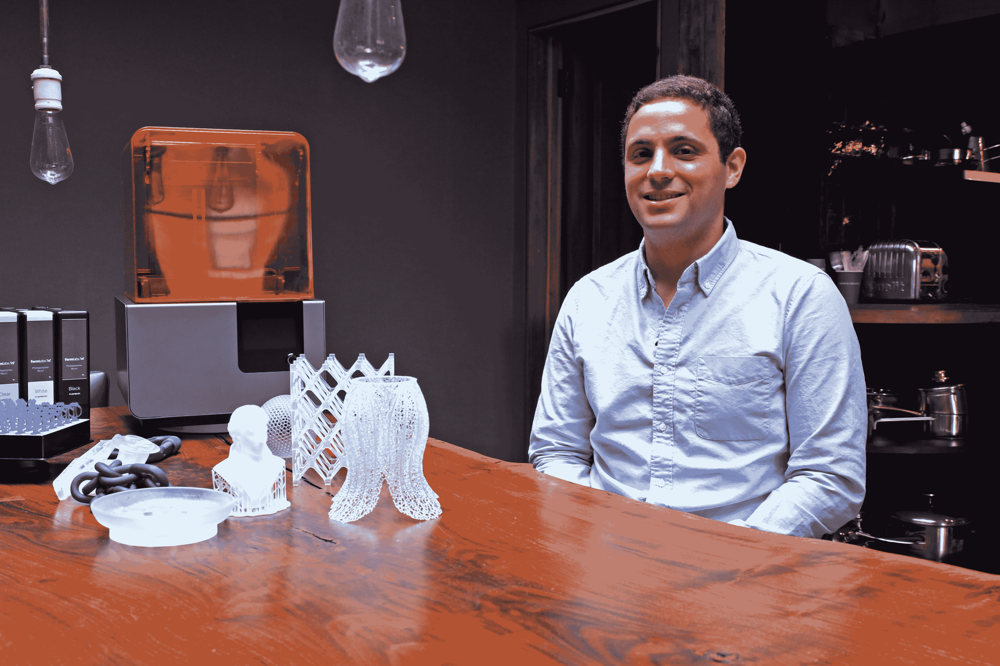
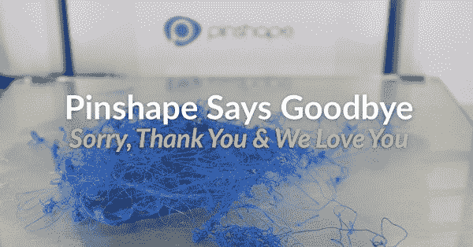
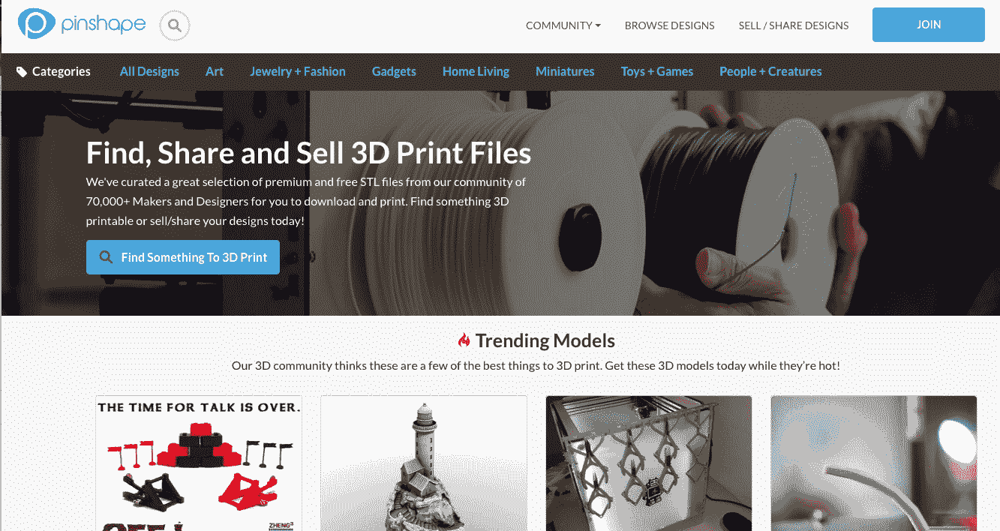

# Formlabs 收购在线 3D 打印社区/市场 Pinshape 

> 原文：<https://web.archive.org/web/https://techcrunch.com/2016/05/03/formlabs-acquires-online-3d-printing-community-marketplace-pinshape/>

当 Form 1 开始向 Kickstarter 支持者发货时，市场上已经充斥着无数基于相同基本塑料挤出技术的 3D 打印机。

但是 Formlabs 提供了一些不同的东西。这家总部位于马萨诸塞州的初创公司避开了像 [MakerBot](https://web.archive.org/web/20221222164353/https://www.crunchbase.com/organization/makerbot) 和 [3D Systems](https://web.archive.org/web/20221222164353/https://www.crunchbase.com/organization/3d-systems) 这样的公司在流行的消费类机器上提供的 [RepRap](https://web.archive.org/web/20221222164353/https://en.wikipedia.org/wiki/RepRap_project) 工艺，而是采用了以前只在高端工业模型上发现的更复杂的立体光刻方法。

该公司的产品似乎引起了创客群体的共鸣。在推出第一款产品六个月后，公司[获得了 1900 万美元的融资](https://web.archive.org/web/20221222164353/https://www.crunchbase.com/organization/formlabs#/entity)。根据公司发言人的声明，去年年底，Formlabs [推出了简单命名的 Form 2](https://web.archive.org/web/20221222164353/https://techcrunch.com/2015/12/02/the-formlabs-form-2-brings-the-3d-printing-magic-again/) ，自 9 月推出以来，该公司的销售额实际上翻了一番。

现在，这家硬件初创公司目前在波士顿和德国的办公室雇用了 160 名员工，正在通过收购总部位于温哥华的在线社区 pin shape(T2)来大力拓展用户，该公司最初是山景城孵化器(Mountain View incubator)500 Startups 的一部分。

Formlabs 首席执行官 Maxim Lobovsky 告诉 TechCrunch:“我们已经关注 Pinshape 有一段时间了，对他们所做的一切印象深刻。“这是增长最快的在线社区之一，从一开始，我们就一直在问自己，FormLabs 的在线社区会是什么样的，什么与我们的客户相关，以及我们是否应该建立一些东西。”

在此之前，3 月 31 日，Pinshape 的博客宣布该公司将终止其服务。一天后，该公司发布了一个迅速逆转的消息，称:“我们已经从 3DP 社区获得了大量的兴趣和支持，我们希望我们已经找到了一家与我们分享 Pinshape 愿景的公司来接管。这样一来，服务就不会中断了！”

根据 Formlabs 产品负责人 Dávid Lakatos 的说法，这个决定并不像 back to back 博客帖子看起来那样突然。相反，这是长达六个月的讨论的高潮。拉卡托斯补充说，社区将暂时保持不变。

“从非常抽象的意义上来说，它是让人们能够用工具制作他们设计的多个版本，”他解释道。“未来，这意味着我们希望接触到更广泛的受众，我认为 Pinshape 是通往未来更大社区的桥梁。对我们来说，现在最重要的部分是继续发展社区，并继续支持它。”

Formlabs 坚持认为，此次收购的价值不在于以 MakerBot 在 2014 年推出的在线店面[的方式将上传到该服务的优质 3D 模型货币化。](https://web.archive.org/web/20221222164353/https://techcrunch.com/2014/05/14/makerbot-scores-sesame-street-as-the-first-big-partner-in-its-3d-printing-store/)

“这不仅仅是一个为人们提供股票溢价内容的网站，”Lobovsky 说。“3D 打印更有趣的部分是创造新事物和合作。iTunes 的 3D 打印模式过于简单，不如 GitHub 的协作式建筑模式有趣。我们几乎所有的顾客都是专业人士。他们从创造一个前所未有的新事物中获得价值。”

Pinshape 首席执行官卢卡斯·马西森表示，这笔交易是一个明显的匹配。“我们有机会与行业内的许多公司交谈，对我们来说，Formlabs 显然是将 Pinshape 提升到新水平的最佳公司。他们那边有一支很棒的队伍。让社区得到良好的管理是我们的首要任务。”

“把社区交给好的人管理”在某种程度上意味着将公司从温哥华转移到新英格兰，可能在未来几个月。Matheson 解释说，“现在我们是一个八人团队，目前的首要任务是与 Formlabs 密切合作，帮助他们了解技术、平台和社区，并在未来几个月内最终决定我们是否可以最终将平台转移到波士顿的 Formlabs 团队。”