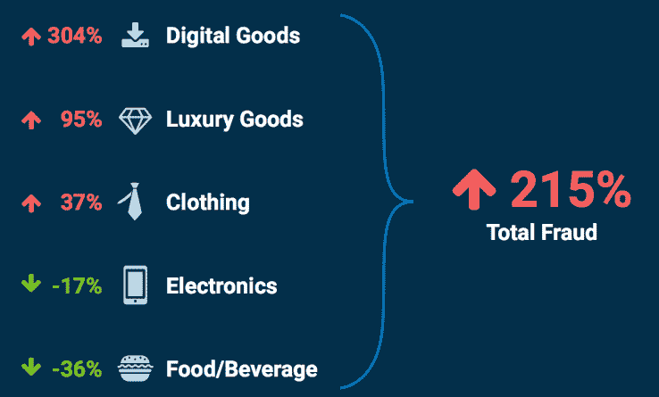
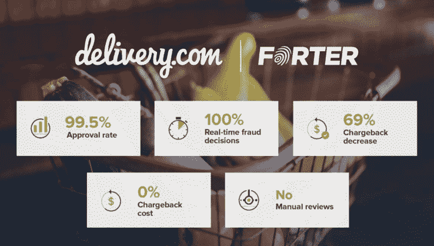

# Forter 筹集了 3200 万美元的 C 轮融资，继续打击在线欺诈 

> 原文：<https://web.archive.org/web/https://techcrunch.com/2016/04/21/forter-series-c/>

# Forter 筹集了 3200 万美元的 C 轮融资，继续打击网络欺诈

欺诈防范公司 [Forter](https://web.archive.org/web/20221007194901/http://www.forter.com/) 今天宣布获得由 [Scale Venture Partners](https://web.archive.org/web/20221007194901/http://www.scalevp.com/) 领投的 3200 万美元 C 轮融资，后续资金来自[红杉](https://web.archive.org/web/20221007194901/https://www.sequoiacap.com/)和 [NEA](https://web.archive.org/web/20221007194901/http://www.nea.com/) 。

该公司使用其决策即服务算法来帮助在线零售商分析他们在结账时面临的欺诈风险。它如此确信其准确性，以至于向零售商提供 100%的保证，防止事后退款。

现在还不算太晚:欺诈攻击正在增加，Forter 的研究声称，所有在线交易中约有 2.7%是欺诈企图，对于零售商来说，也许更令人担忧的是，绝大多数退款都是欺诈性的 T10，即所谓的“T12 友好欺诈 T13”，即客户使用他们信用卡中内置的退款系统，而不是直接与商家交易。

一些行业表现更好，但奢侈品和数码产品领域的欺诈行为继续大幅上升。

新注入的资金将投入到该公司消除电子商务欺诈的使命中。

在当今世界 日益增长的欺诈攻击 中，我们希望从电子商务中彻底消除对欺诈的恐惧，帮助零售商捕获更多的销售额，“Forter 的首席执行官 Michael Reitblat 说。

[Forter 的客户之一 Delivery.com](https://web.archive.org/web/20221007194901/https://www.delivery.com/)报告称其退款减少了近 70 %,展示了该平台的威力:

“我们尝试了其他欺诈工具和指标，包括专有的和第三方的，虽然效果有限，但仍然需要大量的运营开销，”Delivery.com 首席运营官的科林·西姆斯说。“批准率极高，决策即时，退款率低，最重要的是，我们的员工有更多的时间来帮助我们的客户和商家，而不是审查和审计交易。这对我们来说真的是最好的。”

最终，成功对所有人来说都是好消息:对商家来说是好消息，对信用卡公司来说是好消息，对你来说也是好消息，如果你有信用卡的话。只要有欺诈行为，我们这些信用卡用户就会为之买单，我全心全意地支持一切有助于让我们的网上生活稍微安全一点的事情。