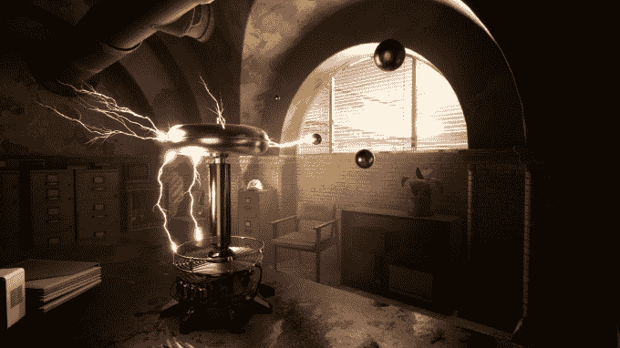
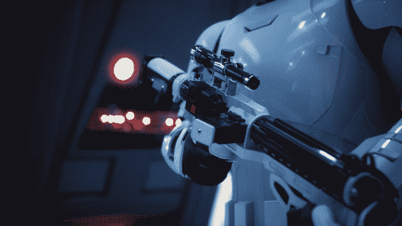

# 堡垒之夜制造商 Epic Games 在新的更新中增强了其虚幻游戏引擎 

> 原文：<https://web.archive.org/web/https://techcrunch.com/2018/07/18/fortnite-maker-epic-games-beefs-up-its-unreal-game-engine-in-new-update/>

# 堡垒之夜制造商 Epic Games 在新版本中增强了其虚幻游戏引擎

由于堡垒之夜的努力，在过去几个月取得了巨大成功之后， [Epic Games](https://web.archive.org/web/20221027185441/https://www.epicgames.com/site/en-US/home) 正在对其虚幻游戏引擎进行一些实质性的新更新，该引擎支持各种跨平台游戏和体验。一些功能，如在移动设备上更平滑的兼容性和对 Switch 的更好支持，直接来自于他们必须快速迭代以构建如此巨大成功的跨平台游戏这一事实。

Epic Games 首席技术官金·利布雷里(Kim Libreri)告诉 TechCrunch:“我们的引擎非常好，因为我们提供游戏。“艺术家需要点击多少次才能改变某样东西的颜色或调整某样东西的外观，这一切都得到了高度优化，因为如果效率不高，艺术家们会在引擎团队中日复一日地对我们大喊大叫。”

该引擎使独立开发者能够访问与主要工作室同等的环境构建和渲染系统。许多新功能来自 Epic Games 开发的工具，因为它需要这些工具来开发自己的游戏。最新的 4.20 更新对引擎来说相当显著，带来了一些性能提升，但也带来了新的视觉效果引擎和其他一些新东西。

这次更新的一个更大的亮点是一个在需要时以降低的多边形复杂度渲染对象的系统。该引擎的代理细节技术与 Simplygon 的一些技术直接竞争，Simplygon 于去年被微软收购。该技术基本上允许对象以低多边形网格版本进行渲染，而不是柔化或全有或全无的场景，而当你穿越一个环境时，对象会在渲染时突然出现在地平线上。

该公司表示，这项技术对于确保堡垒之夜玩家即使在低功耗设备上也能保持平等至关重要。自从最近一次更新以来，这个特性已经在一个实验性的版本中提供了，但是在这个新版本中，它已经变得更加可靠了。

该版本的另一个重磅人物是 Niagara 的早期版本，这是一个期待已久的视觉效果编辑器，该公司在 GDC 上谈论了很多。该工具允许开发人员对爆炸或火灾等粒子物理进行大量控制，最终将取代引擎现有的级联系统。

除了视觉效果看起来更真实之外，Epic 还希望通过技术给过场动画打一针强心剂，使开发人员可以通过焦深散景式的增强功能来提供一些非常顶级的电影质量的镜头，从而吸引人们对场景中重要内容的注意。同样，Epic 也发布了他们在工作中使用的工具，以创造更真实的数字人类角色。

这个版本中还有很多其他新功能，包括对 Magic Leap One 和 ARKit 2 的更新 AR 支持，以及早期访问中的一些混合现实捕捉功能。

所有这些特性现在在 4.20 更新中对开发者都是可用的。