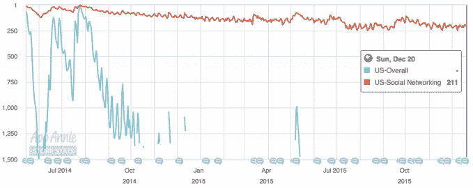
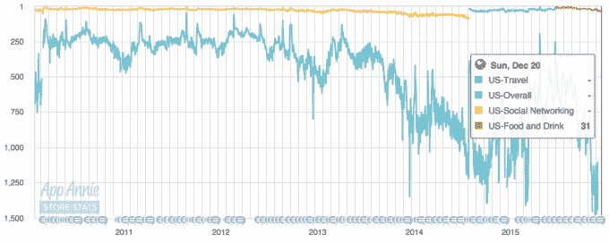

# Foursquare 正在筹集下一轮资金

> 原文：<https://web.archive.org/web/https://techcrunch.com/2015/12/21/foursquare-is-raising-a-down-round/>

我们听到很多传言说 Foursquare 正在进行新一轮融资，这将是一轮下跌。

如果这一轮以低于上一轮的估值完成，那也不会太令人震惊。当前的投资环境导致许多初创公司增加体重，为未来可能的艰难日子做准备。在这个节骨眼上，获得增长所需资金的回报超过了估值下降带来的好处。

该公司筹集资金的确切美元价值或估值无法得知，但它仍代表着该公司的一次折价。一位消息人士告诉我们，参与了前一轮融资的微软也在寻求参与本轮融资。

尽管如此，four square——曾经是纽约最热门的创业公司之一——正在以低于上一轮的估值进行新一轮融资，这一事实具有重要意义。首轮融资往往会显示出对公司核心业务更保守的兴趣，也可能会放缓初创公司的增长。本质上，Foursquare 必须找到一种新的方式，以强劲的增长打动投资者——这需要一些调整。

与往常一样，交易条款可能会有变动，在公司就融资条款进行谈判的过程中，任何估值都可能发生变化。这并不是 Foursquare 的第一次“落败”。据报道，该团队在 2013 年以 6.5 亿美元的估值筹集了资金，低于 2012 年的 7.6 亿美元。该公司总共筹集了 1.62 亿美元的风险融资和债务。

微软发言人拒绝置评。Foursquare 的一名代表拒绝置评。

去年 5 月，该公司将其签到服务 Swarm 从其主要场所和推荐应用中剥离出来。对 Foursquare 来说，拆分是一个有趣的举动，但这款应用并没有像 Foursquare 那样真正获得显著的吸引力。在 2009 年推出 South by Southwest 之后，four square 成为了一个短暂的现象。在很大程度上，拆分似乎并不成功。以下是 AppAnnie 对 Swarm 在 App Store 上的排名:

虽然事实证明，Foursquare 比 Swarm 具有更大的吸引力，但它同样没有获得这家总部位于纽约的初创公司在 2010 年左右首次应用时获得的推动力。不过，该应用在 App Store 上的星级仍然是 4.5 星。以下是 AppAnnie 为 Foursquare 提供的应用商店长期排名:

尽管如此，该公司的业务还有另外一面，包括其精准的移动广告服务和其他商业解决方案。这些并不完全依赖于应用程序的成功，并利用了公司强大的数据存储——这对公司来说仍然非常有价值，但以后会更有价值。

Foursquare 的网站称，其服务已有超过 5500 万人注册，有超过 200 万家企业声称拥有位置。该网站称，该公司在纽约、旧金山和伦敦共有 170 多名员工。

## 利用 Foursquare 的数据

为什么 Foursquare 认为现在筹集一大笔钱很重要？该公司没有透露，但要寻找线索，只要看看该公司最近预测苹果最新款 iPhone 销量的数据就知道了。通过测量几年来苹果商店附近的客流量，Foursquare 能够很好地确定这些预测数字。很难想象这种预测在大规模应用时有多困难。有几十家供应商通过部署传感器、行计数器、摄像机和其他系统，以本地化的方式实现这一目标。不过，如果 Foursquare 能够扩展自己的方法，它可能会成为任何寻求准确销售预测的企业的一支重要箭。

到目前为止，这种数据是作为一种奖励提供给 Foursquare 其他产品的客户的。如果它想将其业务的数据方面发展成一个成熟的帝国，它将需要现金来打造销售团队，制造产品，是的，铺设足够让它飞起来的跑道。

这种基于位置的武器化分析远远超出了 Foursquare 之前提供的数据交易。其中一些包括与苹果等客户的商业交易，以利用他们更深层次的数据软管，增强对地图搜索和企业名录的信心。根据 Foursquare 的 Jeff Glueck 在 6 月份的报告，超过 40%的总收入来自为其他平台的定位服务提供动力。似乎是值得调查的事情。

有一个很好的理由可以解释为什么微软的故事是有意义的:比如，它已经与 Foursquare 建立了关系，作为交易的一部分，它获得了该公司重要数据存储的访问权。

虽然 Foursquare 的签到服务可能受到了很多批评，但该公司似乎仍然能够吸引新的风险融资。这可能是基于该公司的数据，例如，它吸引了微软作为其最后一轮融资的追求者。在最后一轮融资中，该交易将 Foursquare 的数据贡献给 Bing 平台在 Windows 8 和 Windows Phone 上的位置和上下文层。

然而，可以肯定的是，Foursquare 的数据一直很有价值，因为它建立了一个关于场馆的重要信息库——包括场馆周围更准确的围栏、评级以及对餐厅等场所的评论。例如，任何想要将 GPS 坐标转换成实际场地的公司都可以向 Foursquare 支付数据。

随着世界走向移动，越来越多的计算在家庭之外完成，Foursquare 的数据可能会推动超本地广告或营销，指向几英尺外的企业。通过对位置**的理解，搜索结果、新闻提要等等可以被个性化。**

## 错过的机会

随着 Foursquare 将其应用一分为二，其他社交网络取代了 Foursquare，让分享你此刻正在做的事情变得更加容易。Foursquare 最初为 Instagram 的位置引擎提供支持，但脸书最终转向自己处理这一功能，位置基本上成为一个功能，而不是一个独立的应用程序。它还删除了好玩的市长功能，[后来不得不在今年 6 月重新添加它以安抚其用户群](https://web.archive.org/web/20230327125051/https://techcrunch.com/2015/06/22/swarm-brings-back-mayorships/#.yx4hxw:MqMK)。

所有这些都归结为 Foursquare 错过了一个机会，它发现自己正在尝试新的社交网络工具，而新的网络正在慢慢蚕食它的用户群。虽然该公司确实在尝试，但随着这款应用慢慢失去人气，这显然还不够。因此，不可避免的是，Foursquare 必须找到一种新的方式来展示公司的价值，并获得融资来发展——即使它必须在这个过程中削减其估值。

***更新:**更新了关于 Foursquare 如何使用这笔新资金的更多信息。*

*马修·潘扎里诺对本文有报道贡献。*