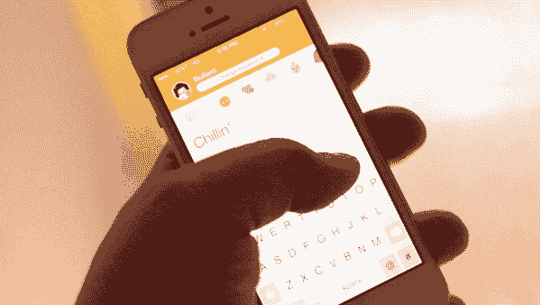
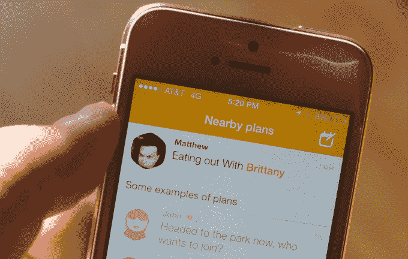
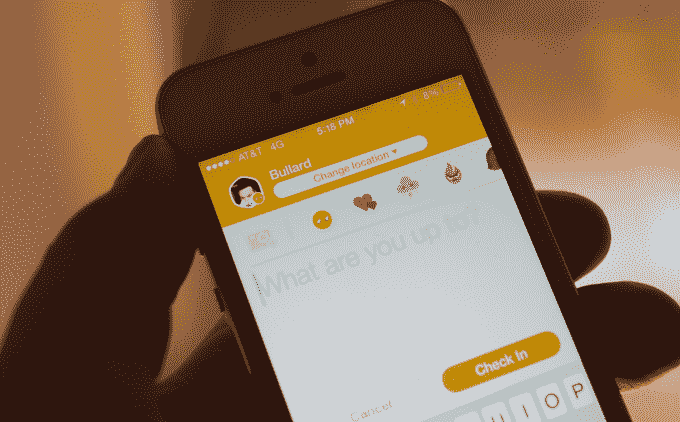

# Foursquare 的 Swarm 和隐形应用 TechCrunch 的崛起

> 原文：<https://web.archive.org/web/https://techcrunch.com/2014/05/15/foursquares-swarm-and-the-rise-of-the-invisible-app/>

Swarm 是 Foursquare 今天发布的一款新的应用[，它去掉了主应用的签到和邻近功能，把它们放在一个稀疏的、焦点驱动的新家。这款应用做得很好，尽管它将主要用于那些有很多朋友的密集城市地区。](https://web.archive.org/web/20230130081632/https://play.google.com/store/apps/details?id=com.foursquare.robin)

Swarm 的底层机制才是真正有趣的地方——更重要的是，它说明了你将在智能手机上使用的下一代应用。

我们使用应用程序的方式正在发生根本性的转变，症状无处不在。从更深入、更周到的推送通知方式，到将庞大、笨重的应用程序分解成更小、更集中的组件。

我们看到的转变将是自 iPhone 大规模普及移动应用以来的第三层用户交互。最初的 iPhone 产品和后来的 Android 设备都非常接近“信息设备”模式。使用软件，你把你的手机变成了一个功能单一的设备，就像电视上说的那样。现在它是一部电话。现在是计算器了。现在它是一个信息工具。

第二个阶段是“主屏幕”时代，每个应用都努力成为你的大本营。普遍的看法是，你必须把你提供的所有服务都塞进手机，用一种设计驱动的强灌法来填充你的应用，直到它被标签、槽和抽屉填满。

现在，我们正在进入应用即服务层的时代。这些是你手机上的应用程序，但只有当你知道它们明确有话要对你说时才会打开。它们不是用来“随意浏览”的，它们是专门构建的，由硬件传感器、位置、使用历史和预测计算等上下文信号提供信息。

这些“看不见的应用”与其说是关于它们的外观或者它们有多少功能，不如说是关于在不占据你注意力的情况下最大化它们对你的用处。

当一个社交网络确切地知道你想看什么帖子，并告诉你什么时候可以看到它们，而不是之前，会发生什么？如果一个购物应用程序忽略了所有你不太可能买的东西，只拍你的肩膀寻找最划算的交易，那该怎么办？一个位置感知应用程序怎么样，它知道你和你所有的朋友在哪里，但又足够智能，知道你什么时候想让别人知道，什么时候不想。

在这个时候，各种因素的融合使得这种环境感知应用成为可能。提高物理内存和设备处理器的能效有助于延长电池寿命。这反过来又让苹果放松了对使用卫星定位服务的限制，并使在一些 Android 设备上不进行微观管理变得实际可行。随着 iOS、Windows Phone 和 Android 变得越来越复杂，越来越具有上下文意识，它们为开发人员提供了所需的工具，不仅可以整理和处理这些信号，还可以快速而谨慎地将它们呈现给用户。

像 Foursquare 这样的服务已经达到了数据和用户的临界质量，这使它能够开发出准确判断你是在经过一家餐馆还是真的走进了一扇门的系统。

几周前，我与 Foursquare 首席执行官丹尼斯·克劳利(Dennis Crowley)就 Swarm 进行了交谈，他说他们还没有准备好被动地将人们“签到”到准确的位置，但暗示这项技术正在发展中。而且，即使有谷歌、脸书和苹果这样的强大竞争对手，Foursquare 似乎也在这方面思考得最认真，拥有大量的历史数据，让其他数据库相形见绌。

Instagram 的位置数据库最近从 Foursquare 转移到了脸书，这表明了该公司在位置方面的领先优势。如今，尝试在一张照片上标记一个位置，这完全是一场赌博——与 Foursquare 数据被挖掘时的即时结果相去甚远。

Swarm 是一个非常简单的应用，它没有对它的执行说任何负面的话，因为正确地做简单总是比做复杂更难。

这在很大程度上是 Foursquare 的“签到”方面的核心，通过一组以图表为中心的功能，以粗体和亮色显示你的朋友现在离你有多近，范围从 500 英尺的“就在这里”到 20 英里的“在这个区域内”。这本质上就是这样，通过被动或明确的位置共享，加上一个规划功能，让你使用 Foursquare 的朋友网络和地点数据库创建聚会，偶然相遇。

有一个突出的“邻居共享”开关，让你在几乎任何屏幕的顶部向右滑动，以“隐身”。最后，你可以对你的整个登记历史进行简明的搜索，这对于试图记住你那次去的地方很有帮助。

这远不是第一次尝试这种机缘巧合+地点的事情。突出，当然，是一个更高姿态去，脸书有自己的朋友附近的功能。甚至在那之前的黑暗日子里，定位技术甚至没有强大到足以支撑自己的脖子。毫无疑问，Swarm 有自己的工作要做。

我认为它是否成功很大程度上取决于 Foursquare 能否很好地利用知道你和你的朋友在哪里的被动方面。如果它能够让自己对位置的信心达到近乎完美的程度，它甚至可以为特定的地方提供安静的自动签到，而不仅仅是社区。一旦发生这种情况，你将获得签到的所有好处(记录、日记、对你朋友的友好的数字信号),而不必主动记得去做。

这将增加 Foursquare 的整体价值，也增加了你继续安装 Swarm 的可能性。

我个人觉得 Foursquare 在我出门在外的时候绝对必不可少，而在我在家的时候几乎没用。但我住在一个人烟稀少的郊区环境中，那里的“附近”一点也不近——而且我已经老了(呃)，有一群朋友。我很好奇随着时间的推移，规划功能是否会增加 Swarm 对我的效用，否则它可能会在密集的环境中或年轻人聚集在一起认识新朋友的地方最有效。

你可能听说过这样一种观点，一个应用要想真正成功，它需要在你的主屏幕上赢得一席之地。对于许多主流消息应用来说，这当然是真的，并且可能会作为一个突出的指标存在，直到主屏幕本身发生大的震动。

但是，如果 Swarm 做了它设定的事情，我们可以看到另一整类应用程序，它们不仅不需要争夺主屏幕位置，也根本不需要打开来增加价值。这很有趣。

Swarm 今天可以在 iOS 和 Android 上运行。

*Josh Constine 的视频，点击阅读[的披露。](https://web.archive.org/web/20230130081632/https://techcrunch.com/2014/05/01/ambient-proximity/)*