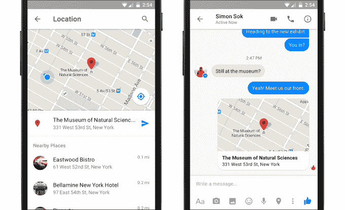
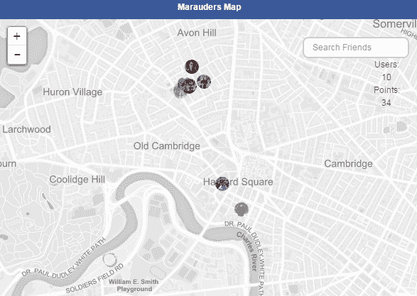
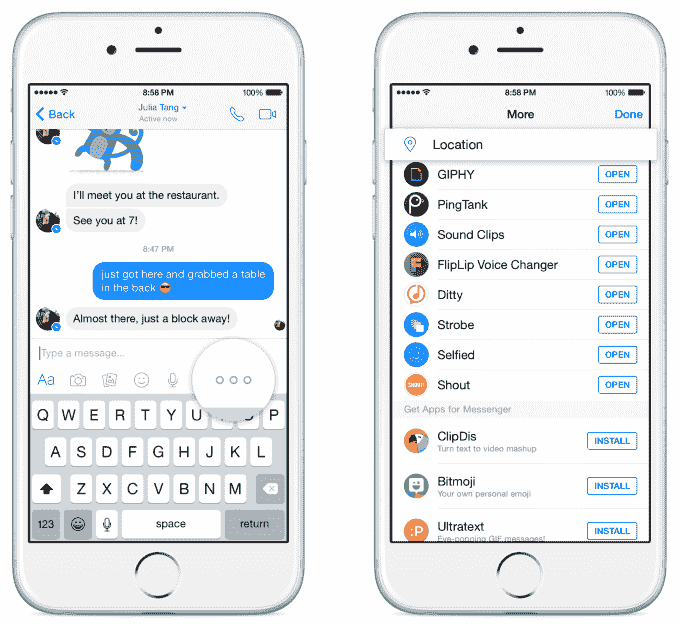

# Facebook Messenger 放弃持续地图绘制，为更多位置功能奠定基础

> 原文：<https://web.archive.org/web/https://techcrunch.com/2015/06/04/foursquessenger/>

脸书正在移除信使中令人困惑的、有点令人毛骨悚然的“T1”位置共享功能，以获得更明确的“T2”一次性方式来共享你现在或将来的位置。产品总监 Stan Chudnovsky 告诉我，位置将不再是“二等公民”。相反，Messenger 对 GPS 功能有很大的计划，他说“我们发射的是未来一切的基础。”

例如，“您可能需要预订。我们是如何到达那里的？“也许某种程度上有交通服务，”丘德诺夫斯基暗示道。当我问 Messenger 是否可以利用优步的 API让你立即预订乘车服务时，他害羞地回答道:“我没这么说，但这并不意味着我不喜欢你说的话。”

这里有一个新的位置共享系统如何工作的快速演示:

## 不再有掠夺者地图

不幸的是，对于脸书的公众形象来说，可切换的持久位置共享功能的取消仅仅晚了两周。一名哈佛大学计算机科学专业的学生最近开发了一个 Chrome 扩展，在 Messenger 中打开它，自动记录朋友发送的恒定位置数据，以创建一个[“marua ders Map”](https://web.archive.org/web/20230226195429/https://medium.com/@arankhanna/stalking-your-friends-with-facebook-messenger-9da8820bd27d)。它是以显示人们位置的哈利波特地图命名的。

这一扩展激起了人们对隐私的担忧，尽管考虑到人们自愿打开位置信息，这是相当良性的，而且它只和信息一起发送给你的朋友。在掠夺者地图发布之前，脸书已经为今天的更新工作了三个月，尽管有些人肯定会说它的发布是下意识的倒退。

## 想分享就分享

Messenger 中位置共享的新设计今天在 [iOS](https://web.archive.org/web/20230226195429/https://itunes.apple.com/us/app/facebook-messenger/id454638411?mt=8) 和 [Android](https://web.archive.org/web/20230226195429/https://play.google.com/store/apps/details?id=com.facebook.orca&hl=en) 上面向所有人推出。它驱逐了蓝色箭头和任何不断分享你的坐标的方式。取而代之的是一个大头针按钮，旁边是发送照片、贴纸或钱的按钮，或者是三点多抽屉中的一个选项。轻按它会弹出一张标有您当前位置的地图，您可以再轻按一次将它发送给朋友。这使得告诉朋友“我在这里，来见我”变得很容易。

通过拖动地图，您可以更改大头针的位置。可以让你选择见面地点。您也可以使用附近脸书地方的建议，如当地企业，或搜索一个设置到特定目的地的 pin。Chudnovsky 说，试图通过打开谷歌地图做类似的事情需要“7 次点击，2 次应用程序切换，以及 150%的挫败感。”

70 次点击，2 次应用程序切换和 150%的挫败感。

## 我应该和谁一起出去玩？

手机短信的很大一部分是关于计划与朋友见面的。脸书在其消除摩擦的不懈追求中瞄准了这一用途。对于脸书来说，真正的潜力是建立一个结合了其附近朋友功能的东西，让你不断地与朋友分享你的大致位置，或向某些人发送临时访问你的准确，实时坐标。

“附近的朋友”功能很棒，而且相对来说比较隐私友好，但是脸书把这个功能藏在了主应用的导航抽屉里。推送通知你的朋友在半英里之内或者一个人正在访问你的城市是有帮助的，但很少有人认为主动浏览谁在哪个社区的列表可以激发自发的聚会。

如果他们打对了牌，脸书和信使可以回答“我的哪些朋友现在有空出去玩”这个问题。这是一个如此大的机会，以至于，坦白说，我曾短暂地建议一家名为 Signal 的公司尝试解决这个问题，尽管这家初创公司现在正处于冬眠状态。

## 受中国单一聊天应用的启发

丘德诺夫斯基承认，当谈到在信息中加入位置或商业等额外功能时，“在亚洲，他们找到了解决办法。”像中国的微信这样的应用程序可以让你在发短信的同时预订出租车等等。关于今天的更新，Chudnovsky 说“我们认为它将改变人们对 messenger 中位置的看法。它将带我们到达一个点，在那里我们准备好向前推出各种令人敬畏的体验。”

随着脸书在 4 月份推出其 [Messenger 平台](https://web.archive.org/web/20230226195429/https://techcrunch.com/2015/03/25/facebook-launches-messenger-platform-with-content-tools-and-chat-with-businesses/#.c09dfs:ZxeX)，它在其聊天应用中创建了一个第三方体验之家。但发布合作伙伴和脸书自己的 Messenger 平台配套应用都是制作 gif 或发送声音效果的内容创作者。正如我在发布前报道的那样，脸书计划在考虑添加实用程序之前先观察平台[的采用情况。](https://web.archive.org/web/20230226195429/https://techcrunch.com/2015/03/19/facebook-messenger-platform/)

现在，脸书似乎准备将打车等外部工具引入我们的聊天话题。

