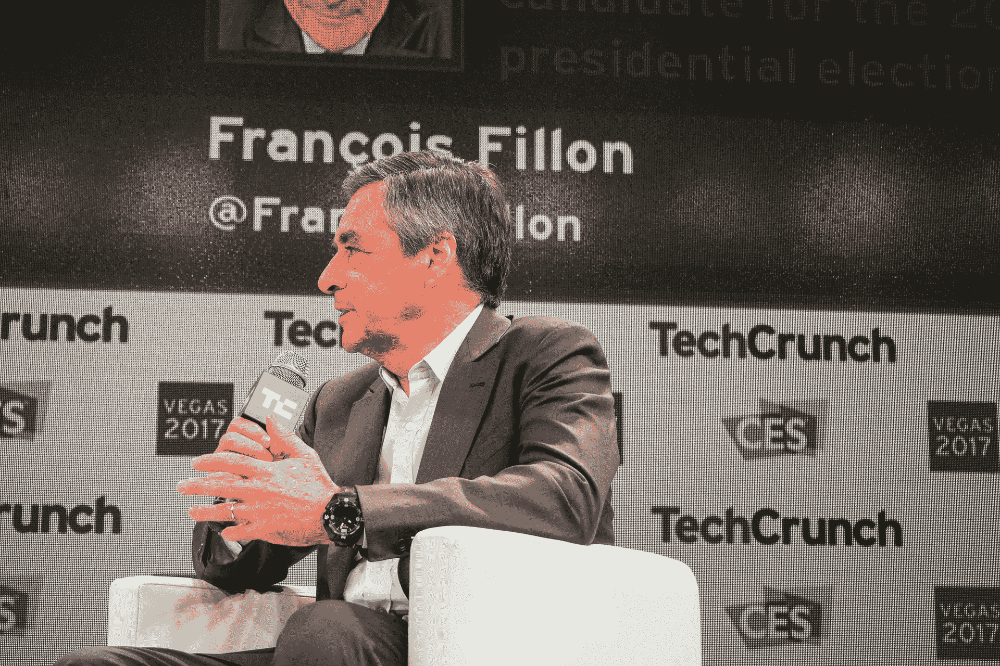

# 法国总统竞选领跑者弗朗索瓦·菲永对法国初创企业 TechCrunch 的评价

> 原文：<https://web.archive.org/web/https://techcrunch.com/2017/01/17/frances-presidential-front-runner-francois-fillon-on-french-startups/>

每次 CES，都有越来越多的法国创业公司。在这一点上，将 CES 转移到巴黎或至少纽约是有意义的，这样成千上万的法国人就不必一路飞到拉斯维加斯。

法国的创业公司也吸引了法国的政治家。这就是为什么法国前总理和现任总统候选人[弗朗索瓦·菲永](https://web.archive.org/web/20230109063927/https://en.wikipedia.org/wiki/Fran%C3%A7ois_Fillon)在那里，试图证明他了解法国的创业公司。

弗朗索瓦·菲永在 2007 年至 2012 年担任总理，当时尼古拉·萨科齐是法国总统。2012 年后，他已经相当安静了几年，为 2017 年的总统选举做准备。去年秋天，尽管困难重重，他还是在保守党的初选中战胜了尼古拉·萨科齐和领先的阿兰·朱佩。

他现在是法国主要保守党的正式候选人，并且碰巧在民意调查中领先，因为现任总统弗朗索瓦·奥朗德和他的政党非常不受欢迎。因此，菲永很有可能成为法国的下一任总统，他将对法国和欧洲的创业生态系统产生巨大影响。

本月早些时候，在拉斯维加斯的 CES 上，我有机会在 TechCrunch 的舞台上采访他。你可以在这里观看法语版的采访，或者在下面阅读完整的英语版采访。

[https://web.archive.org/web/20230109063927if_/https://www.youtube.com/embed/9xzYIRrCnyg?feature=oembed](https://web.archive.org/web/20230109063927if_/https://www.youtube.com/embed/9xzYIRrCnyg?feature=oembed)

视频

**TechCrunch:弗朗索瓦·菲永，感谢你接受我们的邀请。我想我不是一个人有这种情况，但是几天前，当我得知你要来 CES 的时候，我非常惊讶。你对创业社区有什么话要说吗？**

**弗朗索瓦·菲永:**我当然有话要对创业社区说。我想说的第一个信息是，数字革命对我来说是增长和法国保持世界主要经济力量的关键。我想说的第二个信息是，在一个有 600 万失业人口，57%的公共支出和世界税收纪录的国家，法国的创业公司没有希望，没有未来。因此，数字革命当然是必不可少的，但只有我们修复基础，培育健康的经济，它才能起飞。这是我想在这里说的信息，尤其是针对法国的选举。

我们一会儿将讨论技术问题，但在此之前，我相信我们很多人都想知道你是不是一个极客，一个真正的极客。你用优步做例子吗？

**FF:** 我当然用优步。只有在法国以外的地方，我才会自然地使用它。

**TC:我猜你在法国有一名司机？**

**FF:** 正是。

或许你用 Deliveroo 点餐？

我使用 Deliveroo，在亚马逊上订购书籍，在苹果商店订购电脑。

或许在 BlaBlaCar 上拼车？

不，还没有…那是给我的孩子们的。

**TC:昨天我们看到你在 CES 上走来走去，我相信你遇到了很多企业家，其中一些可能就在这里。你喜欢的创业公司有哪些？**

**FF:** 首先，我对所有将导致自动驾驶汽车的技术突破印象深刻。我认为这是真的——在这里展示的所有革命性产品中，这可能是对我来说最重要的一个，因为它将对经济和我们社会的运作方式产生影响。我看到一家名为 Sqool 的初创公司，它在专用平板电脑上实现了教育内容，似乎是一件了不起的事情。

你是右翼和中间党派的候选人。投票给右派的人通常希望税收减免特别有利于公司。在弗朗索瓦·奥朗德(Franç ois Hollande)的所有税收减免之后，你认为你能走得更远吗？

> 弗朗索瓦·奥朗德的税收减免只是一个大骗局弗朗索瓦·菲永

**FF:** 弗朗索瓦·奥朗德的税收减免只是一个大骗局。当他成为总统时，他增加了税收，然后他给了一点回报——对不起，但是你用的这个短语让我很恼火，“税收减免”这不是问题所在。问题是我们如何帮助法国公司变得更大。为了帮助他们成长，我们必须向他们征收与我们竞争的主要国家一样多的税——至少是主要的欧洲国家。所以我们不应该谈论税收减免。我们必须返还一些公司收入，这样他们才能投资，才能发展，才能做研究。而我，我想把 600 多亿欧元还给公司——这些税现在缴纳得不公平…

我们谈论的是多少钱？GDP 的 3 个百分点之类的？

**FF:** 多多少少。除此之外，弗朗索瓦·德努瓦耶还实施了 CICE，这是一个非常复杂的系统，返还一些公司已经缴纳的税款。我把所有的东西都放在一个系统里，我降低了所有公司的公司税。因为我认为税收政策应该简单、稳定。我们的目标是与我们的德国邻居或英国邻居拥有相同的税收水平，因为他们是我们的天然竞争对手。

**TC:你在谈论简单的税收政策，而你的税收政策的主要内容之一就是取消 ISF [ [财富团结税](https://web.archive.org/web/20230109063927/https://en.wikipedia.org/wiki/Solidarity_tax_on_wealth) ]。ISF 仍然是法国商业天使的一个重要激励机制。他们投资以降低他们的 ISF。你打算怎么补偿？**

再次抱歉，但当我们听到你刚才问的问题时，感觉我们在倒退。我们有一个系统，可以从法国的公司拿走所有的钱，这个系统叫做 ISF。我们从富人那里拿尽可能多的钱，那些可以投资经济的人。我们有办法通过投资公司来降低你的 ISF。人们现在告诉我们，我们不应该为了维持这个系统而取消 ISF。

如果我们取消 ISF，许多法国人将有更多的钱投资于经济，因为他们将支付更少的税收。我想补充一点，为了平稳过渡，我希望制定一项与英国完全相同的政策。这项政策使得这次可以从所得税中扣除投资——对小公司和创新公司的投资，可以扣除所得税的 30%，最高可达 100 万欧元。

**TC:直接上所得税？**

**FF:** 直接上所得税。

**TC:我们换个话题，谈谈劳动法。你想让现有的劳动法更加灵活吗？**

如果法国人相信我的话，在我五年任期的头 100 天里，我希望通过的三项重要改革是企业税收改革、劳动法改革和刑事司法改革。

> 我想创造一种非常适合新经济的自主创业状态，那些想创建自己公司的人

谈到劳动法，我希望允许公司与员工就工作时间进行谈判，没有任何 35 小时的限制——与我们所有的竞争对手相比，这在我们国家是独一无二的。更重要的是，我想创造一种个体经营的状态，这种状态非常适合新经济，适合那些想以简单的方式创建自己公司的人，并且不受劳动法的限制。这些约束在我们国家非常大。因此，将会出现一种让人想起我担任首相时的身份——“个体企业家”。将有一个独立承包商的地位，这些独立承包商将能够与公司签订合同。这些合同将持续三年，在这三年期间，政府不可能将他们转为全职雇员。

三年后，会发生什么？

**FF:** 老实说，与承包商的三年合同经常会导致与公司的讨论。如果一家公司与承包商合作超过三年，这意味着该公司应该雇用他们。

**TC:你可能知道所有关于承包商的讨论，特别是在美国优步司机、邮局快递员……许多人认为这些工作不稳定，一些法院正试图将这些工作转变为全职雇佣合同。你不认为在法国承包商的工作也可能太过分了吗？**

当然风险总是存在的，我们需要定期检查。但是今天法国的主要问题是:我们如何解决失业问题？我们有 600 万人没有工作。600 万人，这既是这些人的悲剧，也是法国经济在消费和增长方面的悲剧。我想给这些人创造自己公司的能力。在法国，我可以向你保证，它永远不会像在美国那样不受限制。总会有一些限制。正如我们对“自雇企业家”所做的那样，你将能够用简单的规则创建你的公司，它将是安全的，特别是在法律确定性方面。

这也是 Nathalie Kosciusko-Morizet 竞选活动中的一个热门话题。

是的，它也在我的程序中。

大多数法国人都知道你是尼古拉·萨科齐的前总理。但我觉得他们今天重新发现了你。你认为在总统选举前的几个月里，你有能力吸引他们吗？

我不会试图诱惑他们，因为我不认为政治是一种诱惑。我将努力说服他们——让他们相信，修复当今法国经济的唯一途径是做出彻底改变我们经济体系的激进决策。法国是工作时间最短、公共支出最高的国家。即使没有长时间的学习，你也能明白这不可能持续，这不可能奏效，当涉及到工作时间和公共支出时，你必须回到标准。这将促进经济增长。

**TC:这让我想到了一个会激怒你的问题。我见过许多部长来来去去，有些人比其他人更有说服力。在过去的几年里，有一个人在创业社区非常受欢迎，那就是埃马纽埃尔·马克龙。你参加 CES 是为了说服那些可能投票给埃马纽埃尔·马克龙的选民吗？**

**FF:** 首先，这个问题没有惹恼我。竞争是一件好事…

这就是民主。

当我担任首相时，埃马纽埃尔·马克龙几乎是我团队中的一员，所以他当然非常优秀。我比他早来 CES，因为我 1999 年就来了。我相信我是第一批把法国公司带到 CES 的政治家之一。有来自卢瓦尔河地区的公司。现在，在即将到来的竞选中，我们必须用我们的计划和经验来说服选民。我有一些经验，因为我让创业和数字经济变得更加容易。我将法国电信私有化，将法国的电信业私有化…

**TC:90 年代吧？**

**FF:** 反对马克龙先生的朋友们不喜欢这个想法。我建立了今天存在的研究税收抵免。这是一股清新的空气，尤其是对初创公司而言。因为如果没有研究税收抵免，我认为许多公司不会有这么大的增长。

> 当我说我们必须取消 35 小时工作制时，我们将废除它

所以我有一个记录，我正在用这个记录去和法国人对话。和一个程序。我的程序有些不同。我不是想避开障碍。当我说我们必须取消 35 小时法律的时候，我们就会废除它。我并不是说我们要建立一个基于年龄的不同工作时间的系统，如果你明白我的意思的话——因为这就是埃马纽埃尔·马克龙所说的。至于数字经济，我不是告诉创业公司，我们将为数字经济中的创业公司制定一套小型的特殊法律，这些法律将会很棒，但我们不会改变 35 小时法律，税收，公共就业岗位的数量，公共支出。所有人都认为，不努力简化法国的经济组织，法国就没有未来。因此，这将是一场激烈的辩论。我不太担心我说服法国人的能力。

当涉及到当前政府的一些政策时，比如法国科技大学 T2 分校，这是一个政府支持的想法。你对此有什么看法，这是你想要保留的吗？

**FF:** 是的，当然。我们应该保留一些非常好的想法。洛杉矶法国理工大学是个很好的主意。但是我提醒大家，没有研究税收抵免的法国理工学院，没有不久前通过的一系列扶持创业公司的法律的法国理工学院……就不会有创业公司。或者至少会少一些。所以我们应该保留所有这些东西，自然我们也会保留更多最近运行良好的东西。我已经和大约 40 家初创公司以及许多专业人士一起准备了我的数字计划。通过听取他们的意见，我和他们一起建立了一个项目，以满足那些想在数字行业发展自己公司的人们的需求。

你能说出几个支持你的创业公司吗？

我们会给你名单，但是很难说出 40 个名字。但我们会给你名单。

**TC:2016 年，有英国退出欧盟，唐纳德·川普的当选，马林·勒·庞在总统选举的民调中表现相当不错。感觉反移民情绪正在接管西方国家。你的移民政策是什么？这可能是总统竞选期间的一个关键问题，你对此持什么立场？**

**FF:** 这将是一个必不可少的话题。欧洲人想要更多的安全，尤其是在法国。几年来，暴力袭击时有发生。欧洲必须团结起来对抗一种威胁，我已经非常明确地指出了这种威胁。我称之为伊斯兰极权主义。也就是说，有一种新形式的极权主义正在对世界和平构成威胁，不仅是对法国或欧洲，而是对世界和平。

**TC:这是一些暴力的话…**

**FF:** 是现实。在生活中，你必须正确地命名事物。如果我们不能说出事物的名称……例如，谈论恐怖主义是一种简化。恐怖主义是一种行动方式。但在这些恐怖袭击的背后，有一个政治项目，是极端分子的结果。不是一般的穆斯林，是穆斯林极端分子想要建立一个极权国家。这个极权主义国家，他们试图建立从巴基斯坦到尼日利亚。巴基斯坦出现了强烈的动荡。尽管经历了近 10 年的战争，但阿富汗离重新落入塔利班手中已经不远了。多个地区已经落入塔利班手中。叙利亚已经不稳定，伊拉克已经不稳定，黎巴嫩受到威胁，也门处于战争状态，利比亚处于混乱状态……这种现象蔓延到西非的萨赫勒地区。

所以，如果那些是强烈的言辞，那些强烈的言辞描述了一个现实。这就是为什么我们需要欧洲的政治反应，安全反应，防御反应，移民控制…我们必须遵守人权，民主价值观，民主欧洲社会的价值观。但是我们必须抵抗和保护自己。

**TC:具体来说，那些有居留许可的法国人会怎么样？那些想雇佣外国工程师的企业家会怎么样？**

什么都不会发生，他们仍然被允许住在那里。

你只打算和其他欧洲国家谈判？

> 这不会改变招聘你需要的高管、你需要的人的任何事情

**FF:** 不，这是一个调节迁徙流动的问题。这是什么意思？这意味着决定获得签证的人数和我们想要强调的工作。这就是所谓的迁移策略。加拿大有移民政策，美国有移民政策，英国有移民政策。因此，我们将努力制定一项移民政策。直到现在，我们从来没有真正的迁移政策…我们没有建立一个。

这不会改变招聘你需要的高管、你需要的人的任何事情。但是有些事情需要改变——我们需要保护我们的欧洲边界。当你来到美国，你要在机场安检处呆上两个小时。当你回到欧洲，就有点不一样了。

你不得不在机场呆上两个小时，这有点烦人，不是吗？

**FF:** 美国是这样的吧？这是我每次来这里的经历。

**TC:啊，你们没有专线给…？**

我来度假的时候不会。

最后一个问题，因为我们剩下的时间不多了。你提到了一点，但是我想知道更多的细节。如果 2017 年当选，你会做创业公司的总裁还是大型上市公司的总裁？

> 反对大公司和小公司是一个荒谬的想法

**FF:** 都不是。我想成为成功的法国经济的总统。我想成为创业公司的总裁，我想成为帮助创业公司成为大公司的总裁。而且，在某些情况下，我想成为允许大公司成为大型公共集团的总统。

反对大公司和小公司是一种荒谬的想法。法国是欧洲国家中全球领导人数量最多的欧洲国家。我们不会道歉。在法国，我知道有时候说大公司是邪恶的很流行。

当我还是首相的时候，一年中总会有一个艰难的时刻——当道达尔公布他们的收益时。很不幸的是，道达尔赚到了钱，但没人知道如何与人交流。这不是我想的。我很高兴 Total 赚钱了。

**TC:我们如何改变心态？**

**FF** 我希望道达尔投资创业公司。我想让道达尔帮助他们成长。而这正是当今法国所缺乏的。一方面，有一些全球性的大公司没有太多的成长问题，因为它们凌驾于法国国家市场及其规则之上。也有很棒的创业公司。中间的台阶不见了。初创公司应该能够在法国成长并取得成功。所以他们需要钱。这就是为什么我们需要更低的税收。他们需要更灵活的劳动法。然后，他们需要找到他们的市场。一个经济增长的国家会创造这个市场。

非常感谢弗朗索瓦·菲永接受我们的采访。