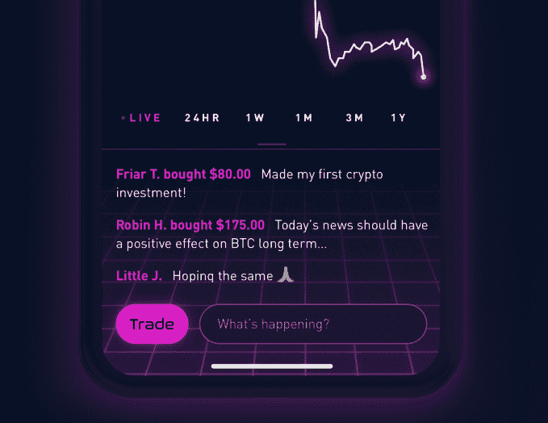

# Robinhood 推出零费用加密交易，触及 400 万用户 

> 原文：<https://web.archive.org/web/https://techcrunch.com/2018/02/22/free-crypto-trading/>

比特币基地有一些激烈的竞争。今天，Robinhood [开始在加州、马萨诸塞州、密苏里州、蒙大拿州和新罕布什尔州推出](https://web.archive.org/web/20230131234337/http://blog.robinhood.com/news/2018/2/21/robinhood-crypto-trading-is-here)无佣金加密货币交易功能。那里的用户可以买卖比特币和以太坊，无需支付额外费用，每个人都可以在它时尚的应用程序中跟踪这些和其他 14 种硬币。相比之下，在美国比特币基地支付 1.5%至 4%的费用。用户可以[在 Robinhood Crypto](https://web.archive.org/web/20230131234337/https://crypto.robinhood.com/) 网站上注册，进入等候名单。

Robinhood 有机会通过大幅降低费用来取代比特币基地，成为事实上的加密交易网站应用。当人们一次购买数千美元的加密货币时，比特币基地在美国收取的 1.5%至 4%的费用会很快增加。

但 Robinhood 认为免费提供服务是为其现有服务赢得用户的有力手段，该服务允许人们在不收取额外费用的情况下交易股票、ETF 和期权。其时尚、复古的未来 Tron 界面也是一种超级简单的方式来查看 16 种硬币的定价和新闻:比特币、以太坊、比特币现金、莱特币、Ripple、以太坊经典、Zcash、Monero、Dash、Stellar、Qtum、比特币黄金、OmiseGo、NEO、Lisk 和 Dogecoin。跟踪现在对每个人都可用，交易将很快提供给等待列表中的用户和更多的州。

https://www.youtube.com/watch?v=Q3NL2w4dyJY

[Robinhood Crypto 上个月首次宣布了这项功能，](https://web.archive.org/web/20230131234337/https://techcrunch.com/2018/01/25/free-cryptocurrency-trading-app/)仅在头四天就有一百万人注册。这种兴趣使得 Robinhood 的总注册用户数从 11 月份的 300 万增加到 400 多万。迄今为止，这些用户已经交易了超过 1000 亿美元，节省了 10 亿美元的佣金。

在大多数股票交易服务上，如 E*Trade 和 Scottrade，客户每笔交易需要支付大约 7 美元，以覆盖这些公司的营销、实体分支机构和销售代表。Robinhood 成立于 2013 年，通过以工程师及其应用程序为中心的精益运营，放弃了这些费用。它靠客户的现金利息赚钱，或者通过出售每月的 Robinhood Gold 订阅服务赚钱，让用户借钱进行交易。

这项业务让这家初创公司筹集了 1.76 亿美元，最近一次估值为 13 亿美元。凭借其免费的加密交易，它可能已经找到了吸引一批新的业余投资者的方法。保持严密的安全将是至关重要的，尤其是考虑到其他加密公司灾难性的违规行为。但随着 crypto 吸引新一代人进入金融领域，罗宾汉希望帮助他们不分昼夜地参与市场。

*[欲知更多，请阅读我们关于](https://web.archive.org/web/20230131234337/https://techcrunch.com/2018/01/25/free-cryptocurrency-trading-app/)**[R](https://web.archive.org/web/20230131234337/https://techcrunch.com/2018/01/25/free-cryptocurrency-trading-app/)**[obinhood](https://web.archive.org/web/20230131234337/https://techcrunch.com/2018/01/25/free-cryptocurrency-trading-app/)**[Crypto 的完整报道。](https://web.archive.org/web/20230131234337/https://techcrunch.com/2018/01/25/free-cryptocurrency-trading-app/)*

*【披露:这个故事的作者在比特币和以太坊拥有少量头寸】*