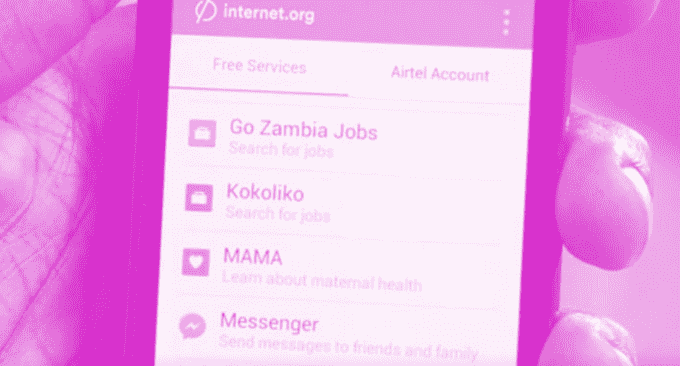

# Internet.org 应用程序为坦桑尼亚带来免费的脸书、维基百科、英国广播公司、本地信息访问 

> 原文：<https://web.archive.org/web/https://techcrunch.com/2014/10/29/free-internet-tanzania/>

# Internet.org 应用程序为坦桑尼亚带来免费的脸书、维基百科、英国广播公司和当地信息

数据访问的成本是发展中国家上网的最大障碍之一，所以今天 Internet.org 通过运营商 [Tigo](https://web.archive.org/web/20221129092345/http://www.tigo.co.tz/tigo-world/press-room/corporate/tigo-offers-free-access-basic-internet-services-through-facebook) 发布了其 Internet.org 应用，向坦桑尼亚免费提供基本网络服务和本地资源的数据访问。脸书的互联网无障碍倡议[7 月在赞比亚发布了一个类似的应用](https://web.archive.org/web/20221129092345/https://beta.techcrunch.com/2014/07/31/internet-org-app/)，现在坦桑尼亚人可以使用脸书、信使、BBC 新闻和维基百科 plus 获得当地新闻、健康信息、在线教育、分类广告和体育报道。如果用户想探索更多的网络，他们可以通过 Tigo 购买访问权限。

Internet.org 应用程序既可以作为智能手机的安卓应用程序，通过 Google Play 使用，也可以作为手机网站，供坦桑尼亚的手机用户访问。

坦桑尼亚版本包括以下免费服务:

*   AccuWeather–天气
*   婴儿中心和妈妈-儿童保育信息
*   BBC 新闻和 BBC 斯瓦希里语-世界和地区新闻
*   布莱特星期一——就业委员会
*   公民-坦桑尼亚英语新闻网站
*   脸书——社交网络
*   生命的真相——联合国儿童基金会健康信息
*   女孩效应——年轻女性健康和反贫困信息
*   信使——脸书的聊天应用
*   mwan anchi——坦桑尼亚报纸
*   姆瓦纳斯波提-体育新闻
*   OLX-分类广告
*   Shule Direct 在线教育
*   超级体育–体育新闻
*   今日坦桑尼亚-当地新闻
*   维基百科——在线百科全书

赞比亚版和坦桑尼亚版 Internet.org 应用程序的一个显著区别是，坦桑尼亚版不包括免费的谷歌搜索。我已经联系 Internet.org 询问原因。一个潜在的原因是，由于赞比亚 Internet.org 应用程序的用户只能免费访问搜索结果页面，而不能访问结果，这种体验可能会感觉不自然。

Internet.org 是一个慈善项目，旨在将世界其他地方与互联网连接起来，脸书首席执行官马克·扎克伯格称之为“基本人权”。但是，如果 Internet.org 的卫星、无人机和应用程序成功地提供包括脸书在内的免费基础互联网，它可能会把新一代网络用户变成忠实的 Facebook 用户。