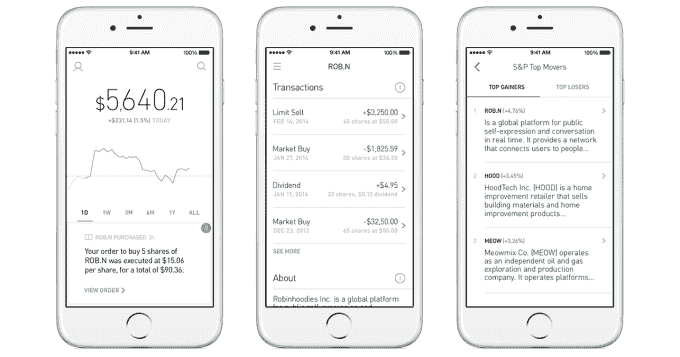
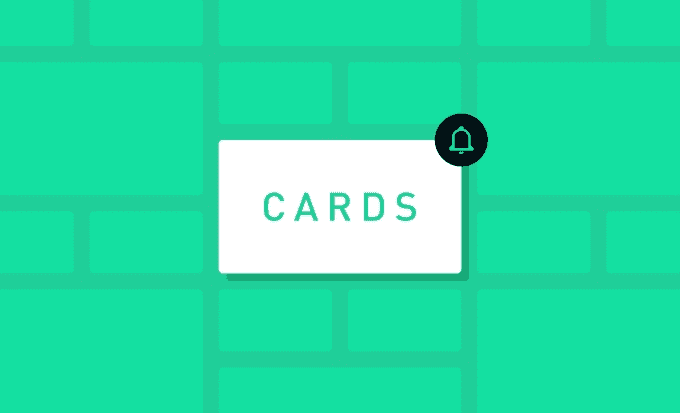
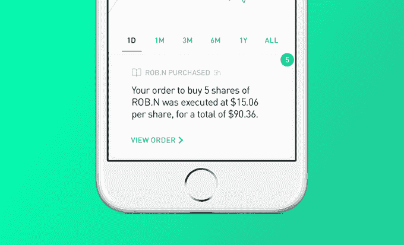

# 股票交易既昂贵又丑陋。Robinhood 的应用程序让它变得免费而漂亮

> 原文：<https://web.archive.org/web/https://techcrunch.com/2015/10/26/free-stock-trading-app/>

Robinhood 从西装革履的有钱人那里窃取股票交易，然后把它给那些支付不起每笔交易 7 美元的普通人。零费用的股票交易应用程序真正受到了欢迎。在推出后不到一年的时间里，它已经拥有了成千上万的用户，超过 10 亿美元的交易额，[，6600 万美元的资金](https://web.archive.org/web/20230326205627/https://www.crunchbase.com/organization/analyst)，以及一项苹果设计奖。事实上，这是第一款获得该奖项的金融应用。但它仍在推动股票交易变得时尚，而不仅仅是简单。

Robinhood 的产品工程副总裁乔·宾尼(Joe Binney)曾在脸书任职，他说:“有很多经纪公司都有难看的股票应用，我们不是其中之一。”。自 2013 年在[成立以来，Robinhood 一直非常重视设计，因为它试图将股票交易带给一个全新的人群:年轻人。](https://web.archive.org/web/20230326205627/https://techcrunch.com/2013/04/18/robinhood-app/)

E*Trade 和 Scottrade 的巨大实体足迹意味着他们不得不收取 7-10 美元的交易费用来支付管理费用。但是仅仅依靠少数几个工程师，Robinhood 已经用软件消除了这种费用。突然之间，那些只用几百块钱交易的人不会因为费用而失去所有的收益。

“在过去的 15 年里，基础技术发生了变化，没有一家公司向现有公司施加压力，要求它们相应地改变定价，”联合创始人弗拉德·特涅夫(Vlad Tenev)表示。直到罗宾汉出现。“我们吃的东西没有什么成本。这是完全电子化的交易。”(披露:我从大学就认识特涅夫和他的联合创始人拜朱·巴特(Baiju Bhatt)，和特涅夫在同一个兄弟会。)

仅仅因为它不对交易收费，并不意味着 Robinhood 没有潜力成为一项严肃的业务。它已经从用户存入的现金余额中获得了利息。这也是一种测试方式，让用户支付 3.5%的试用费率，使用保证金进行交易，保证金是他们所欠但尚未存入他们账户的钱。

尽管如此，大多数股票跟踪和交易应用程序并不是为更随意的人群设计的。Tenev 说:“这个领域的现有产品之所以如此不友好，是因为你看到了所有这些信息，但没有一条是针对你的，所以你不知道应该看什么”。首字母缩略词和波动的美元数额构成的不可逾越的壁垒，并不能让一项已经令人望而生畏的活动民主化。

## 有型地买卖

所以今天，罗宾汉[发布了迄今为止最大的应用更新](https://web.archive.org/web/20230326205627/http://blog.robinhood.com/news/2015/10/16/lets-get-personal)。它把关于你的投资组合和市场的个人化信息的小卡片带到主屏幕上。更新将于今天在 [iOS](https://web.archive.org/web/20230326205627/https://itunes.apple.com/us/app/robinhood-free-stock-trading/id938003185?ls=1&mt=8) 和 [Android](https://web.archive.org/web/20230326205627/https://play.google.com/store/apps/details?id=com.robinhood.android) 进行。

Robinhood 的卡片可以显示最新的金融新闻、标准普尔 500 最大的赢家和输家、你的投资组合中最大的赢家和输家，以及有关你的银行转账、预定和已支付的股息以及订单的最新信息，而不必在网站和新闻中搜寻。

点击一张卡片，应用程序内就会弹出一个托管的内容页面。Robinhood 还会给你投资组合中的每只股票或你跟踪的每只股票一个关于该公司头条新闻的收报机。因此，如果一家你持有股份的科技巨头发布了一款新的应用程序，或者业绩不佳，你将能够了解到这一情况，并在 Robinhood 应用程序中进行交易。

当然，让千禧一代像发自拍一样快地把钱押在股市上是有风险的。Robinhood 希望它的零佣金股票交易将教会下一代投资的力量，但不可避免的是，一些用户将失去他们的股份。这就是为什么该公司计划在信用卡投资中加入教育技巧和见解。

100 万人加入 Robinhood 的等待名单，以及最近由 NEA 牵头的 5000 万美元的 B 轮融资吸引了一些竞争对手。例如， [Stash](https://web.archive.org/web/20230326205627/http://www.stashinvest.com/) 使用了很多关于“股票交易民主化”的相同营销手段，但它仍然收取月费。

据该公司称，Robinhood 已经是有史以来增长最快的经纪公司，它不得不通过多年的监管和安全检查来建立自己的经纪技术体系。只要 Robinhood 严密保护，任何人想要赶上都不容易。此外，现在罗宾汉正着眼于国际扩张。它在澳大利亚有 20，000 名用户，每笔交易费用超过 50 美元。

随着 Robinhood 势头越来越猛，人们越来越清楚，它打造的不仅仅是一款应用，而是一个围绕现代化金融的品牌。有了这一点，以及它能为新员工提供的丰厚股权，罗宾汉正成为顶尖年轻人才的替代选择，这些人希望摆脱纽约投资银行业的灵魂研磨者。

与此同时，这家初创公司在帕洛阿尔托(Palo Alto)的豪华总部被受迪士尼(Disney)动画片《罗宾汉》(Robin Hood)中拟人化狐狸启发的壁画所包围，40 人的团队正在忙碌着。Tenev 总结道:“没有多少聪明的斯坦福工程背景的人愿意在银行工作。”

*[罗宾汉](https://web.archive.org/web/20230326205627/https://www.robinhood.com/)在 [iOS](https://web.archive.org/web/20230326205627/https://itunes.apple.com/us/app/robinhood-free-stock-trading/id938003185?ls=1&mt=8) 和 [Android](https://web.archive.org/web/20230326205627/https://play.google.com/store/apps/details?id=com.robinhood.android)* 上免费提供