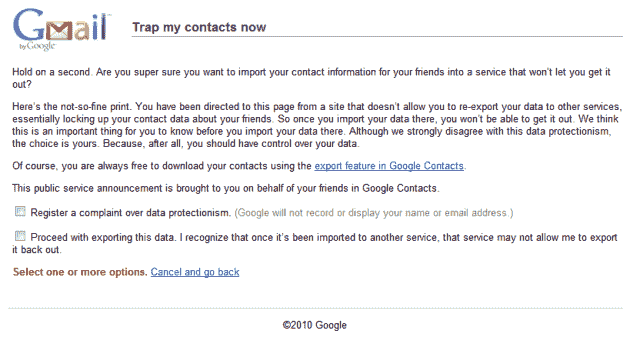

# 脸书不应该阻止你在竞争对手的 TechCrunch 上找朋友

> 原文：<https://web.archive.org/web/https://techcrunch.com/2018/04/13/free-the-social-graph/>

Twitter，Vine，Voxer ，MessageMe。在说服人们上传他们的 Gmail 联系人，启动了自己的社交图谱后，脸书一再取消竞争对手在他们的应用程序上查找你的脸书朋友的功能。与此同时，脸书的下载你的信息工具仅仅输出一个你在别处不能使用的好友名单。

随着国会在[马克·扎克伯格的证词](https://web.archive.org/web/20221220065813/https://techcrunch.com/2018/04/10/zzzuckerberg/)后考虑潜在的监管，它应该优先考虑为有抱负的脸书替代者创造公平的竞争环境，并让消费者选择在哪里社交。为了表示诚意和反对它滥用垄断，脸书应该让我们的朋友名单真正便于携带。

是时候解放社交网络了——把它当作基本的数字财产，就像 1996 年的电信法案保护你把电话号码带到新网络的权利一样。

两个最强有力的方法是让脸书停止，或者国会停止，阻止在竞争对手上寻找朋友，就像过去在 Twitter 和其他网站上做的那样。脸书应该改变它的下载你的信息工具，以一种真正可互操作的格式输出我们的朋友列表。当你在脸书上加某人为好友时，他们不仅仅是一个名字。他们是许多同名人中的一个特殊的人，脸书应该对我们在其他地方与他们联系持开放态度。

## 脸书拿走了它不愿给出的数据

直到今天，早在 2010 年，脸书就鼓励用户导入他们的 Gmail 地址簿，这样他们就可以添加他们为脸书好友。但是它拒绝让用户将朋友的电子邮件地址导出到其他地方使用。这导致谷歌改变了政策，要求任何使用其联系人 API 的应用程序的[数据可移植性互惠](https://web.archive.org/web/20221220065813/https://techcrunch.com/2010/11/04/facebook-google-contacts/?_ga=2.177373281.576575749.1523206016-1361550980.1392837599)。

那么脸书退缩了吗？不。它建立了一个[解决方案](https://web.archive.org/web/20221220065813/https://techcrunch.com/2010/11/08/facebook-finds-a-new-way-to-liberate-your-gmail-contact-data/?_ga=2.257649743.576575749.1523206016-1361550980.1392837599)，给用户一个深层链接，让他们从谷歌的荣誉导出工具下载 Gmail 联系人。然后，脸书煞费苦心地向用户解释如何上传文件，这样它就可以建议他们把所有联系人都加为好友。

谷歌不想阻止用户合法导出他们的联系人，所以它只是给 Gmail 用户贴了一个措辞强硬的警告:“现在就给我的联系人设置陷阱:等一下。你确定要将你朋友的联系信息导入一个不让你获取的服务中吗？。。。虽然我们强烈反对这种数据保护主义，但选择权在你。因为，毕竟，你应该对你的数据有控制权。”谷歌提出让你“对数据保护主义提出投诉”

八年后，脸书从一个追赶谷歌的好斗的暴发户成长为互联网上最大、最有实力的玩家之一。它还在教用户如何获取他们的 Gmail 联系人的电子邮件地址，同时只允许你导出朋友的名字——除非他们通过模糊的设置选择加入，因为它认为他们分享的联系信息是他们的数据，而不是你的。你是否应该被允许将他人的联系信息上传到社交网络是一个更大的问题。但脸书鼓励用户从其他应用程序导入数据，却不导出，这是公然的数据可移植性伪善。

在某些方面，你不能批量输出你所有脸书朋友的电子邮件地址，这是件好事。这可能会导致垃圾邮件，这可能不是有人在脸书上加你为好友时所想的。他们可以阻止你，解除你的好友关系，或者让你静音，但是他们无法找回他们的电子邮件地址。剑桥分析公司丑闻发生后，脸书已经在忍受对其处理数据隐私方式的批评。

然而，你可以在其他应用程序上找到你的脸书朋友的想法，是该平台存在的合理理由。这是让脸书登录如此有用和受欢迎的原因之一。脸书的 API 允许某些应用程序检查你的脸书朋友是否已经注册，这样你就可以轻松地关注他们或向他们发送连接请求。但当脸书感觉到真正的竞争时，它已经取消了这一选择。

## 数据保护主义

Twitter 就是最大的例子。脸书过去和现在都不会让你看到你的脸书朋友在 Twitter 上，尽管它的用户数量是你的七倍。Twitter 的联合创始人 Ev Williams 在 2010 年受挫，他说“他们把自己的社交图谱视为核心资产，他们希望确保与任何访问它的人建立双赢的关系。”

脸书接着[建立了一个正式的政策](https://web.archive.org/web/20221220065813/https://techcrunch.com/2013/01/25/facebook-bans-replicating-its-functionality/?_ga=2.216140114.576575749.1523206016-1361550980.1392837599)说想要使用它的寻找朋友工具的应用程序必须遵守这些规则:

*   如果您使用任何脸书 API 来构建个性化或社交体验，您还必须使人们能够轻松地与脸书上的人分享他们的体验。
*   > 未经我们的许可，您不得使用 Facebook 平台推广复制脸书核心产品或服务的产品或服务，或将用户数据导出至该产品或服务。
    > 
    > 

本质上，依附于脸书社交图谱的应用程序必须让你分享回脸书，并且不能与之竞争。这有点讽刺，因为脸书多年来的总体战略一直是“复制核心功能”从克隆 Twitter 的不对称关注和趋势话题到 Snapchat 的故事和增强现实过滤器，一直追溯到抄袭 FriendFeed 的新闻订阅和脸书抄袭 Winklevii 的 HarvardConnection。

对复制核心功能的限制在科技界并不是闻所未闻。例如，苹果的 iOS 系统不允许你在应用程序内部运行应用商店。但是脸书有选择地执行这项政策令人担忧。它只是忽略了那些永远不会流行的竞争应用。然而，如果他们开始成长为潜在的竞争对手，脸书会迅速执行这一政策，并取消他们的“寻找朋友”访问权限，这往往会抑制进一步的发展和参与。

以下是脸书从图表中剔除竞争对手的几个例子:

*   Voxer 是 2012 年[最热门的消息应用](https://web.archive.org/web/20221220065813/https://techcrunch.com/2012/04/11/walkie-talkie-app-voxer-goes-big-ivp-and-intel-lead-30-million-round/)之一，凭借其对讲机式的功能，攀升了排行榜并筹集了 3000 万美元。2013 年 1 月初，脸书通过[在 Messenger 中添加语音消息](https://web.archive.org/web/20221220065813/https://techcrunch.com/2013/01/03/facebook-voice-messaging/)复制了 Voxer。两周后，脸书[切断了 Voxer 的 Find Friends 访问](https://web.archive.org/web/20221220065813/https://techcrunch.com/2013/01/18/facebook-data-voxer)。Voxer 首席执行官汤姆·卡蒂斯当时告诉我，脸书表示，他拥有数千万用户的应用程序是一个“竞争性社交网络”，不会将内容分享回脸书。Katis 告诉我们，他认为这是虚伪的。到 6 月份， [Voxer 已经转向商业通讯](https://web.archive.org/web/20221220065813/https://techcrunch.com/2013/06/25/voxer-transforms-into-a-walkie-talkie-service-for-the-business-world/)，在应用排行榜上一落千丈，让 Facebook Messenger 茁壮成长。
*   **MessageMe** 有一个[精心打造的聊天应用](https://web.archive.org/web/20221220065813/https://techcrunch.com/2013/03/08/messageme/)，在 2013 年推出后增长迅速，对 Facebook Messenger 构成了威胁。在达到 100 万用户前不久，[脸书切断了 MessageMe](https://web.archive.org/web/20221220065813/https://techcrunch.com/2013/03/15/facebook-messageme/) 的 Find Friends 访问。这款应用[最终以微不足道的两位数百万的价格卖给了雅虎](https://web.archive.org/web/20221220065813/https://techcrunch.com/2013/03/19/messageme-2/),随后解体。
*   Phhhoto 及其命运显示了脸书的数据保护主义是如何影响 Instagram 的。让你[拍摄动画 gif](https://web.archive.org/web/20221220065813/https://techcrunch.com/2014/09/15/phhhoto-is-an-addictive-albeit-poorly-named-gif-style-photo-app/)的 Phhhoto 应用程序在[越来越受欢迎。](https://web.archive.org/web/20221220065813/https://techcrunch.com/2015/03/30/phhhoto-tops-1-million-users/)但在达到 100 万用户后不久，它[于 2015 年 4 月从 Instagram 的社交图](https://web.archive.org/web/20221220065813/https://techcrunch.com/2015/04/24/nochill/)中被切断。六个月后， [Instagram 推出了 Boomerang](https://web.archive.org/web/20221220065813/https://techcrunch.com/2015/10/22/instagram-boomerang/) ，明目张胆的克隆了 Phhhoto。两年内， [Phhhoto 关闭了它的应用](https://web.archive.org/web/20221220065813/https://techcrunch.com/2017/06/20/phhhoto-shuts-down/)，指责脸书和 Instagram。“我们看着[Instagram 首席执行官凯文] Systrom 和他的产品团队在 Boomerang 发布的近一年前悄悄使用 PHHHOTO。所以一点都不意外。。。我不确定 Instagram 在他们整个身体中都有创意。”
*   Vine 有机会成为短视频的未来。然而，在 Twitter 自有应用发布的那天，脸书关闭了 Vine 的 Find Friends 访问。Vine 让你分享回脸书，你在应用程序中拍摄的 6 秒钟循环与脸书的重量级视频文件上传器相去甚远。尽管如此，脸书还是切断了它，到 2016 年末，Twitter 宣布关闭 Vine。

正如我在 2013 年写的那样，“这些政策的实施可能会在脸书周围形成一条护城河。它为竞争公司的参与、保留和发展制造了障碍。”但在 2018 年，在反垄断行动的传言中，脸书限制对其社交图谱的访问以保护其新闻订阅的主导地位似乎非常反竞争。

这就是为什么脸书应该承诺停止禁止竞争对手使用它的 Find Friends 工具。如果不是，国会应该告诉脸书，这种行为可能会导致更严格的监管。

## 朋友不仅仅是名字

当参议员约翰·尼利·肯尼迪(John Neely Kennedy)本周问扎克伯格:“你愿意给我把我在脸书的数据转移到另一个社交媒体平台的权利吗？”，扎克伯格声称“参议员，你已经可以做到了。我们有一个下载你的信息的工具，你可以在那里得到所有内容的文件，然后用它做你想做的任何事情。”

但是这并不完全正确。您可以导出可以轻松上传到其他地方的照片。但是你的社交图——所有那些确认的好友请求——会变成一串无用的文本。下载你的信息仅仅是列出你朋友的名字和你上网的日期。没有唯一的用户名。没有链接到他们的脸书个人资料。除了手动输入他们的名字，你无法在其他社交网络上找到他们。

如果你的朋友有共同的名字，那就更成问题了。脸书上有成千上万的约翰·史密斯，所以在另一个只有名字的社交网络上找到他需要大量的调查或猜测工作。取决于你住在哪里，找到一个特定的加西亚，斯米尔诺夫或李可能是相当困难的。脸书甚至建立了一个名为 [Friendshake](https://web.archive.org/web/20221220065813/https://techcrunch.com/2012/06/24/friendshake-facebooks-new-mobile-feature-for-finding-people-nearby-and-a-highlight-killer/) 的短命功能，帮助你在重叠的名字空间中把附近的人加为好友。

当我问及此事时，脸书告诉我，用户可以选择将其电子邮件或电话号码包含在下载信息导出中。但这个隐私设置被埋没，鲜为人知。我的朋友中只有 4%的人，集中在精通技术的旧金山，已经启用了它。

正如我早在 2010 年推出下载你的信息时批评的那样，“这些数据可以用作日记，或者替换硬盘崩溃或被盗电脑中的其他信息——但不一定要切换到不同的社交网络。”

鉴于脸书对 Find Friends API 的严格控制，用户应该得到分散的数据可移植性——这是一种脸书无法收回的带走朋友的方式。这就是下载你的信息应该提供的，但没有。

## 社交图可移植性

这就是为什么我呼吁脸书提高你的朋友连接的数据可移植性。给我们同样的消费者保护，使电话号码可携带。

至少脸书应该包括你朋友的独特的脸书用户名和网址。但是真正的可移植性意味着你可以将列表上传到另一个社交网络，在那里找到你的朋友。

一个选择是，脸书的导出包括一个隐私安全的散列版本的你朋友的电子邮件地址，他们注册并与你分享。脸书可以建立一个散列电子邮件查找工具，这样如果你把这些无意义的字符串上传到另一个应用程序，他们就可以把它们与脸书的朋友数据库进行交叉引用。如果有匹配的，应用程序会把那个人显示为你可能想重新联系的人。实际上，这可以让你通过电子邮件地址找到其他地方的朋友，而脸书不会给你或其他应用程序一个可读的联系信息列表。

如果你不能随身携带你的社交网络，脸书的可行替代品出现的可能性很小。不管出现了更好的社交网络，或者脸书不尊重你的隐私，因为你无处可去。打开社交图谱需要脸书在产品和政策上进行竞争。试图用各种隐私规定来迫使公司就范并不能解决核心问题。但用户实际上能够离开的前景，将让市场迫使脸书对我们更好。

*关于脸书在数据隐私方面面临的挑战，请查看 TechCrunch 的专题报道:*