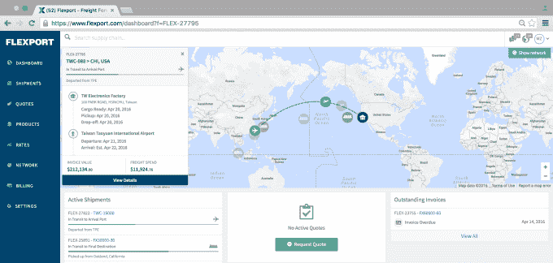
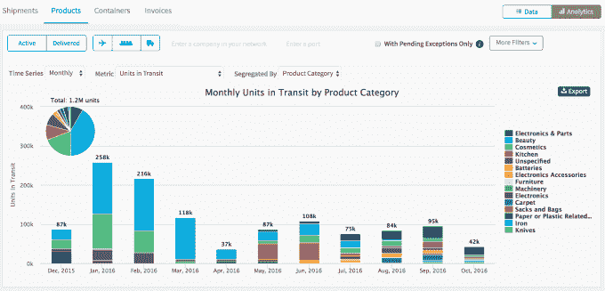

# 不性感的 Flexport 获得 6500 万美元，因为软件蚕食了航运

> 原文：<https://web.archive.org/web/https://techcrunch.com/2016/09/26/freight-forwarding/>

货代是一个数万亿的行业，但大多数人甚至不知道那些词是什么意思。在世界各地运送装满货物的船只、卡车和飞机的业务最近被技术忽视了。

从历史上看，货运代理一直是由大量纸质舱单、电子邮件和电子表格处理的，几乎没有透明度、洞察力或动态改变路线的灵活性。但有时最枯燥的工作对初创公司来说蕴含着最大的机遇。

进入 [Flexport](https://web.archive.org/web/20230330090602/https://www.flexport.com/) ，它刚刚以超过 3 亿美元的估值筹集了[6500 万美元的 B 轮](https://web.archive.org/web/20230330090602/https://www.flexport.com/blog/flexport-fundraising-global-growth/)，使货运代理可编程。首席执行官瑞安·彼得森称之为“无缝商业网络”

Flexport 既是安排货物运输的传统货运代理服务，也是数据提供商。你可以在我们的公司简介[“最不性感的万亿美元创业公司”中了解更多关于它的背景故事、业务和与史蒂夫·乔布斯的争吵](https://web.archive.org/web/20230330090602/https://techcrunch.com/2016/06/07/flexport/)

Flexport 的软件[接收经过验证的货物清单数据](https://web.archive.org/web/20230330090602/https://techcrunch.com/video/flexport-integrates-government-data-to-optimize-imports/56cfc2b7-4c06-3577-81a9-9c9d6d11a11a/)，这些数据包括装运的货物、价值以及运往何处。然后，制造商可以使用这些数据来优化他们的货物所走的路线，并确保他们在商店里总是有足够的产品。您无法将您的货物运送给多家货代，但 Flexport 可以让您更深入地了解您的货运情况。

利用数据增值来扰乱 DHL 和 Expeditors 等大型货运代理业务的承诺，说服了 Flexport 的大多数现有投资者加倍下注，完成了这一轮投资。创始人基金(Founders Fund)、彭博贝塔、菲利西斯风险投资公司(Felicis Ventures)、首轮资本公司(First Round Capital)、苏萨风险投资公司(Susa Ventures)、尤里·米尔纳和其他公司都回到了 B 轮融资中，8VC 的乔朗斯代尔也加入了进来。Founders Fund 的 Trae Stephens 将加入 Flexport 的董事会，该公司自 2013 年成立以来已经筹集了 9400 万美元。

Y Combinator 创始人兼 Flexport 投资者保罗·格拉厄姆表示:“ Flexport 是‘软件吞噬世界’与国际航运相遇的地方。“你能想象如果国际贸易变得更容易，就像软件让我们的工作和个人生活变得更容易一样，世界会变成什么样吗？”

【Flexport 的工作原理

与当今许多快速崛起的初创公司不同，Flexport 没有大出血。“我们实际上是靠增长赚钱的。我认为这是非常独特的。我们有机会成为首批真正盈利的独角兽公司之一，”彼得森告诉我。

他有权利骄傲，但也可能会自责。Flexport 的出货量同比增长了 16 倍，该公司今年的商品交易额刚刚超过 10 亿美元。这些商品的零售价值将达到 25 亿美元，而整个亚马逊在 2015 年的收入为 1070 亿美元。彼得森笑着说，“我们的业务才开展了几年，规模只有他们的 2%。”

Flexport 创始人兼首席执行官 Ryan Petersen

但或许如果他再等几个月再发行 B 系列，Flexport 的估值会高得多。彼得森说，这一轮融资是在夏天完成的，但“我们在两个月内增长了 80%的收入”，并在 8 月份积累了 50 万美元，同时感到震惊、兴奋和有点渴望。

然而，他知道这种情况比没有钱或没有足够的钱来竞争要好得多。“我厌倦了资金紧张。我们想进攻。”

Flexport 将把资金投入到进一步的国际扩张中，特别是设立办事处来“润滑”中国，因为它的许多客户都来自中国。“我们真的想在中国大力投资。我们会犯一些错误，尽管不会像优步那样，”彼得森笑着说。

Flexport 的深圳办公室加入了位于香港、纽约、阿姆斯特丹和其他地方的办公室，而不是建立一个庞大的总部。“小团队工作起来更有趣，在许多方面也更有效率。与其有一个 1000 人的办公室，我宁愿有 10 个 100 人的办公室。  大家都知道彼此的名字。它导致更少的政治。”彼得森说，他很乐意为一流的视频会议设备买单。

这些团队的合作创造了 Flexport 的下一个重大优势:在运输途中将货物重新发送到单个托盘的能力。

“假设你是一家销售扬声器的公司，你销售给三家不同的零售商:塔吉特、百思买和沃尔玛。彼得森解释说:“现在，你需要仓库里的所有库存，这样当他们购买托盘时，你就可以发送出去。

现在有了 Flexport 的 API，“你可以从中国购买一整个集装箱的扬声器，从海洋中的集装箱你可以改变这些托盘的路线(到任何想要更多的商店)。企业会因此而疯狂。他们可以减少仓库中的库存，基本上将这些集装箱变成移动仓库，”彼得森告诉我们。

新董事会成员 Trae Stephens 表示" Flexport 正在帮助解决将行业带入互联网时代的问题。全面了解供应链的价值不仅会导致更明智的决策，还会彻底改变你的业务。"

Flexport 将不得不与像 Haven 这样的初创公司一决雌雄，这些公司试图通过特定的服务将 flexport 与众不同，而富有的货运代理巨头则渴望克隆它或在支出上超过它。彼得森说，他们竞争对手的一位首席信息官一直在给 Flexport 的客户打电话，看他们应该做得更好。另一家公司向 Flexport 员工 5X 开出了跳槽的薪水，但他们仍然保持忠诚。“为什么？因为他知道他们会失败，”彼得森说。

“竞争对手要么嘲笑我们，要么把我们看得很重，但不管怎样，他们都不喜欢我们。”创业和电子游戏一样，如果敌人越来越强大，你就在朝着正确的方向前进。