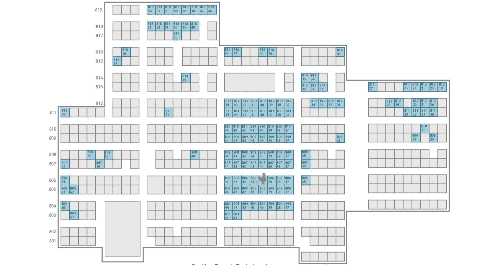

# 法国初创公司也在接管 CES 

> 原文：<https://web.archive.org/web/https://techcrunch.com/2016/01/03/french-startups-are-also-taking-over-ces/>

没错，[创业公司正在接手 CES](https://web.archive.org/web/20221026001234/https://beta.techcrunch.com/2016/01/03/startups-are-taking-over-ces/) 。但这只是故事的一部分。CES 不是另一个创业展。这是一场创业秀，来自许多不同国家的数百家公司同时推出引人注目的新产品——尤其是法国的初创公司正蜂拥而至*。*

 *今年，190 家法国初创公司将在 CES 上设立展位。

你已经知道其中一些了。我们已经报道了 [Withings](https://web.archive.org/web/20221026001234/https://beta.techcrunch.com/tag/withings/) 、 [Parrot](https://web.archive.org/web/20221026001234/https://beta.techcrunch.com/tag/parrot/) 、 [Devialet](https://web.archive.org/web/20221026001234/https://beta.techcrunch.com/tag/devialet/) 、 [Netatmo](https://web.archive.org/web/20221026001234/https://beta.techcrunch.com/tag/netatmo/) 以及过去许多成功的法国公司。其中一些将在拉斯维加斯会议中心与三星、索尼、LG 和所有大公司比邻而居。

但是其他几十个你还不知道的人呢？他们基本上要接管距离会展中心几个街区的金沙会展中心。今年，尤里卡公园三分之一的初创企业是法国初创企业。从这个角度来看，美国初创企业占尤里卡公园的 42%。尤里卡公园地图上所有的蓝色标志都是法国的创业公司:

现在，如果你一直在关注法国的技术领域，这应该不会感到意外。去年已经是[CES 上法国创业公司](https://web.archive.org/web/20221026001234/https://www.yahoo.com/tech/france-is-absolutely-crushing-it-at-ces-107251174669.html)的大年。但今年，法国初创公司似乎正试图表明自己的观点。

那么，为什么法国的初创公司要千里迢迢来拉斯维加斯参加 CES 呢？有几个原因可以解释法国对 CES 的新热爱。在过去的几年里，法国政府一直试图通过法国科技在全世界推广法国创业公司，这是一个政府支持的团队，试图改善法国创业公司的形象。洛杉矶法国理工大学挑选了十几家初创公司，并为他们的 CES 之旅支付了费用。

但这并不能解释为什么 175+其他创业公司也要去 CES。谈到硬件初创公司，法国可以说是最有前途的国家。这也是为什么许多创业公司会去拉斯维加斯。

法国很幸运拥有一些世界上最好的工程学院。学生在这些学校不仅仅学习计算机科学。他们学习电子、机械等低级课程。如果你打算为硬件公司工作，这是一个更好的培训。

这就是为什么像 Parrot 和 Withings 这样的公司在过去几年里蓬勃发展的原因。但我也听说过 Parrot 和 Withings 的工程师离开他们的公司去小型硬件创业公司工作。硬件工程黑手党使得在法国创建一家硬件创业公司变得更加容易。

最后，在过去几年里，许多法国初创公司已经意识到，通过将工程团队留在法国，并在美国开设小型办公室，可以建立一家全球性公司，这种模式对硬件初创公司非常有效。

我们已经在 TechCrunch 上报道了一些有前途的法国初创公司——[Prynt](https://web.archive.org/web/20221026001234/https://beta.techcrunch.com/2014/11/13/the-prynt-case-turns-your-smartphone-into-a-polaroid-camera/)、[phonontonic](https://web.archive.org/web/20221026001234/https://beta.techcrunch.com/2015/01/10/the-photonic-lets-you-make-beats-by-dancing/)、 [Prizm](https://web.archive.org/web/20221026001234/https://beta.techcrunch.com/2014/11/21/prizm-automatically-plays-music-you-like-to-transform-your-living-room-into-your-favorite-coffee-shop/) 、 [ISKN](https://web.archive.org/web/20221026001234/https://beta.techcrunch.com/2015/01/04/iskns-smart-sketching-surface-works-amazingly-well/) 、 [Giroptic](https://web.archive.org/web/20221026001234/https://beta.techcrunch.com/2015/12/15/giroptic-is-building-the-gopro-for-virtual-reality/) 、 [Lima](https://web.archive.org/web/20221026001234/https://beta.techcrunch.com/2015/07/21/lima-finally-ships-its-dropbox-alternative-to-its-kickstarter-backers-sort-of/) 以及无数其他公司。但也有几十家我们从未听说过的新创公司参加了 CES。

我们已经看到法国出现了新硬件创业公司的趋势。在我们的[硬件战场竞赛](https://web.archive.org/web/20221026001234/https://beta.techcrunch.com/startup-battlefield/hardware-battlefield-2016/)中，有一些初创公司位于法国，或者创始人是法国人。TechCrunch 还将采访法国企业家一整周。本周晚些时候，我还将采访法国经济、工业和数字事务部长埃马纽埃尔·马克龙。

所以传言是真的，CES 正在成为一个创业展，这也是 TechCrunch 在这里的原因。但 CES 也正在成为法国初创公司的国际发射台。我们将密切关注这一趋势。

*