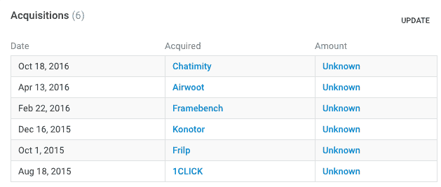

# Freshdesk 收购数据集成初创公司 pipe monk 

> 原文：<https://web.archive.org/web/https://techcrunch.com/2017/01/04/freshdesk-acquires-data-integration-startup-pipemonk/>

# Freshdesk 收购数据集成初创公司 Pipemonk

Freshdesk 今天宣布，它已经收购了总部位于孟加拉国的初创公司 Pipemonk，金额未披露。 [Pipemonk](https://web.archive.org/web/20221007040126/https://www.pipemonk.com/) 帮助公司在云平台之间移动数据，这对 Freshdesk 及其合作伙伴来说应该会很方便。

Pipemonk 原名 ZapStitch，自 2014 年成立以来已筹集了 200 多万美元，其中[的首轮融资于 2015 年 5 月](https://web.archive.org/web/20221007040126/http://www.iamwire.com/2015/05/cloud-integration-platform-zapstich-secures-2m-pre-series-funding-helion-orios/116290)进行，当时它获得了 Helion Venture Partners 牵头的 200 万美元种子资金。

Pipemonk 为客户提供了在 CRM、电子商务、营销和服务台服务等云应用程序之间轻松移动数据的能力。后者对 Freshdesk 尤其重要，其主要产品包括客户服务和服务台服务。

Pipemonk 的联合创始人 Satya Padmanabham 说，该公司简化了数据集成，这是一个传统上充满复杂性的过程。“有了 Pipemonk 平台，我们让非工程师也能在几分钟内配置和运行集成，”他在一份声明中解释道。

云服务和之前的本地软件之间的主要区别之一是[它们在很大程度上是用开放 API](https://web.archive.org/web/20221007040126/https://beta.techcrunch.com/2015/05/06/apis-fuel-the-software-thats-eating-the-world/)设计的，允许各种服务——甚至是那些相互竞争的服务——一起工作。策略不再是将您锁在专有堆栈中。取而代之的是，云服务意识到你需要和其他服务一起工作，因为客户需要，所以他们会适应。

Pipemonk 为 Freshdesk 提供的不仅仅是一种通用的方法来自动化服务之间的数据流。它将在内部进行实际应用，帮助整合 Freshdesk 在过去 16 个月的迷你购物狂欢中收购的六项服务。

过去 16 个月收购的 Freshdesk。今天增加了 Pipemonk。图表: [Crunchbase](https://web.archive.org/web/20221007040126/https://www.crunchbase.com/organization/zapstitch#/entity) 。

所有 13 名 Pipemonk 员工都将加入 Freshdesk，本质上是给它一个内部数据集成团队。Freshdesk 首席执行官兼创始人 Girish Mathrubootham 在一份声明中说:“让你的应用程序相互对话并实现无缝数据流在当今的任何业务中都发挥着重要作用，我们 Freshdesk 专注于为我们的客户简化工作流程。”

Freshdesk 于 2010 年作为云客户服务平台推出。自那以后，它已经将其产品扩展到包括 it 帮助台、CRM、实时聊天、应用内聊天和社交证明工具。该公司已经筹集了近 1.5 亿美元。