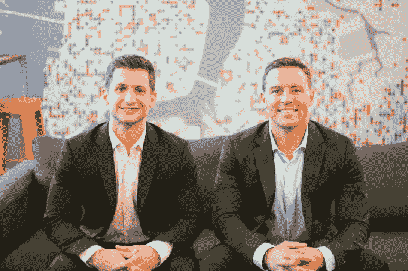

# 健康膳食配送初创公司新融资 2100 万美元 

> 原文：<https://web.archive.org/web/https://techcrunch.com/2016/07/12/freshly-series-b/>

[Freshly](https://web.archive.org/web/20221006180616/https://www.freshly.com/) 宣布已经筹集了 2100 万美元的 B 轮融资。

这家总部位于纽约市的公司提供健康餐，每餐价格约为 11 美元——这听起来可能像许多其他食品初创公司，但首席执行官迈克尔·怀斯特拉赫(下图为他和联合创始人卡特·康斯托克)表示，这种模式在一些关键方面有所不同。与 Blue 围裙等餐包服务不同，新鲜的饭菜不需要任何烹饪(你只需要在微波炉或炉子上加热它们)，也不同于 Sprig 等按需用餐服务，新鲜只是在给定的一周内一次性交付所有的饭菜。

“我们的思维过程是，按需意味着不同的东西，”Wystrach 说。“我们想说的是，当你想要牙膏时，你可以让别人给你送来，但你的医药箱里已经有牙膏是真正的按需供应。当人们饿的时候，你现在也饿了。你不希望必须等待。”

他补充说，在他看来，Freshly 的真正竞争对手不是科技初创公司，而是餐馆和杂货店的传统选择。

【T2

显然，该公司是从 Wystrach 试图吃得更健康和减肥的个人经历中产生的——他将这项服务比作拥有自己的私人营养师为你做饭。

顾客可以选择从每顿饭 11.50 美元开始的计划，一周吃六顿饭(每顿饭的价格会随着你点的越多而下降)。你从一个更大的菜单中选择特定的膳食——每个选项都应该包括健康的蛋白质和蔬菜，并且不含麸质和加工糖。该公司正在努力增加针对特定饮食的选择，如素食主义和旧石器饮食。

Freshly 现在声称每月向 28 个州提供 250，000 份饭菜，之前在 A 轮融资中筹集了 700 万美元。新一轮由 Insight Venture Partners 领投，之前的投资者 Highland Capital Partners 和 White Star Capital 也有参与。

Wystrach 表示，这将有助于将该服务扩展到美国的所有 50 个州(并使这些州的任何人都可以使用该服务，而不仅仅是生活在主要大都市地区的客户)。它还将允许 Freshly 扩展其菜单并改进其技术。

“随着时间的推移，当我们开始单独了解你，了解你喜欢或不喜欢的食物时，我们对技术与食物的融合感到兴奋，”他说。"然后我们可以提供量化自我的另一面."