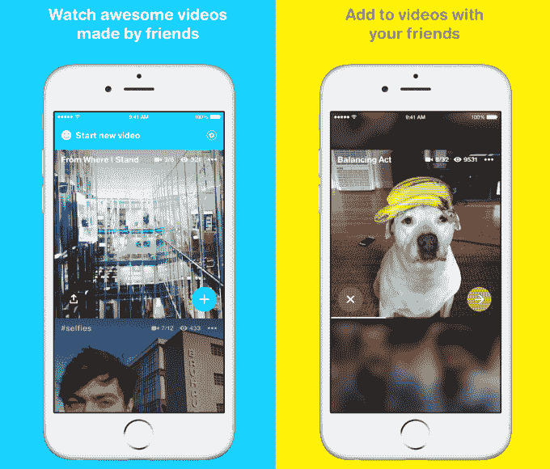
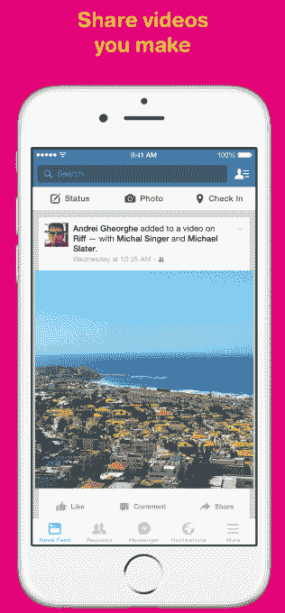

# 脸书的最新应用 Riff 让朋友们可以在协作视频中添加剪辑

> 原文：<https://web.archive.org/web/https://techcrunch.com/2015/04/01/friends-contribute-then-their-friends-contribute-then/>

你可以用[脸书的新应用 Riff](https://web.archive.org/web/20230404070746/http://newsroom.fb.com/news/2015/04/riff-make-videos-with-friends/) 开始下一个哈莱姆摇摆舞式的众包视频现象，它今天在全球以 15 种语言在 [iOS](https://web.archive.org/web/20230404070746/https://itunes.apple.com/us/app/riff-make-videos-with-friends/id971307496) 和 [Android](https://web.archive.org/web/20230404070746/https://play.google.com/store/apps/details?id=com.facebook.riff) 上发布。

在 Riff 中拍摄一个长达 20 秒的视频，并给它加一个标题，指示其他人应该给它添加什么，如“做一个有趣的表情”、“给约翰尼的生日祝福”或“香蕉先生的冒险”朋友们会在 Riff 上看到视频，并收到邀请他们投稿的通知，每个剪辑都被附加在末尾。然后，投稿人的朋友也被邀请添加场景。

脸书的 Riff 产品经理乔希·米勒说:“潜在的创意合作者可以从那里呈指数级增长，所以一个短视频可以成为朋友圈之间的一个发明项目，你可以分享到脸书或互联网上的任何地方。”

下面来看看[使用 Riff](https://web.archive.org/web/20230404070746/https://www.321riff.com/) 是什么感觉:

Riff 是脸书创意实验室的最新[项目，继纸张、弹弓、提及、房间和群组等应用设计实验之后。就像这些，即使它没有获得大规模的牵引，它可以告诉脸书人们想要什么，在这种情况下围绕视频。如果它确实在争夺增长，它可能会推动脸书的视频创作，但将不得不与其他合作视频应用竞争，如](https://web.archive.org/web/20230404070746/https://www.facebook.com/labs) [JumpCam](https://web.archive.org/web/20230404070746/https://techcrunch.com/2013/09/26/jumpcam/) 、 [Vyclone](https://web.archive.org/web/20230404070746/https://techcrunch.com/2013/03/13/social-video-app-vyclone-brings-its-collaborative-video-editor-to-the-web/) 、 [MixBit](https://web.archive.org/web/20230404070746/http://blog.mixbit.com/better-together-major-update-brings-collaboration-mixbit/) 和 Snapchat 的 Our Stories 功能。

这里你可以看到百老汇的电影《一个美国人》的演员在后台与粉丝交谈的片段视频。

## 一个新的迷因生成器

Riff 都是从人们把冰水倒在头上开始的。米勒说，Riff 的灵感来自 ALS 冰桶挑战，在这个挑战中，成千上万的 Facebookers 用户发布了他们为慈善事业进行同样寒冷跳水的视频。米勒说，这感觉像是合作，因为你必须被贴上标签，并贴上你想挑战的其他人的标签，以便为 ALS 研究捐款和/或被淋湿。

我 2009 年斯坦福大学网络社会学硕士学位的[期末论文](https://web.archive.org/web/20230404070746/http://www.scribd.com/doc/126081918/Symbiotic-Memes-A-Study-of-Meme-Popularity-Cycles-by-Josh-Constine)实际上就是关于这些模因的[，比如哈林奶昔](https://web.archive.org/web/20230404070746/https://techcrunch.com/2013/02/18/what-is-the-harlem-shake-so-popular/)和冰桶。如果你用一个模板开始一个迷因，这个模板能让你明白如何用你自己的内容替换其中一个变量来重新组合它，那么人们就会蜂拥而至，创造并分享他们自己的版本。代替你的朋友疯狂跳舞或者你被冻住了，会让注意力回到最初的迷因，并让它活得更久。

从 2014 年 5 月到 7 月，冰桶挑战[帮助脸书的视频浏览量增长了 50%](https://web.archive.org/web/20230404070746/http://newsroom.fb.com/news/2014/09/the-latest-on-facebook-video/),达到每天 10 亿次。如果脸书可以建立一个工具来催化和主持这些病毒式的视频爆炸，它可以吸收大量的视频参与，使其能够滑入利润丰厚的视频广告。因此，包括米勒在内的脸书伦敦办公室的一些员工开始在下班后喝啤酒的时候研究 Riff。

## 保留即兴表演，放弃即兴表演

以及一些重复播放的规则:

*   只能用 Riff 拍视频，不能上传。你会得到一个 3-2-1 倒计时，并可以在发布前批准你的剪辑，但没有像 Instagram、Vine 和其他应用程序那样的多镜头录制或编辑功能。
*   Riff 里没有喜欢和评论。米勒说，我们的目标是让人们做出贡献，所以 Riff 的设计是为了让拍摄未经修饰的自发视频“有吸引力”。
*   观众可以点击快进无聊的片段，与 Snapchat 故事非常相似。
*   只有视频创作者的朋友或合作者才能贡献视频，使其通过社交图病毒式传播，而不是立即传遍全球。
*   不过，你的视频最终可能会非常公开，因为 Riff 将在其主页上展示用户视频主题，以激励其他用户。点击率将有助于激励人们追求名声。
*   当你发布一个 Riff 视频到脸书，所有的贡献者都会被自动标记。
*   原创者可以调整他们的线程，点击视频上的“三点”按钮来删除他们不想要的剪辑。Riff 上的任何人都可以举报任何特定的片段令人不快，而脸书用户可以举报整个视频包含一些糟糕的内容。
*   虽然它现在可以在全球的 iOS 和 Android 上使用，但它只支持 15 种语言，包括英语、西班牙语、葡萄牙语、法语、意大利语、泰语、越南语、日语和波兰语。
*   脸书目前没有直接利用 Riff 赚钱的计划，但上传到脸书的更多视频会让它更容易展示视频广告来赚钱。

现在的问题是 Riff 是否会受到任何关注。脸书之前的创意实验室项目大多以消费产品的形式失败了。Riff 当然不是新的。它基本上是一个更简单的 [JumpCam](https://web.archive.org/web/20230404070746/https://jumpcam.com/videos/6b3CBu1p7CLj0VZBAfwEAW) 的克隆，做了 [Everlapse](https://web.archive.org/web/20230404070746/https://techcrunch.com/2013/07/11/everlapse/) 为照片做的事情，并提供了 Snapchat 编辑精选的用户策划版本。

JumpCam 首席执行官大卫·斯图尔特表示:“核心机制……它与 JumpCam 有着惊人的相似之处。”。然而，他警告称，用户生成视频的挑战促使他转向新的应用 Fade。“我们想不出如何让足够多的人一起创作有趣的视频供其他人观看。很难让多个人一起为一件事情做出贡献，因为内容的质量完全没有障碍。”

也许这就是为什么协作视频的专用产品变得如此巨大，所以我们将拭目以待脸书是否能打破这些应用程序及其创意实验室项目(如 Slingshot)的趋势。

据 [AppAnnie](https://web.archive.org/web/20230404070746/https://www.appannie.com/apps/ios/app/878681557/) 报道，脸书创意实验室的最新内容创作应用“弹弓”像石头一样沉了下去

但米勒表示，大规模增长并不是 Riff 成功的唯一途径。米勒对期望进行了管理，他说:“我们希望能从视频中学到一些东西——人们想如何分享，什么样的视频体验让分享变得容易，人们如何选择使用视频与他人交流，他们是否想要更多的工具，等等。”

已经有效果了。脸书一直在测试其独立应用中的功能，然后将其带回主要应用中。它用脸书相机开发了滤镜，用信使开发了贴纸，用纸开发了动画手机设计，用弹弓开发了绘画。

正如我去年写的那样，这就是“[为什么独立应用会失败](https://web.archive.org/web/20230404070746/https://techcrunch.com/2014/08/04/why-standalone-apps-are-supposed-to-fail/%20)”。像脸书这样的巨人有资源指派小分队向长城扔意大利面。即使只有最多汁的肉丸有棍子，母公司也会得到资助。没什么可失去的。

米勒总结道，“对于团队来说，这主要是一个实验性的附带项目，结果证明非常有趣。”