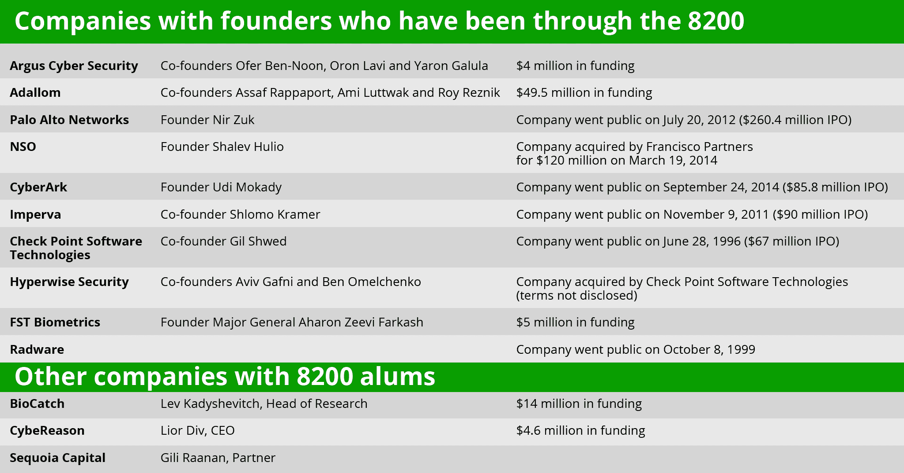

# 从以色列陆军 8200 部队到硅谷

> 原文：<https://web.archive.org/web/https://techcrunch.com/2015/03/20/from-the-8200-to-silicon-valley/>

**编者按:** *Idan Tendler 是 Fortscale 的首席执行官兼联合创始人，Fortscale 是一家为财富 1000 强企业提供大数据分析驱动的安全解决方案的公司。在创建 Fortscale 之前，Tendler 是以色列国防军网络战部门 8200 的主要特工。*

以色列是一个大约 800 万人口的小国，它是如何产生出比世界上任何国家都多的科技创业公司和人均风险投资的呢？为什么一个自然资源匮乏的国家在纳斯达克上市的公司比欧洲、日本、韩国、印度和中国的总和还要多？

要理解以色列的创新成功，只需看看以色列国防军和该国为年轻人服务的强制性政策。对于我和成千上万像我一样的以色列企业家来说，我们的创业之旅始于以色列国防军的技术部门。特别是一个单位已经成为一个多产的技术孵化器，特别是在网络安全领域:IDF 单位 8200。

8200 是一个特殊的单元，在许多方面，它的运行就像一个高科技创业公司。它始于发现最优秀的人才。以色列国防军侦察兵对全国的高中进行梳理，以便在早期就发现高潜力的候选人。他们的目标是具有卓越分析能力的学生，这些学生能够快速做出决定，并在团队环境中工作得很好。只有最优秀、最聪明的人才会进入这个精英网络安全团队。

8200 的技术人员不再依赖外部研发，而是直接与他们的“客户”(情报人员)合作。该部门的所有技术系统，从分析到数据挖掘、拦截和情报管理，都是内部设计和制造的。技术专家每天与他们的用户坐在一起，以确保他们的“产品”符合情报官员的具体要求。

结果是，8200 名校友甚至在创办第一家公司之前，就已经具备了关键的创业技能和经验。这就是为什么 CheckPoint、Imperva、Nice、Gilat、Waze、Trusteer 和 Wix 等技术公司都植根于英特尔信息技术峰会的原因。

[
点击放大 ](https://web.archive.org/web/20230325210053/https://techcrunch.com/wp-content/uploads/2015/03/8200-list.png)

在我的 8200 训练中，最早也是最有意义的一次是在 1999 年的一个雨天。与我的一些高中朋友不同，他们已经是驻扎在寒冷的内盖夫沙漠的战斗学员，8200 部队的训练是在舒适温暖的教室里进行的。我们是一群 18 岁的孩子，再过几个月，他们将在以色列的 NSA 中领导复杂的情报技术行动。

在这个密集的课程中，我们学习了如何产生智能，利用最先进的 SIGINT(信号智能)，利用复杂的数据挖掘技术，并构思高度先进的技术。在那个特别的雨天，我们的教官让我们进行了一次模拟练习。

他们为我们提供了数百条短小的虚构的情报。每一个，就其本身而言，都显得无关紧要。然而，很快，我的一个同学，一个未来的情报官员，开始拼凑呈现给我们的拼图。

他大喊:“一场战争即将爆发！”

受训人员之间爆发了一场激烈的辩论，讨论我们所得到的看似无关的信息的真正含义。

我们的导师用模拟来激发热烈的讨论，也许更重要的是，一个领导力测试案例。当我们热烈地争论一场战争是否会在我们虚构的国家发生时，我们的导师戏剧性地停止了模拟并结束了讨论。他们告诉我们，模拟是基于现实生活中的事件，事实上，一场战争已经爆发。我的同学是对的。

对我和我的同学来说，这是一堂重要而深刻的课。我们了解到在情报工作中取得成功需要的不仅仅是纪律和专业精神。成功需要跳出框框的思维，挑战传统智慧的勇气，以及避免自大的能力。一名优秀的情报官员需要知道何时绕过等级制度，并愿意承担风险和犯错误。

今天，作为一名首席执行官和企业家，回顾我在 IDF 8200 上度过的时光是一件令人着迷的事情。这是一次形成性的学习经历，有助于指导我领导一家快速增长的初创公司。作为没有大学或专业经验的年轻人，我们定期运行复杂的技术项目和启动创业公司。我们发明了数据挖掘和调查技术的最佳实践。我们学会了质疑权威和传统的思维方式，以不断改善结果。

我们的团队几乎全天候工作，毫不畏惧我们面临的挑战。我们几乎没有任何报酬。正是在 8200 中，我了解到发明的热情始于领导力和价值观。它始于这样一种信念:你有责任感，并且正在做一些能够改变世界的重要事情。

几年后，我召集了 8200 名退伍军人创建了 Fortscale。我们应用从我们的军事服务中学到的哲学、高级机器学习和数据挖掘概念来识别恶意用户活动并开发安全分析解决方案。

但是我们的 8200 经历教会了我们许多比网络安全技术和工具更有价值的课程。我们认识到，创业要想成功，就必须愿意在充满挑战的情况下不断冒险，即使我们面对的是国家级的网络对手。成功需要坚持不懈的改进和从失败中学习。