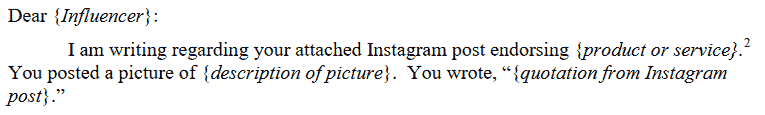

# 联邦贸易委员会告诉“有影响力的人”不要试图掩盖他们在为品牌买单的事实

> 原文：<https://web.archive.org/web/https://techcrunch.com/2017/04/20/ftc-tells-influencers-to-quit-trying-to-hide-the-fact-that-theyre-shilling-for-brands/>

# 联邦贸易委员会告诉“有影响力的人”不要试图掩盖他们在为品牌买单的事实

美国联邦贸易委员会已经通知了几十名所谓的有影响力的人，因为[未能充分证明](https://web.archive.org/web/20230407181425/https://www.ftc.gov/news-events/press-releases/2017/04/ftc-staff-reminds-influencers-brands-clearly-disclose)他们的 Instagram 等帖子实际上是几乎不加掩饰的广告，发帖人为此获得了丰厚的报酬。

该机构向“名人、运动员和其他有影响力的人”发出了 90 多封信，提醒他们“清楚而显著地披露”帖子是由赞助的，或者有公司以其他方式支持他们。

 也没有可爱的东西，联邦贸易委员会在信中说。

例如，不要把你的赞助商信息放在“更多”按钮下面，这样没人会看到。不要含糊其辞地掩饰成“谢谢耐克”，好像耐克很酷，因为你友好地提出要求，就让你使用他们的企业度假海滩别墅。还有！不要用晦涩难懂的术语，比如#sp 或#partner，来掩盖真相，把它隐藏在标签的海洋里。

Instagram 可能应该在这一点上只为赞助商的帖子添加一个特殊的过滤器。