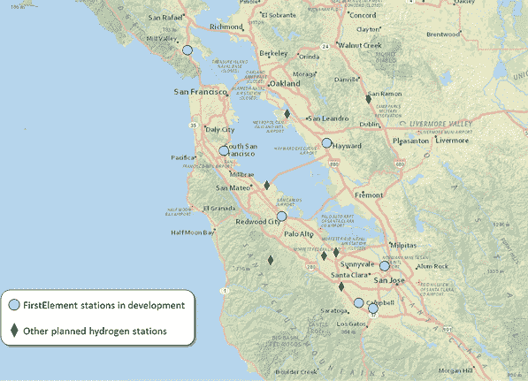

# 燃料电池汽车明年将在加州大受欢迎 

> 原文：<https://web.archive.org/web/https://techcrunch.com/2014/07/09/fuel-cell-cars-are-going-to-get-a-big-boost-in-california-next-year/>

到 2015 年 10 月，我们可能还没有悬浮滑板，但是由于来自 T2 加州能源委员会和丰田的投资，我们将会有一些未来的东西:在加州运行的氢经济的雏形。

那个月， [FirstElement Fuel](https://web.archive.org/web/20221209205036/http://www.firstelementfuel.com/) 将在加利福尼亚州开设 19 个新的氢燃料站，来自[加州能源委员会](https://web.archive.org/web/20221209205036/http://www.crunchbase.com/organization/california-energy-commission)的 2720 万美元拨款和来自[丰田](https://web.archive.org/web/20221209205036/http://www.crunchbase.com/organization/toyota)的 720 万美元贷款。另外 9 个将在该州开放，通过拨款的方式将资金分配给该州的其他提案。

随着氢燃料站的数量从目前的 9 个增加到 4 倍以上，汽车公司最终将能够推出燃料电池汽车，与电池电动汽车相比具有明显的优势。

例如，丰田去年秋天在东京发布了其燃料电池汽车概念[(如上图所示，在今年的 CES 上),并承诺将于明年投入大规模生产。这款车和凯美瑞差不多大，有一个由氢燃料电池驱动的电动机。多亏了高压油箱，它能够储存足够的氢气，在不加油的情况下行驶 300 多英里，比最高端的特斯拉 Model S 还要多 40 英里，而且没有对环境有害的排放。](https://web.archive.org/web/20221209205036/http://www.toyota.com/fuelcell/)

在电话中，丰田高级技术全国经理克雷格·斯科特(Craig Scott)解释说，燃料电池汽车的技术已经准备了几年，但基础设施仍未到位，无法让大多数司机使用。尽管理论上它们的行驶里程比带电池的电动汽车要远得多，但如果人们购买或租赁一个加氢站，他们就无法离开有加氢站的地区，因为下一个加氢站太远了。

2015 年，同时进行的氢基础设施的扩张和丰田、本田和现代汽车的发布将对整个行业产生加速效应。由于加油站的存在，丰田现在能够将他们的氢平台投入大规模生产，这带来了显著的成本节约，因为该公司可以开始从其他动力系统中引入零件，并在有限的数量内“手工”制造更少的零件。

FirstElement Fuel 首席执行官乔尔·伊万尼克(Joel Ewanick)今天早上告诉我，由于这些早期投资，未来氢气站的部署将节省大量资金。随着水泵数量的增加，伊万尼克告诉我，在未来十年内，建造一个电站的成本可能会下降 50%，燃料成本会下降 30-40%。伊万尼克说，五年内，FirstElement 的这些站点将会盈利，因为“这是一种非常简单的商业模式。”

氢燃料汽车之所以如此诱人，是因为它们可以在化石燃料汽车的行驶里程内实现零排放。不过，这个零后面有一个星号:有些氢的来源比其他氢更环保。如果你用煤发电将水转化为氢，那就不太干净。

伊万尼克说，南加州 FirstElement 站 33%的氢气将来自可再生沼气(该州要求的[最低量)，而 35%将来自该州北半部。“我们可以花更多的钱来达到 100%，”他说，但所涉及的价格对他们或司机来说不会很好。](https://web.archive.org/web/20221209205036/http://www.energy.ca.gov/releases/2014_releases/2014-05-01_hydrogen_refueling_stations_funding_awards_nr.html)

应该指出的是，虽然明年推出后，加州大多数大都市地区的驾驶距离内都将有氢气站，但它仍然不会像今天给你的汽车加满汽油那样方便。作为一个例子，这是 FirstElement 在湾区即将到来的车站的地图；如果我住在旧金山，我不会想开那么远的路去加油:

加州希望到 2025 年有 150 万辆零排放汽车上路，并且正在为此投入资金。到目前为止，其加速替代和可再生燃料和技术的[项目](https://web.archive.org/web/20221209205036/http://www.energy.ca.gov/drive/)已经投资超过 4 亿美元用于促进氢、生物燃料和运输电力的项目。