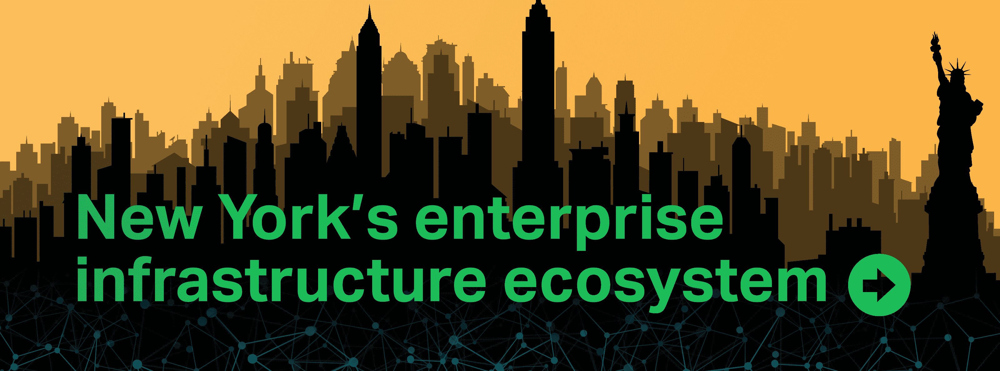

# 全金属包承载云基础设施的未来 

> 原文：<https://web.archive.org/web/https://techcrunch.com/2018/04/21/full-metal-packet/>

云计算是数据中心的一场革命。公司不再投资昂贵的硬件和直接管理数据中心，而是依赖公共云提供商，如 AWS、Google Cloud 和 Microsoft Azure，以高度灵活的方式提供通用和高可用性的计算、存储和网络资源。

然而，随着工作流转移到云，公司越来越意识到，与他们过去拥有的硬件相比，这些抽象的资源可能非常昂贵。很少有公司想回到自己直接管理硬件的状态，但他们也渴望拥有过去享受的性价比水平。此外，他们希望利用定制和专用硬件的全新生态系统来处理独特的工作流——想想机器学习应用的[张量处理单元](https://web.archive.org/web/20221025222508/https://cloud.google.com/blog/big-data/2017/05/an-in-depth-look-at-googles-first-tensor-processing-unit-tpu)。

这就是[数据包](https://web.archive.org/web/20221025222508/https://www.packet.net/)进来的地方。这家总部位于纽约的初创公司的平台提供了一个高度可定制的基础设施，用于在云中运行裸机。Packet 的客户“拥有”他们选择的硬件，因此他们可以使用该硬件的所有资源，而不是与其他用户共享一个实例。

更有趣的是，Packet 还将为其数据中心部署定制硬件，目前该数据中心在全球共有 18 个。因此，例如，如果您想在其中一半的中心冗余地部署一个量子计算箱，Packet 将为您处理安装这些箱、设置它们和管理基础设施的后勤工作。

该公司由扎克·史密斯、雅各布·史密斯和亚伦·韦尔奇在 2014 年创立，根据 Crunchbase 的数据，它已经筹集了总计 1200 万美元的风险投资融资，最后一轮由软银牵头。“我走了通常的路，去了茱莉亚音乐学院，”扎克·史密斯在他的办公室对我说，他的办公室俯瞰着曼哈顿市中心的世界贸易中心。低音提琴是他的初恋，但他最终进入了互联网主持行业，在纽约的 Voxel 公司担任首席运营官。

在 Voxel，Smith 说他是在云计算刚刚起步的时候在主机服务中成长起来的。“我们看到了用户的这种变化，从一个关心汤姆的硬件的系统管理员，变成了一个从来没有打开过电脑，但突然开始精心设计基础设施的开发人员，”他说。

创新是开发人员的生命线，然而，公共云越来越多地从开发人员那里抽象出底层基础架构的任何细节。史密斯解释说，“基础设施变得越来越私有，成为少数公司的领地。”虽然他曾经想过离开后体素的托管世界，但他和他的联合创始人看到了从金属开始重新思考云基础设施的机会。

“我们的客户是千禧一代的开发者，32 岁，他们从来没有打开过 ATX 案例，你怎么可能以同样的方式给他们，”Smith 问道。Packet 的想法是将基础设施的选择权带回给这些开发人员，同时抽象出他们不想参与的实际数据中心物流。“你可以选择自己的观点——我们是硬件独立的，”他说。

给开发者更多的裸机选择是一个有趣的提议，但我认为最引人注目的是 Packet 的长期愿景。简而言之，该公司希望彻底改变全球硬件开发的模式。

风投们越来越多地投资于专门的芯片和内存来处理独特的处理负载，从机器学习到量子计算应用。在某些情况下，与通用芯片相比，这些芯片可以以指数级的速度处理工作负载，这在规模上可以为公司节省数百万美元。

Packet 的使命是通过本质上成为一个市场，连接原始设备制造商和最终用户开发商，来鼓励这一生态系统。“我们经常使用 WeWork 模型，”史密斯说。他的意思是，Packet 允许你租用其全球数据中心网络的空间，并处理安装和监控硬件盒的所有后勤工作，就像 WeWork 允许公司租用房地产，同时处理像重置咖啡过滤器这样的细节。

在这一愿景中，Packet 将创造出更有眼光、更多样化的买家，让制造商开始瞄准更专业的利基市场。推动几乎所有云购买的英特尔通用 x86 处理器已经一去不复返，取而代之的可能是数十家新的硬件供应商，他们可以在开发人员中建立自己的品牌，并拥有计算和存储工作负载的细分市场。

通过这种方式，开发者可以破解他们的基础设施，就像上一代人破解他们的个人电脑一样。他们现在可以更容易地测试新硬件，当他们找到他们喜欢的特定硬件时，他们可以在短时间内让它在云中运行。Packet 不仅成为基础设施运营商，而且成为连接买家和卖家的渠道。

这是 Packet 的大愿景。实现这一点将需要硬件制造商越来越多地制造差异化的芯片。更重要的是，公司必须拥有独特的工作流，必须达到优化这些工作流的规模，并认识到他们可以将这些工作流与特定的硬件相匹配，以最大限度地提高其性价比。

这听起来可能是一个艰巨的任务，但 Packet 的梦想就是创造这样的市场。如果成功，它可能会改变硬件和云供应商的合作方式，并最终改变任何 32 岁的千禧一代开发人员的创新，他们不喜欢插入盒子，但希望插入创新。

