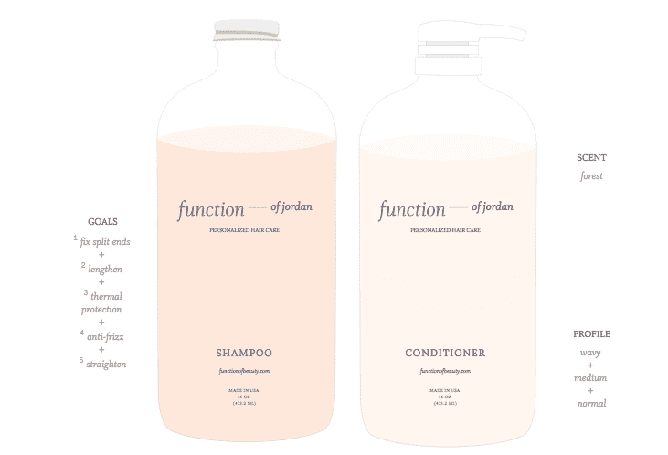

# 由 Y Combinator 支持的 Function Of Beauty 提供定制洗发水和护发素

> 原文：<https://web.archive.org/web/https://techcrunch.com/2015/12/10/function-of-beauty-backed-by-y-combinator-offers-customized-shampoo-and-conditioner/>

人们很容易被当地商店护发区的无数选择所淹没，但事实证明，在所有这些产品中，大多数洗发水和护发素的配方在不同品牌之间没有太大差异。

一家新的 Y Combinator 公司“美丽的功能”正在寻求改变这一切。

该公司让用户选择一种气味，并描述他们自己的头发类型，选项从直发到卷发，干性到油性，以及稀疏到粗糙的头发。从那里，用户可以选择不同的头发目标，结合像加强热保护和防卷曲这样的事情。

“美丽功能”目前根据头发类型和目标提供了 4.5 亿种不同的组合。

“大多数产品会迎合一种头发类型或一个特定的目标，”联合创始人兼首席执行官扎希尔·多萨说。"很少有人能同时满足多个目标."

如果你不知道你需要什么，美容功能提供了与头发化学家的即时聊天，以帮助你自我评估和选择目标。该公司表示，未来将提供一个工具包，帮助那些不确定自己需要什么的人确定合适的配方。

目前，该团队正在手工灌装每个瓶子，并使用软件算法来确定洗发水和护发素的超精确配方。然而，最终，Function of Beauty 将使用一种先进的机器人机器来自动创建每个配方并灌装瓶子。

“一旦我们建造了这台机器，我们将能够处理 100 种不同的成分混合，产生 9000 亿种组合，”多萨说。“这个数字让地球上的人口数量相形见绌，更不用说市场上数量相对较少的洗发水和护发素了。”

除了配方定制，该公司还提供命名特定配方的能力，定制名称就印在瓶子上。

“有些人可能对他们使用的产品完全着迷，不想改变任何一件事情，但这些人很少，即使这样也需要根据季节或发型的变化来更换产品，”Dossa 说。“我们可以根据这些变化为顾客快速改变配方，允许无数次的调整，这样我们的顾客就总能得到完美的洗发水。”

美妆功能通过直接在网上销售给消费者来保持相对较低的价格。一套 8 盎司的要 26 美元，一套 16 盎司的要 38 美元。相比之下，Suave 等低端产品的价格约为 10 至 15 美元，而 Fekkai 洗发水和护发素等高端产品的价格高达 50 美元/套。

“美丽的功能”是由两位麻省理工的毕业生查希尔·多萨和约书亚·马西耶斯基，以及化妆品化学家海因·阮共同创立的。该公司主要由创始人自己资助，还有 10 万美元的朋友和家人资助。

[vimeo 131560682 w=640 h=360]

[美容功能:个性化护发(www.functionofbeauty.com)](https://web.archive.org/web/20230325080833/https://vimeo.com/131560682)从[美容功能](https://web.archive.org/web/20230325080833/https://vimeo.com/functionofbeauty)到 [Vimeo](https://web.archive.org/web/20230325080833/https://vimeo.com/) 。

你可以点击查看网站[。](https://web.archive.org/web/20230325080833/https://functionofbeauty.com/)