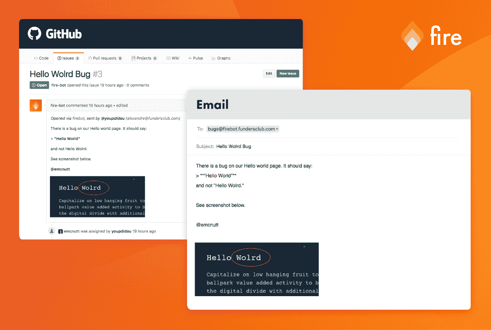

# FundersClub 在 scale TechCrunch 试验全方位在线风险投资模式

> 原文：<https://web.archive.org/web/https://techcrunch.com/2017/03/08/fundersclub-experiments-with-the-full-service-vc-model-at-scale-with-the-launch-of-catalyst/>

慢慢推翻刻板印象，在线风险投资已经成为科技金融的可行工具。然而，尽管这种模式为投资者赚了钱，但该行业仍面临着为钱而卖钱的观念，而不太关心企业家与投资者之间微妙的关系。作为最早也是最活跃的在线基金之一，FundersClub 正在组建自己的八人工程团队，为其投资组合打造黑客技术，并尝试规模化的全方位服务风险投资公司。

[FundersClub 的努力，Catalyst，](https://web.archive.org/web/20221005184621/https://catalyst.fundersclub.com/)通过关注创始团队而不仅仅是创始人来区分自己。首批发布的三个工具集是 Fire bot、Standup 和 Reports。现在可用的 Fire bot 使非技术团队成员只需发送一封电子邮件就能报告 GitHub 上的错误。希望将工程师从地狱中拯救出来，即来自 Jimmy 的随机工作流中断，Jimmy 是善意的，但却是孤陋寡闻的业务开发助理。

站立和报告将在未来几周内发布。站立会议将在普通的每周站立会议之前总结 GitHub 的活动，有效地有声进度报告。报告将通过向 Slack 发送每周工程活动指标来提供类似的功能。FundersClub 的[之前的工程项目是网络搜索，](https://web.archive.org/web/20221005184621/https://beta.techcrunch.com/2016/10/20/online-vc-fundersclub-launches-network-search-to-better-connect-its-18000-members/)试图利用其庞大的社区向创始人和投资者传递网络效应。

提供全方位服务的风险投资公司并不新鲜。它以实物形式存在了很多年，由安德森·霍洛维茨和首轮资本这样的公司发扬光大。这些公司向自己的公司投入大量资金来构建专有软件，以帮助他们的内部采购和尽职调查流程，并通过专有的 LinkedIn 风格的工具来帮助投资组合公司。

布雷特·贝尔松是第一轮平台团队的合伙人和领导者，他告诉我，他的团队花了 75-80%的时间为投资组合公司开发工具。但是这些工具与 FundersClub 网络搜索的共同点比 Catalyst 更多。首轮投资组合公司可以私下互相提问，并参考匿名的薪酬、福利和供应商数据。

“软件必须有粘性，”贝尔松说。“许多公司需要一个整体战略，这样它就不会成为资源不足的鬼城。”

[凯鹏华盈&拜尔斯边缘](https://web.archive.org/web/20221005184621/https://www.kpcbedge.com/)是工程师和沙丘路碰撞的另一个例子。EDGE 的创始合伙人 Anjney Midha 领导开发了一款名为 Office Hours 的应用程序，该程序摒弃了精英们梦寐以求的热情介绍，转而支持一个开放的 messenger，让任何人都可以与种子期基金的合伙人聊天。

但这些努力都没有让普通的早期创业员工受益。重要的是，与其他专有产品不同，Catalyst 完全对公众开放。虽然 FundersClub 的形象无疑受益于每一次下载和提及，但初创公司的员工只是希望 s**t 发挥作用。这就是产生影响所需要的一切，取代单个运营商完成工作的黑客，无论是产品搜索的小事情还是 Asana、Slack、GitHub、Salesforce 等的大组合。

从生态系统的角度来看，提供全方位服务的在线风险投资的表现形式应该是软件。合作伙伴无法扩展，南方市场的晚宴、个人介绍或营销和战略服务也是如此。剩下的唯一问题是，竞争对手是否认为 Catalyst 是一种值得追随的趋势，还是一种不必要的干扰。