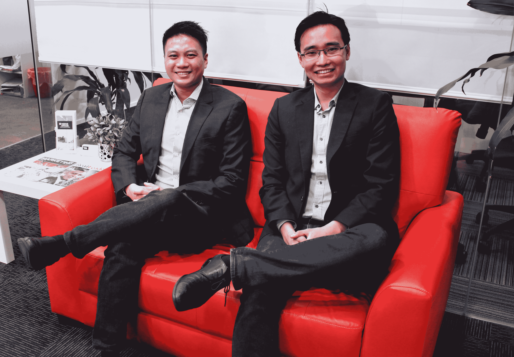

# 东南亚贷款平台 Funding Societies 获得由软银风险投资韩国公司领投的 2500 万美元 B 轮融资

> 原文：<https://web.archive.org/web/https://techcrunch.com/2018/04/17/funding-societies-a-southeast-asian-lending-platform-gets-25m-series-b-led-by-softbank-ventures-korea/>

资助社团联合创始人 Reynold Wijaya 和 Kelvin Teo。

东南亚 P2P 贷款平台 Funding Societies 今天表示，它已经筹集了 2500 万美元的 B 轮融资，由日本科技集团的早期风险投资部门软银风险投资韩国(Softbank Ventures Korea)牵头。这轮投资包括回归投资者红杉印度(Sequoia India)，它在两年前领导了这家总部位于新加坡的初创公司的 A 轮，金门风险投资公司和阿尔法 JWC 风险投资公司，以及新的支持者 Qualgro 和 LINE Ventures。

融资协会还表示，它已经从银行和金融机构那里提高了信贷额度，以便向中小企业放贷。这家初创公司由 Kelvin Teo 和 Reynold Wijaya 于 2015 年创立，其名称代表了其“东南亚金融普惠的愿景”。

在新加坡、印度尼西亚和马来西亚运营的 Funding Societies 说，它的 B 系列被超额认购。

首席执行官 Teo 告诉 TechCrunch，当它在 2016 年 8 月宣布 750 万美元的 A 轮融资时，融资协会已支付了 870 万新加坡元，这一数字已增长到 1.45 亿新加坡元。自成立以来，这家初创公司已将其贷款人基础增加到 6 万多人，目前声称违约率不到 1.5%，低于两年前的约 2%至 3%，这要归功于其承销模式的改进。

在一份新闻声明中，软银风险投资韩国合伙人兼董事总经理 Sean Lee 表示，该公司“一直在东南亚积极投资。东南亚的中小企业数字借贷是我们看到巨大增长潜力的地方。在众多玩家中，我们印象最深的是资助社团在短时间内取得的成就及其继续成为头号玩家的潜力。”

虽然 Teo 说，资助社团“总是在探索其他市场，但在目前的三个市场中，我们仍有大量工作要做。”尽管在过去的三年里有了相当大的增长，这家初创公司的口号是“慢而稳”，Teo 在我们的采访中经常重复这个词。

“我们强调的一个关键点是，对我们来说，缓慢而稳定的增长比快速而鲁莽的增长更重要，因为这是一个基于信任的行业，”Teo 说。

“我们需要发放贷款，并能够收回贷款，所以我们专注于了解市场，理解市场，解决关键的痛点，而不是发放一堆贷款来获得高额回报，吸引风投。”

例如，尽管该平台未来可能会提供个人贷款，但 Teo 表示，目前它只向中小企业提供贷款，因为“我们认为，从战略上讲，我们更适合为小企业服务，就我们公司的价值观而言，我们认为为中小企业服务是一种扩张努力。消费金融，在我们个人看来，更是消费金融。这无助于经济增长。”

该公司服务的许多中小企业都非常小。例如，它的一些印尼借款人每年的收入约为 5000 美元。

“许多借款人正在寻求他们的第一笔商业贷款，没有其他融资来源。Teo 说:“许多金融机构采取抵押担保方式，而许多新兴企业无法通过这种方式获得融资。

“但我们也看到一些人以充值的形式来到我们这里。他们已经有一笔银行贷款，但对他们来说还不够，所以他们来找我们，因为他们受到抵押品规模的限制。此外，我们能够比传统机构更快地处理融资。”

融资协会的成立是为了给中小企业提供更多的融资途径，其中许多中小企业以前主要依赖朋友和家人的贷款。该公司指出，安永(Ernst & Young)、大华银行(UOB)和邓白氏(Dun & Bradstreet)最近的一项研究显示，东南亚 65.2%的中小企业不容易获得传统的商业融资，尽管大多数中小企业对其他选择持开放态度，包括 P2P 贷款平台。

该公司表示，它是马来西亚第一个在线 P2P 贷款平台，根据第三方数据，它现在是马来西亚领先的中小企业贷款平台，也是新加坡三大 P2P 贷款平台之一。它在印度尼西亚也占有相当大的市场份额。

尽管其平台使用算法进行初步申请筛选，但取决于贷款规模，很大一部分工作仍由资助社团的员工完成，这些员工的数量已从 2016 年的 70 人增加到现在的 165 人(Teo 表示，该公司目前正在认真招聘，并愿意为有前途的人才支付安置费用)。几乎所有的申请人都直接和公司的人交谈。小额贷款的规模从 500 美元到 40，000 美元不等，通常需要大约两个工作小时才能批准和发放，而大额贷款的申请人可能需要等待几天到大约一周。

Teo 说:“如果我们留太多的钱在桌面上，我们已经在内部进行了很多辩论和讨论，因为我们的违约率低于我们所服务的市场中的某些银行，但鉴于我们在贷款市场上仍处于相对初级的阶段，并且没有对金融危机的控制，保持谨慎比鲁莽增长更重要。”。

这种系统的方法在进入新市场时也很重要。尽管许多外部观察人士对“东南亚”这个总括术语的理解有点过于字面化，忽略了每个国家之间的文化差异，但 Teo 表示，这仍是一个分散的市场，因此金融服务公司需要谨慎地进行本地化。他补充说，当资助社团进入一个新市场时，它可能会从以前的市场移植大约 50%的技术和商业模式，但另一半必须从头开始建立，以考虑经济和文化差异。

“中小企业融资是一项非常本地化的业务。有了足够的资本，你就能赢得市场，而这实际上是由补贴和强有力的营销推动的，”Teo 说。“但对于中小企业来说，你真的真的需要了解当地市场。”