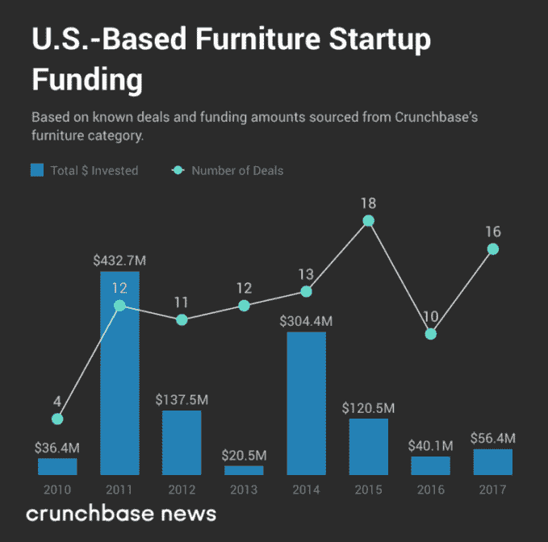

# 家具创业公司跳过展厅，直接上门 

> 原文：<https://web.archive.org/web/https://techcrunch.com/2018/07/14/furniture-startups-skip-the-showroom-and-go-straight-to-your-door/>

More posts by this contributor

让送货和运输变得比以往任何时候都容易的初创公司受到了风险资本家的欢迎，因此，提供家庭必需品——客厅家具、餐桌、沙发等——的年轻科技公司正在筹集大笔资金也就不足为奇了。

从 2010 年到 2017 年，风险投资者在已知的 96 轮融资中为美国家具初创公司提供了略高于 11 亿美元的资金。但如下图所示，这些资金并没有随着时间的推移而平均分配:

根据 Crunchbase 的数据，在 2011 年的 12 轮融资中，流入美国家具初创企业的资金总额创下了 4.327 亿美元的历史新高。致力于销售家具的电子商务网站 Wayfair 在那一年的首轮融资中筹集了 1.65 亿美元，占总交易额的三分之一以上。

不过，尽管资金没有超过 2011 年的水平，但从 2011 年到 2015 年，回合数稳步攀升。在此期间，对种子期和早期创业公司的投资占已知交易的 70%以上。

这一批种子和早期创业公司是否会成为后期投资者的饲料尚不清楚。在这之前，斯蒂芬·库尔认为还有更多工作要做。

通过互联网销售家具的公司 [Burrow](https://web.archive.org/web/20221207043655/https://burrow.com/) 的首席执行官库尔告诉 Crunchbase 新闻，“销售中国或墨西哥制造的传统家具并不创新，因此我们不希望看到大量的风险投资。”但这并不意味着风险投资者对该领域的兴趣注定要破灭。库尔补充说，“一家新公司必须提供一种独特的产品、体验和品牌，这种产品、体验和品牌要比传统产品好[10 倍]。期待资金跟随真正改变现状的新品牌。”

那可能会被证实。我们研究的融资数据讲述了一个特殊的故事:风险资金表现出对交付的偏好，消费者不容易把他们居住的地方称为“家”。

## 送，不要动，家具

对于城市居民来说，模块化、实用的沙发正在占据主导地位。越来越明显的是，你不必离开你的沙发去买一个。

让我们回到陋居，根据 Crunchbase 的数据，该公司总共筹集了 1920 万美元。这家初创公司为那些生活在密集的城市环境中并可能经常移动的人创造了一种模块化沙发。

“我们的客户反映了市场的大趋势。他们更可能是租房者，而不是房主，”库尔解释道。“他们可能会在几年内多次搬家，他们渴望周到、高质量的商品。”

为了应对这种新型顾客，Burrow 将沙发的每一部分都包装成不同的包装。陋居在其网站上声称，其直接面向消费者的商业模式及其运输部分沙发而不是整个沙发的能力，消除了“超过 70%的标准运输成本。”根据 Kuhl 的说法，这款沙发还包括 USB 充电器等现代设施，并且 Burrow 还“推出了一款 AR 应用程序，帮助客户可视化家中的 Burrow”。

然而，作为销售策略的一部分，陋居并没有完全避开展厅。在 TotalRetail 的播客采访中，库尔指出，这家初创公司在 20 多个城市的合作空间和其他零售场所设有“合作伙伴展厅”。

当然，尽管模块化设计对城市居民有所帮助，但也有一些人喜欢更个性化的设计。总部位于芝加哥的初创公司 Interior Define 已经筹集了 2720 万美元，直接向消费者提供沙发和餐厅套件。此外，Interior Define 的创始人罗布·罗耶(Rob Royer)表示，其吸引力来自新一代消费者，他们对“具有真实使命、提供承诺的体验、提供真正的价值主张(而不仅仅是较低的价格)”的品牌感兴趣。

也就是说，这两种选择仍然需要拥有家具——如果你经常搬家，或者只是想在没有承诺的情况下焕然一新，这是一个不必要的负担。通过[羽毛](https://web.archive.org/web/20221207043655/https://www.crunchbase.com/organization/feather-2)，顾客可以以低至每月 35 美元的价格订阅整个客厅、卧室或餐厅。根据 Crunchbase 的数据，这家总部位于纽约的初创公司已经从 Y Combinator 和 Kleiner Perkins 等老牌风险投资公司那里筹集了 350 万美元。

也有初创公司希望通过使用人工智能和增强现实来帮助品牌销售更多家具。一家这样的初创公司， [Grokstyle](https://web.archive.org/web/20221207043655/https://www.crunchbase.com/organization/grokstyle) 已经为一款应用筹集了 250 万美元，该应用可以根据图像、风格和价格偏好来识别家具。

总的来说，街道、厨房甚至前门都被风险投资支持的初创公司占据了。你坐在上面的东西也可能部分由风险资本家支付。