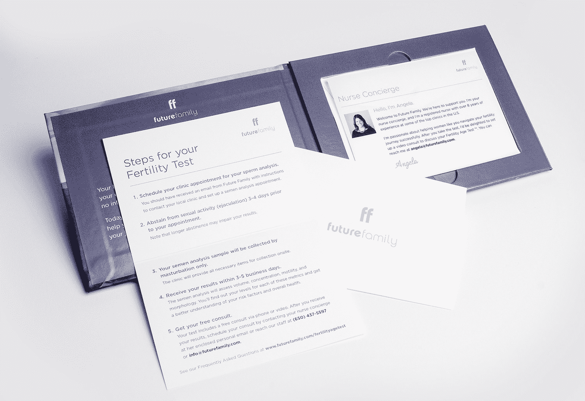

# 未来家庭希望让男性生育测试变得更加容易 

> 原文：<https://web.archive.org/web/https://techcrunch.com/2017/09/18/future-family-wants-to-make-male-fertility-testing-more-accessible/>

回到今年六月，[我们写了一篇关于一家名为](https://web.archive.org/web/20221209231837/https://beta.techcrunch.com/2017/06/22/future-family-wants-to-give-women-a-more-affordable-option-in-fertility-treatments/)[未来家庭](https://web.archive.org/web/20221209231837/https://www.futurefamily.com/)的公司的文章，该公司旨在简化女性生育测试的世界，同时降低治疗选择的成本。但是女性生育能力只是婴儿等式的一部分；俗话说，一个巴掌拍不响。

考虑到这一点，Future Family 现在也为男性提供生育能力测试，推出一种新产品，他们称之为精子活性测试(或 SAT。)他们在 TechCrunch Disrupt 战地上首次登台亮相。

**事情是这样的:**

*   你去他们的网站订购 200 美元的测试。
*   您将收到一封邮件，介绍您的“护士门房”并概述接下来的步骤。
*   你和当地的一家诊所配对，去那里做精子分析。诊所测量体积、浓度、运动性和形态。
*   由于大多数人不知道他们在看什么就能得到结果，他们会让你和一位生育专家进行视频聊天，以分析这一切意味着什么以及下一步可能会做什么。

目标？使准确、深入的测试可用，而不需要用户浏览保险困境和专家。

测试之后,“未来家庭”还将提供生育保护(精子库)等服务。

Future Family 没有在这里运行测试或实验室，他们也没有试图提出一些自己的新测试——他们只是试图简化过程，并提供一个清晰而直接的途径来建立实验室测试。“测试仍然很难进行。保险可以是拦路虎；人们不知道去哪里做测试；私人诊所可能很贵。我们把这些都拿走了。”

“任何时候都有大约 700 万对夫妇寻求或需要生育援助，”克莱尔·汤姆金斯告诉我。“你知道有多少人得到了帮助吗？20 万左右。超级贵。真的很难导航；网上有一堆临床信息，别的就不多了。这是一个个人的艰难旅程，没有任何支持服务。”

在汤姆金斯亲眼目睹了诸多挑战后，汤姆金斯和伊芙·布鲁斯特成立了“未来家庭”,他们花费了数十万美元进行治疗以生下一个孩子。“这让我意识到这段经历有多糟糕，”她告诉我。你可以在这里找到我们之前[对该公司的报道。](https://web.archive.org/web/20221209231837/https://beta.techcrunch.com/2017/06/22/future-family-wants-to-give-women-a-more-affordable-option-in-fertility-treatments/)

## 战场判官问答

**你能谈谈你的测试的有效性吗？有假阳性或假阴性的风险吗？**

我们不是一家实验室公司；我们使用顶级医生和诊所使用的测试，并在网上提供。

**到目前为止，关于直接面对消费者，你学到了什么？你的客户获取成本是多少？**

我们在 6 月份启动了这个项目，我们得到了非常强烈的回应，收到了大量的信息。我们的成本非常可持续。

**您认为还有其他相关的产品和服务吗？**

有；这是一个完整的旅程，我们可以在很多方面提供帮助。

**你们是如何招募生育专家的？他们是承包商还是实际员工？**

我们正在建立一个全国性的生育护士网络。我们从顶级诊所招募他们，他们通常有 8-10 年的经验。他们中的许多人是作为承包商加入的，但我们正慢慢开始将他们中的一些人转为(员工)。

**你有没有想过自己做测试或者技术？**

现在，我们正与合作伙伴一起将最好的测试带给更多的用户。