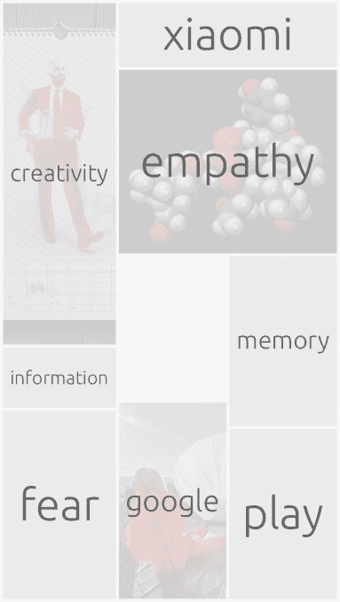

# 由 Janus Friis 支持的人工智能预测发现引擎 Futureful 更名为 Random 

> 原文：<https://web.archive.org/web/https://techcrunch.com/2014/04/04/futureful-becomes-random/>

由 Skype 联合创始人 Janus Friis 支持的人工智能预测发现引擎有了一个新名字和一个新界面——发展了其偶然浏览的主张，以更清楚地标记随机性角度。

iOS 应用的新名字字面意思是: [Random](https://web.archive.org/web/20221007004723/https://itunes.apple.com/app/random/id583361618?mt=8) 。(目前还没有 Android 应用程序，但计划将来会有一个。)

弗里斯写了一篇[中期文章](https://web.archive.org/web/20221007004723/https://medium.com/p/20eb60812a7c)来支持(重新)推出，解释为什么数字世界需要注入意想不到的东西——他的逻辑基本上可以归结为“[过滤泡沫](https://web.archive.org/web/20221007004723/http://www.ted.com/talks/eli_pariser_beware_online_filter_bubbles)”问题。换句话说，我们的社交网络和社交策划的新闻源正越来越多地约束着千篇一律的同心圆，不允许我们尚未涉足的事物穿透我们的网络意识。因此，重新输入 Random 来引入一些新的东西。

更名的问题是随机的，就其呈现给用户的内容而言，并不完全是随机的——因为该应用程序分析用户行为以提供文章建议——这使得新名称有点令人困惑。不过，Futureful 是一个非常糟糕的名字，所以没有人会为它的离去而难过。

Random 至少提供了一定程度的随机性——基于将专门设计的元素纳入其学习算法，以将随机建议注入混合中——所以它对名称的声明是部分准确的。

**从未来到随机**

Random 和 Futureful 之间最大的表面差异是界面。Futureful 的动态浏览气泡本身是其最初的 iPad 用户界面的演变，这是一个[发现跑马灯](https://web.archive.org/web/20221007004723/https://beta.techcrunch.com/2013/01/23/backed-by-skype-co-founder-janus-friis-futureful-launches-on-the-ipad-for-smarter-web-surfing/)。保持新鲜感显然延伸到定期对用户界面进行彻底检查。

“我们试图找出最有效的方法。探索新事物最直观、最有趣的方式是什么，”联合创始人亚诺·科波宁说。

“这使得整个人工智能增强的网络探索范式在 UX 和品牌层面上更容易理解，更容易接近，更令人愉快。”

现在，动态的浏览气泡消失了，取而代之的是一个动态的可能阅读主题的马赛克。点击一个单独的平板，它就会放大，从应用程序抓取的多个新闻来源中的一个拉起一篇文章。

点击顶栏离开文章，它就永远消失了——随机承诺永远不会显示同一个链接两次。

引擎盖下也有一些变化。Koponen 表示，它已经使其人工智能和 UX 反馈回路“更好、更细粒度”。

“UX 得到了简化，而且一直有更多的人工智能功能在发挥作用。有了我们当前的 UX，我们能够描绘出从你的无意识中浮现的事物，如果你愿意的话，你的无理性的自我。你不需要考虑什么东西可以组合在一起，你只需要选择。这是描绘和理解个人兴趣的独特方式，”他补充道。

Futureful 的浏览气泡在用户选择项目并将其发送到特定文章之前，动态地创建了主题集群。这个元素已经从随机中剥离出来——让它看起来更加随机——因为主题马赛克已经准备好了，只需轻轻一点就可以直接进入一段内容。

“总的来说，我们能够减少认知负荷——不需要组合或多重选择。我们的人工智能为你进行聚类和组合，将你的所有选择保存在它的“头脑”中。没必要再给你看了。你只需要选择和探索，AI 会处理剩下的事情。Koponen 说:“你的兴趣在长期(在较长时间内重复发生的事情)和短期(例如，你对某个事件、现象的兴趣)两方面都有权重。

“在某种程度上，随机变成了你自己思维的延伸。它通过捕捉事物之间的联系来复制你的世界思维地图。”

Koponen 强调，随机没有现成的类别。相反，用户根据他们在应用程序中选择点击的东西的顺序，生成他们自己的个人类别。

随机有什么好处吗？嗯，我想你得先花点时间去了解你自己。在我下载了新版本的应用程序并打开它后，它为我建议了一系列话题——包括中国安卓 OEM 厂商小米。

我敲了一下，它拉进了我之前读过的一篇文章，但是，嘿，你不能挑剔它的算法来识别我感兴趣的东西。

如果你不喜欢提供的主题选择，Random 的马赛克包括一个空白的方块，你可以点击它来改变事情，并获得另一组主题建议。

新的界面看起来不错，但因为算法在后台做了更多的事情——通过让用户在获得一条内容之前不再需要考虑呈现给他们的单词之间的联系——在我看来，它可能有点太随机了。这个过程如此之快，以至于你很难对它产生个人依恋感，但随着算法对你的了解越来越多，并相应地调整它的建议，这种感觉可能会随着时间的推移而增长。

就先前设计的实用性而言，马赛克比泡泡大，所以有时确实允许照片融入其中。结果是看起来很像 Flipboard 的东西——也许这种设计共鸣是有意的，作为一种鼓励用户将 Random 更多地视为动态杂志的方式，而不是发现算法。

Random 目前仍未公布任何用户数量。Koponen 只会说:“我们在成长……仍然是这个领域的小演员。我们刚刚推出了 Random，以采取下一步措施实现更多增长。”

“这是为了创造一种独特的体验，让人们觉得自己是生活中不可或缺的一部分。在今天的网络中，几乎一切都是由社交驱动的，因此——当我们创建一个新的范式时——我们也需要提出将随机整合到现有行为生态系统中的解决方案，”他补充道。

这款应用仍然存在一个与过滤气泡相关的大问题:用户。当用户面对多种主题选择时，风险在于他们会因为自己相同的选择而再次掉进自己的兔子洞。(和我一样，偶然发现了同样的小米文章。)然而，你越深入到 Random，这种情况发生的可能性就越小——因为越来越多的内容浮出水面，扩大了你潜在的阅读范围。

货币化呢？Koponen 说，兰登现在根本没有想到这一点。这家初创公司的想法远大得多。

“我们目前 110%专注于让人工智能增强的网络探索成为每个人都可以享受的事情。我们在前进的过程中不断迭代。还没有人破解它，”他说。

“我们的投资者相信我们的远大愿景。我们希望为我们周围的信息/内容创建下一代界面。所需的 UX 和人工智能将为未来的所有数字设备提供动力，成为未来操作系统的种子。”