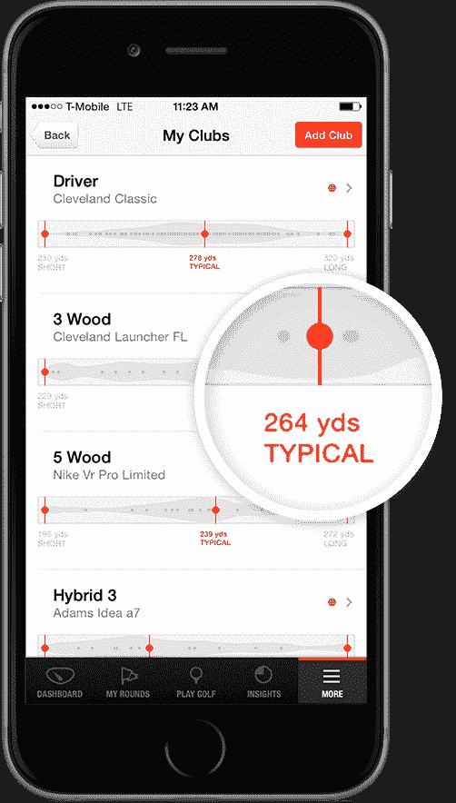

# GAME Golf 推出新的实时高尔夫击球跟踪器 

> 原文：<https://web.archive.org/web/https://techcrunch.com/2015/11/03/game-golf-rolls-out-a-new-live-golf-swing-tracker/>

约翰·麦圭尔之前从未打过高尔夫，但他有运动心理学和大数据方面的背景。正是这种结合最终促使他创办了运动科技公司 [Active Mind Technology](https://web.archive.org/web/20221005190737/https://www.gamegolf.com/home/en-us/?v=0dfc675) ，这是一家首次推出高尔夫球追踪产品的运动科技公司。

现在，主动思维技术公司今天推出了一款[更新的实时跟踪高尔夫击球设备，该设备连接到高尔夫球杆上，位于球员的腰带上，名为 GAME Golf。](https://web.archive.org/web/20221005190737/https://www.gamegolf.com/products/en-us/live?v=0dfc675)它跟踪击球，并将数据反馈给显示玩家表现的应用程序，给他们反馈，帮助他们改善游戏性。然而，这一切背后的目标是确保数据以这样一种方式呈现，即对玩家真正有用，而不仅仅是难以解析的大数据集。

该产品的第一个版本允许用户在事后回顾他们的拍摄，但新版本专注于通过应用程序实时查看性能。GAME 有一个高尔夫球场数据库，可以帮助显示高尔夫球员在球场上比赛的准确指标。该公司还寻求与职业高尔夫球员和组织合作，以提高其在整个行业的影响力。

“底线是，如果你能收集数据，让获取数据变得容易，然后以一种引人入胜的方式将数据可视化，你就能从数据中创造故事，”麦奎尔说。“数据本身是枯燥的。我们当时可不是这么做的。”

整个产品由一个可穿戴设备组成，它充当了拧入高尔夫球杆的小设备和收集所有数据的智能手机之间的中介。每个俱乐部都有相应的特定设备，因此，从确定球员是否使用正确的俱乐部开始，他们都有详细的数据。

他说，麦奎尔关注高尔夫的部分原因是，这是一项具有广泛吸引力的国际运动。McGuire 说，该公司为高尔夫球开发的技术也可以重新应用到其他运动中，团队可以使用 NFC 来识别正在使用的设备类型，如其他户外运动类别中的滑雪板或冲浪板。

“Fitbit 在健身跟踪领域的地位，sport 可能落后几年，所以这是一个在整个运动数据领域抢占市场的真正机会，”McGuire 说。“如果有人可以切入并说，如果你这样做，你会得到好的结果，这就是价值所在。我们正试图利用数据在体育领域做到这一点。”

麦奎尔说，这也是粉丝参与的机会，这就是为什么该公司与专业运动员合作应用其技术。这些运动员可以与他们的粉丝分享他们的数据，粉丝可以使用这些数据来改进他们自己的比赛——或者只是为了好玩而观看。用户可以投票选择他们希望游戏增加的功能。麦奎尔说，这项服务今年将跟踪大约 70 万场高尔夫球赛。

所有这一切的重点是在后端构建技术，以一种有用的方式呈现数据。McGuire 说公司 80%的时间都花在软件开发上。“我们所有的智能都驻留在云中，所有的算法、逻辑和数据处理都在那里完成。这是所有地理空间技术发生的地方，它只是收集数据。”

我本人不是高尔夫球员，但这种事情对其他运动的影响是显而易见的。一个例子可能是分析网球摆动，可以肯定的是，Active Mind Technology 不是唯一一家关注体育跟踪领域的公司。例如，Babolot 有一个基于传感器的网球拍，McGuire 说，但关键是这项技术应该可以在多种不同的运动中复制。

“这从来都不是真正的高尔夫，这是关于体育和技术，以及如何将它们结合在一起，以及如何使用技术作为一个平台来接触大众，所以体育数据，”麦奎尔说。

Active Mind Technology 总部位于旧金山，已融资 1000 万美元。

**更新** : 游戏高尔夫是追踪击球，而不是挥杆。故事已经更新，以反映这一信息。