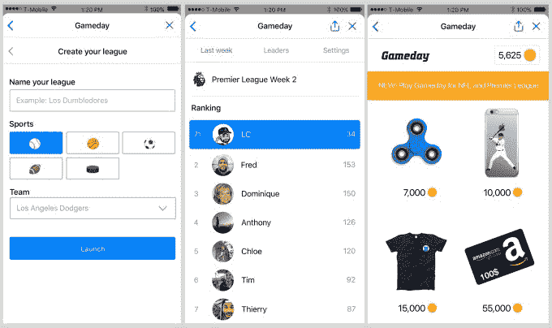

# Gameday 让你在 Facebook Messenger  中进行日常的梦幻运动

> 原文：<https://web.archive.org/web/https://techcrunch.com/2017/08/04/gameday-lets-you-play-daily-fantasy-sports-inside-facebook-messenger/>

# Gameday 让你在 Facebook Messenger 中玩日常的梦幻运动

幻想运动，可能在更大程度上是日常幻想运动，可能会令人生畏。你通常是在玩真钱游戏，并且有可能与那些花费无数时间研究统计数据来打造完美阵容的人对抗。

Y Combinator's Summer '17 batch 的初创公司 Gameday 希望通过对每日幻想体育做一些调整来改变这种情况，让每个人都可以参与其中。

首先，他们正在[把它建成信使](https://web.archive.org/web/20230228032008/https://m.me/gamedaybot)。这意味着你不必每天访问一个专门的网站，浏览一个复杂的用户界面——你只需打开 Messenger 并开始与他们的机器人聊天，它会带你进入游戏并创建阵容。

它也是完全免费的，这也减少了恐吓因素，使它对球迷(和家人)友好。用户可以选择真正的奖品，如服装和礼品卡，可以用奖励给比赛获胜者的应用内货币购买。

最后一个区别是，提供的游戏更简单，比传统的日常幻想运动更有趣。例如，Gameday 的 NFL 比赛让你从创业公司那周选出的 10 名球员中挑选 4 名球员，一名 WR，一名 TE，一名 RB 和一名 QB。从 10 个人中挑选 4 个人比从上百个人中挑选 9 到 10 个人的阵容压力要小得多。

因为如果你只是一个休闲运动爱好者，有时这些复杂的阵容和工资帽可能有点太令人生畏了。大网站实际上也同意这一点，因为 [FanDuel 最近推出了一款为休闲用户设计的“精简”版日常运动产品](https://web.archive.org/web/20230228032008/https://techcrunch.com/2017/04/26/fanduel-launches-mixup-a-more-fun-version-of-daily-fantasy-sports-for-casual-fans/)。

你可以在随机的联盟或者你和朋友创建的联盟中玩，只要脸书增加了对群聊应用程序的支持，你很快就可以在群聊中玩了。

Gameday 还提供 NBA、MLB、NHL 和英超联赛游戏——所有游戏的游戏结构都略有不同。在 NHL 赛季结束之前，这家初创公司每天有 25，000 人玩游戏，其中 75%的用户以前从未玩过日常幻想运动……这证明了一个概念，如果你为休闲爱好者制作一个简单的游戏，他们就会来。

如果您安装了 Messenger，您可以[点击这里开始与 Gameday 的机器人聊天并开始游戏。](https://web.archive.org/web/20230228032008/https://m.me/gamedaybot)

