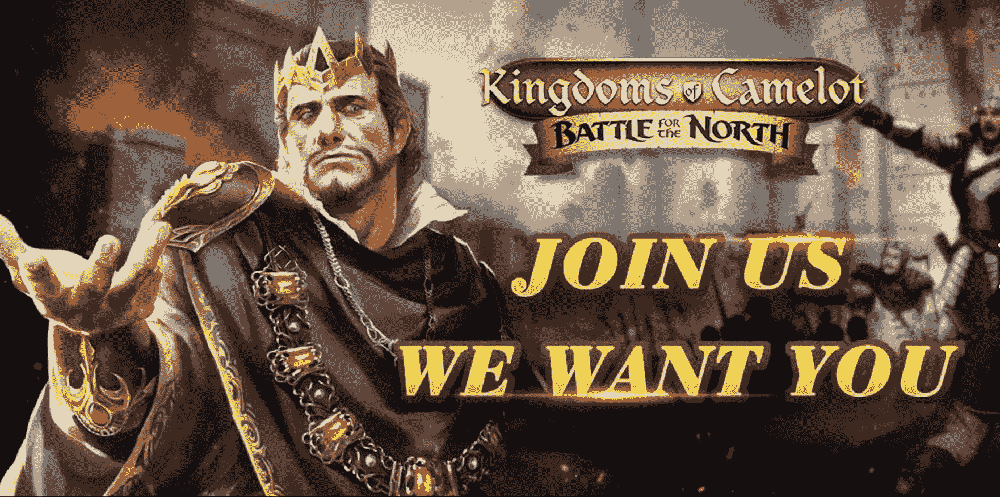
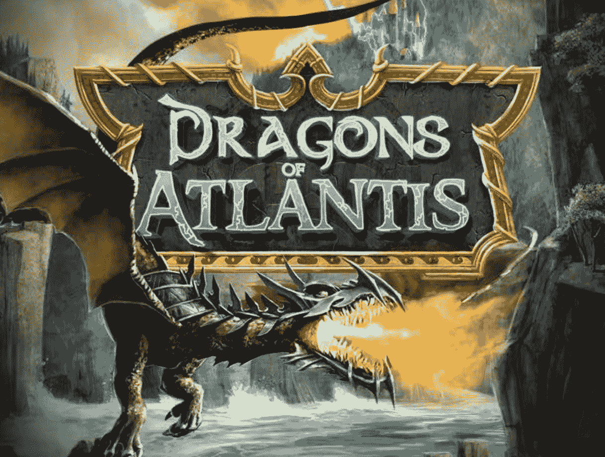

# 游戏公司 Kabam 坐过山车以 8 亿美元退出

> 原文：<https://web.archive.org/web/https://techcrunch.com/2017/02/28/gaming-company-kabams-roller-coaster-ride-to-a-700-million-exit/>

游戏开发者大会昨天在旧金山市中心开幕，整合是今年与会者的中心主题。

上周晚些时候，我们采访了游戏公司 [Kabam](https://web.archive.org/web/20230224135430/https://www.kabam.com/) 的联合创始人兼首席执行官周凯文，他讲述了自己在运营一家游戏初创公司大约十年的过程中既紧张又兴奋的经历，之后[于去年 12 月以 7 亿至 8 亿美元的价格将大部分资产出售给了韩国的 Netmarble Games。](https://web.archive.org/web/20230224135430/http://variety.com/2016/digital/news/kabam-netmarble-acquisition-marvel-contest-of-champions-1201945372/)

他最早的投资者，迦南合伙人公司的玛哈·易卜拉欣也加入了谈话，分享了她对公司高潮、低谷和中间时刻的看法。我们的对话经过了编辑，以保持长度和清晰度。

**TC:Kevin，在创建 Kabam 之前，你曾在迦南公司作为初级投资者为 Maha 工作过一段时间。事实上，Kabam 是在迦南的办公室孵化的。你是从什么时候开始知道自己想创建一家游戏公司的？**

KC:我对消费互联网的发展感到非常兴奋。那是在 2006 年，当时脸书还主要关注大学生。我想为年轻的专业人士建立一个社交网络，但经过一些波折后，它变成了一家游戏公司。

MI:凯文和他的三个联合创始人试图建立一个更好的 LinkedIn，但是我们发现用我们给公司的种子资金，它不起作用。我告诉他，要么把我们给他的 25 万美元还给他，要么找别的事情做。因此，第一个支点被称为[水冷器](https://web.archive.org/web/20230224135430/https://itvt.com/node/10752)。这是一个体育、电视和电影迷的社交网络。

KC:它生长在脸书的背面。在巅峰时期，它每月有 20 亿的页面浏览量，但我们根本无法将其货币化。所以我们更多地涉足幻想运动。

MI:当时我给了公司 A 轮融资，在山景城的一家咖啡馆里，有那么一瞬间，Kevin 感到压力很大。他又开始抽烟了，因为他不知道如何从(饮水机)上赚钱。大概就是这个时候——对吧，凯文？——他转而成为脸书的游戏提供商，推出了《卡米洛特王国》,大获成功。

**TC:目前为止有两个支点。**

起初，脸书(对游戏开发者)说，“你将保留所有的收入，但我们拥有框架周围的房地产，”所以经济是建立在这种关系上的。然后，[在后来，有点臭名昭著的发展]脸书说，我们要拿走每个人收入的 30%。公平地说，苹果和其他[平台公司]也获得了 30%的收入份额，但脸书试图建立平台的方式——他们使用房地产的方式——使得运营一款成熟的游戏非常困难。你无法控制整个经历。然后有了 30%的税收，对我们来说，它变成了一个非常不同的行业。一夜之间，我们从非常有利可图变成非常*不*有利可图。我们知道我们不能再百分之百依赖它的平台了。

你是如何开始转移到脸书围墙花园之外生活的？

KC:我们已经开始考虑手机了。我们开始与[基于社区的游戏平台] [Steam](https://web.archive.org/web/20230224135430/http://store.steampowered.com/search/?publisher=Kabam) 以及谷歌和 Mozilla 的 Firefox 合作，最初是为了让游戏体验多样化，在接下来的 12 个月里，我们大约 50%的收入来自其他平台。然后，在接下来的 12 个月里，我们不得不通过迁移到移动设备来从头再做一遍。

那是痛苦的。]在 Steam 和其他一些[平台]上，要更改或更新你的按钮，你只需点击一个按钮。在苹果公司，你必须排队 10 到 20 天，然后有人会手动审查你的软件，如果他们认为有问题，你必须想办法满足他们的要求，然后再排队等 10 到 20 天(解决这个问题之后)。因此，不再是一天推出一次功能，而是一个月一次。这是一个截然不同的过程，尤其是在我们面临所有经济问题的时候。

**TC:员工辞职是因为对这些曲折变化感到沮丧吗？**

我们确实失去了很多人。我们不得不更换至少一半的工程团队；前端开发人员不一定是移动客户端开发方面的专家。在从脸书转向移动网络的过程中，我们的营销支出也不得不发生很大变化，这需要不同的技能组合。每次我们做出改变，我们都会有双倍的员工流动率——基于我们需要做出的改变的自愿流动和非自愿流动。

**TC:在你做出改变后多久，你想到了“漫威冠军大赛”，这个标题引起了 Netmarble 的注意？**

在那之前我们有很多热门游戏，包括马哈提到的“卡梅洛特王国”。它一生赚了 3.5 亿美元，而且还在继续。

这些游戏的寿命有多长？

KC:嗯，在游戏市场，二级市场发展起来了，所以[你]可以把一个游戏卖给另一家公司，他们[选择]经营多久就经营多久。我们[以两位数百万美元的价格【在 2014 年末】将](https://web.archive.org/web/20230224135430/http://venturebeat.com/2014/12/10/kabam-gives-most-of-its-web-games-to-rockyou/)整个捆绑包——我们 20 款游戏的整个网络业务——卖给了一家名为 RockYou 的游戏发行商。这一切都是基于盈利倍数，由于网络游戏转向移动，盈利倍数正在下降。

有拍卖过程吗？

KC:游戏生态系统是一个非常紧密的生态系统，所以公司会去参加会议，试图达成交易。二级市场在几年前刚刚开始出现，在西方市场还不是很发达；它们在日本和中国要大得多。实际上只有 RockYou 和一些小公司在做这件事，我们非常了解他们，所以这是一次直接谈判。

**TC:你最大的纯手机游戏是什么？**

《卡梅洛特王国》的续集《北方之战》成为 2012 年 iOS 上的顶级游戏。接下来，我们制作了《亚特兰蒂斯之龙》(Dragons of Atlantis)，这是脸书游戏的另一部续集，也是我们与华纳兄弟(Warner Brothers)合作的第三部热门电影《霍比特人》(The Hobbit)。然后“漫威”成了我们的第四大热门。

但是你卖了，尽管这些热门歌曲的播放时间似乎比以往任何时候都长。

KC:称游戏是一个受点击量驱动的行业是不公平的。《魔兽世界》仍然每年赚超过 8 亿美元，它是 13 年前发行的。《使命召唤》是十多年前创作的，(其公开上市的母公司)动视(暴雪)停止了这款游戏的收入，但我相信它每年仍能产生超过 10 亿美元的收入。《糖果粉碎》大约五年前问世，至今仍是安卓系统上票房最高的游戏之一。

如果处理得当，生命周期是 10 到 15 年。理想情况下，你的头衔会增长三到五年，然后达到一个很好的稳定期，然后缓慢下降，再持续五到七年。

**TC:那你是不是有点累了，决定卖了？这当然合理。**

KC:从公司成立到现在，我一直在经营这项业务，年收入达到了 4 亿美元。我喜欢这个行业和和我一起工作的人，但是我们已经做了很长一段时间了，我们想:如果我们找到了正确的时间，让我们进入一个出口，去年是一个好时机。

**TC:你有没有想过要将卡巴姆公开？**

KC:就公众印象而言，这是艰难的五年，包括因为 Zynga 及其 IPO、随后的衰落和创始人问题。我们与董事会决定，部分由于这种看法，我们不应该继续走公共道路。

此外，游戏行业是少数几个盈利能力不错的行业之一，但你也可以从这种盈利能力中获得价值。在 Zynga 首次公开募股后的一段时间里，交易以 6 至 7 倍于息税折旧摊销前利润(EBITDA)的倍数完成。去年，SuperCell 以约 100 亿美元的价格出售给了腾讯——这一价格是 EBITDA 的 10 倍多。

因此，当 Zynga 退出时，我们经历了多次压缩——压缩后整个游戏行业的股价都在下跌——然后随着(认识到)游戏生命周期变得越来越长，我们又回来了。没有多少次有健康的窗口，我们开始接到美国和国际公司的电话，所以我们有一位银行家帮助我们谈判一项对我们的股东也有效的交易[他总共给了我们 2 . 4 亿美元]。

**TC:自从卖给 Netmarble 后，你是否在教练的位置上失败过？**

KC:net 大理石收购了我们最赚钱的工作室，但是我们还有另外两个工作室，我们正在(和潜在的收购者)讨论这些，所以我们还需要几个月的时间才能完成。

但就我的感觉而言，我真的很开心。你可能是一个小而独立的人，但是当品牌影响力和消费者影响力真正重要的时候，你可以通过加入其他公司获得更多的成功。以我们温哥华的工作室为例[它现在是 net 大理石的一部分]。如果下一场比赛没有他们希望的那么好，他们就不用太担心了。或者，如果一个项目因为更广泛的投资组合而延迟或不那么成功，[它就不会那么有压力了]。

**TC:给新游戏开发者的建议？**

KC:真的要确保自己有足够的资金去看两三场比赛。我看到的最大的错误是开发人员只为一个游戏筹集了足够的资金，但是如果没有成功，你的公司基本上蒸发了。

**TC: Maha，你会资助另一家移动游戏公司吗？**

米:在虚拟现实或另一个有潜力的平台起飞之前，我不认为自己会投资一家移动游戏公司。我认为机会主要在于大型企业集团，它们拥有大多数增长最快的图书。时不时地，你会看到一个随机游戏抓住了消费者的兴趣。但是我们不玩随机的。

*更新:这个故事最初报道 Kabam 以 7 亿美元出售。据一位因交易条款保密而要求匿名的消息人士称，收购价格为 8 亿美元，其中 7 亿美元在交易结束时支付，1 亿美元在 12 个月内赚取。这次购买是为了该公司的温哥华工作室；剩下的 Kabam 资产已经分拆成一家名为余震的新公司，将被单独出售。*