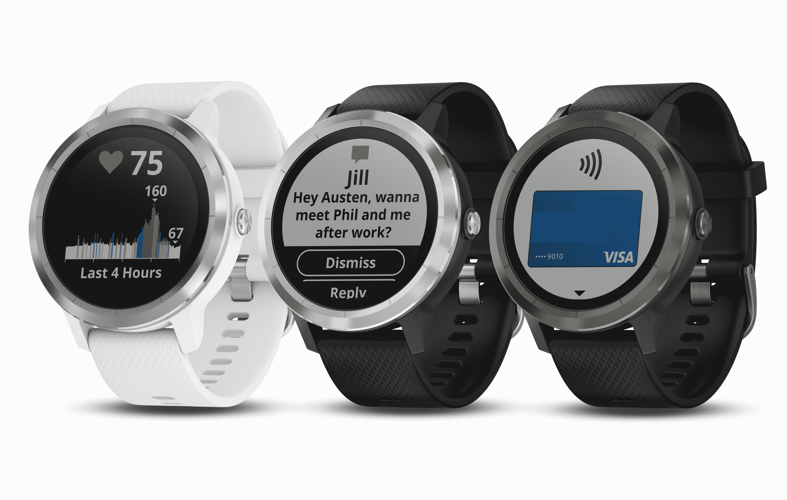
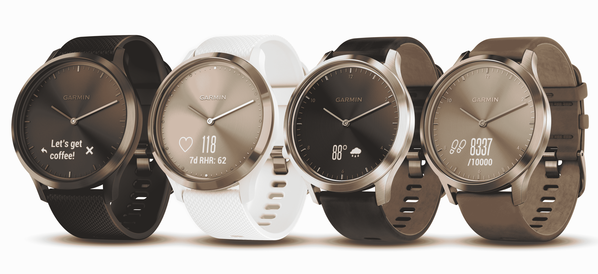
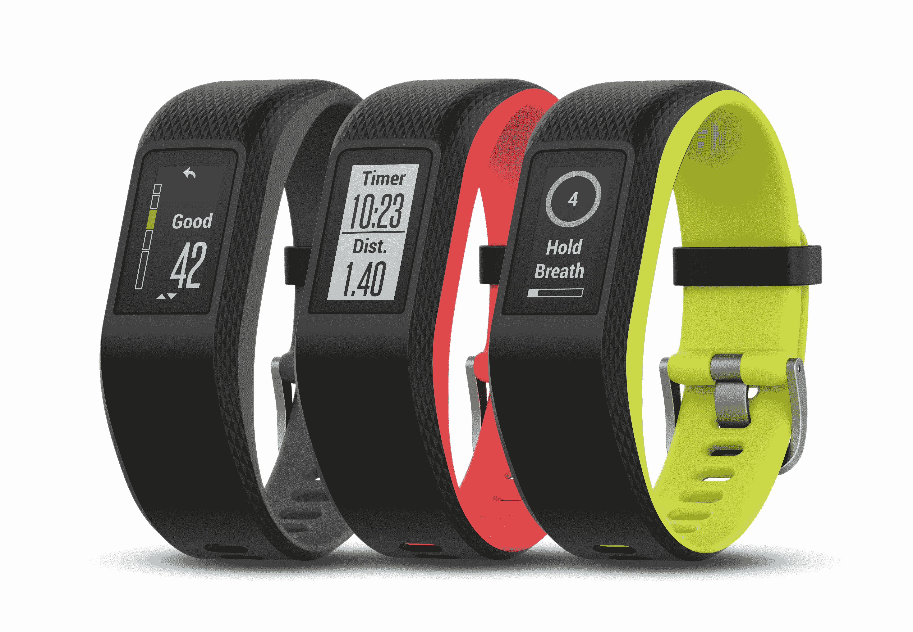

# Garmin 推出三款新的可穿戴设备和一款移动支付解决方案

> 原文：<https://web.archive.org/web/https://techcrunch.com/2017/08/31/garmin-debuts-three-new-wearables-and-a-mobile-payment-solution/>

Garmin 在 2017 年 IFA 展会上首次亮相了三款新的可穿戴设备，包括 vivosport GPS 活动追踪器、vivomove HR 混合触摸屏智能手表和 vivoactive 3，这是一款带有 Garmin Pay 的智能手表，支持 Visa 和 MasterCard 信用卡和借记卡，支持移动支付。

Garmin vivoactive 3 包括全球定位系统、心率监测器，在智能手表模式下电池续航时间为 7 天，如果你使用持续的全球定位系统跟踪，电池续航时间为 13 小时。它有三种不同的颜色，支持多达 15 种不同活动的内置运动应用程序，以及其他用户可定制的活动应用程序。由于心率变异性监测，vivoactive 可以随时跟踪压力水平，另外，Garmin Connect IQ 商店中还提供了额外的表盘、应用程序等，可通过配套的智能手机应用程序访问。

Garmin 的 vivoactive 3 还具有 Garmin Chroma 显示屏，该显示屏将阳光可读的透反射屏幕技术与背光技术相结合，在夜间也能提高可见度。然而，最突出的功能是新的 Garmin Pay 支持，允许通过美国各大银行的 Visa 和 MasterCard 卡进行非接触式支付。Garmin Pay 由 FitPay 提供支持，这是一个专门设计的平台，旨在帮助将移动支付引入移动和物联网设备，而不需要与银行和发行商进行直接、单独的谈判。

vivomove HR 是 Garmin 的第一款混合触摸屏智能手表，这意味着它将传统的模拟表盘与内置的数字副显示屏融为一体。与全数字屏幕设备相比，这款手表的外观更加精致，但仍然可以显示来自智能手机的通知，以及活动数据和心率。它有皮革和硅胶表带两种选择，以及不同的表壳材料，包括高端不锈钢表面。

Vivomove HR 还可以监测全天的压力，并与 Garmin Connect 移动应用程序配合使用。它的零售价为 199.99 美元，升级版为 299.99 美元。

最后，vivosport 是一款智能活动追踪器，更专注于健身功能，但在智能手表模式下可提供长达 7 天的时间，在 GPS 模式下可提供长达 8 小时的时间。它有一个专注于轻量级可穿戴性的超薄设计，并使用始终有效的 Garmin Chroma 彩色触摸屏技术显示。

内置应用程序将跟踪步行、跑步、骑自行车、有氧运动和力量训练，Garmin Move IQ 功能将自动分类并记录大量活动，以防您忘记。你的智能手机还可以通过振动发出通知，如果你碰巧有一台 Garmin VIRB 行动相机，还可以远程控制它。

vivosport 的零售价为 199.99 美元，有三种不同的表带颜色可供选择。