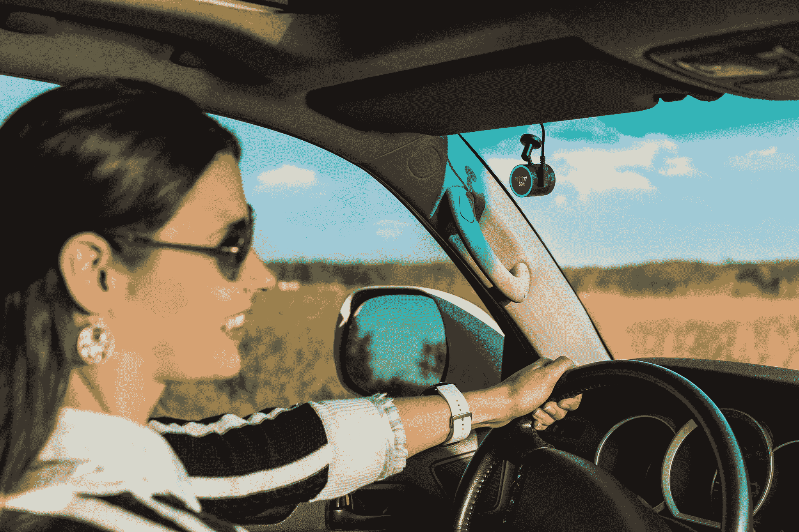
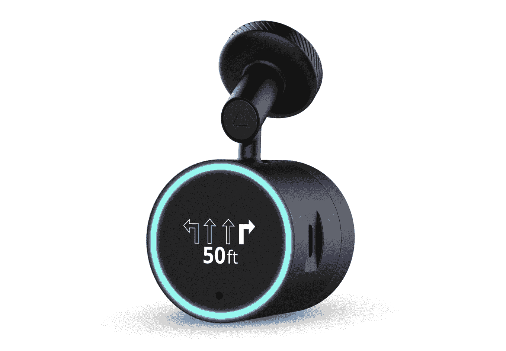

# Garmin 的 Speak Plus 将 Alexa 带到您的汽车上，并兼作仪表板摄像头 

> 原文：<https://web.archive.org/web/https://techcrunch.com/2018/01/08/garmins-speak-plus-brings-alexa-to-your-car-and-doubles-as-a-dash-cam/>

# Garmin 的 Speak Plus 将 Alexa 带到您的汽车上，并兼作仪表板摄像头

亚马逊 Alexa 或多或少会不可避免地进入汽车领域。一旦你习惯了坐在家里对着空气大喊命令，你会很快发现自己也想在车里做同样的事情。苹果和谷歌目前在这方面有优势，它们的语音助手可以在你已经绑在挡风玻璃上的智能手机上持续运行。你只知道亚马逊想要挤进去。

目前，这意味着第三方配件。今天早上，我们看到 Anker 推出了一个由 Alexa 供电的小盒子，它可以插入你的 12V 香烟插座。现在，在 CES 上，Garmin 宣布了一款 Alexa 驱动的 dash cam。

这款产品名为 Garmin Speak Plus，实际上是该公司去年 10 月推出的一款设备的后续产品，该设备的名称相同，但没有“Plus”这里的主要区别？它大约贵 80 美元(Speak 的建议零售价为 149 美元，Speak Plus 为 229 美元)，但它有一个内置的仪表盘摄像头。

前面有一个小屏幕，可以在你开车时传达方向，它通过蓝牙或 AUX 端口连接到你汽车的立体声系统。这款相机以每秒 30 帧的速度运行，速度为 1080fp，并带有一些小功能，如碰撞和车道偏离警告(不过，取决于你的蓝牙音频连接从 Speak Plus 到你的汽车的稳定性，我不确定我是否会依赖这些)。它窃听你的手机的手机连接，同时，它的各种数据需求(GPS 路由，处理 Alexa 命令等。)

Speak Plus 现在可以预订，预计将于 2 月中旬发货。