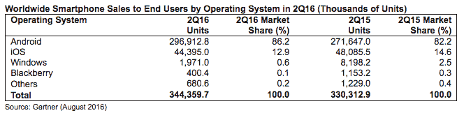

# Gartner: Android 智能手机在 Q2 的市场份额达到 86.2%

> 原文：<https://web.archive.org/web/https://techcrunch.com/2016/08/18/gartner-androids-smartphone-marketshare-hit-86-2-in-q2/>

智能手机市场剩下的增长继续集中在新兴市场，消费者正在从功能手机升级。

这种持续的转变有助于提升 Android 的全球市场份额，Gartner 在其最新的移动市场数据中估计，Android 在 Q2 的市场份额为 86.2%。

但这位分析师表示，Android 不仅仅赢得了新兴市场中低端智能手机市场的买家，搭载 Android 系统的高端智能手机在 Q2 的销量也增长了 6.5%。

Gartner 指出，来自主要安卓原始设备制造商的高端设备，如三星的 Galaxy S7，以及华为和 Oppo 等中国原始设备制造商价格实惠的高端智能手机，有助于提升该平台在高端市场的财富。

该公司指出，三星也在改善自己的表现，夺回了最近在新兴市场失去的部分市场份额，占当季销售额的 22.3%，而华为和 Oppo 的这一比例分别为 8.9%和 5.4%。小米的表现没那么好，在本季度失去了份额。

与此同时，在平台方面，苹果 iOS 的市场份额下降了近两个百分点，从上年同期的 14.6%下滑至 12.9%。只有微软的 Windows 智能手机平台下滑更严重。

【T2

总体而言，高德纳表示，2016 年第二季度智能手机出货量同比增长 4.3%。该公司预计本季度全球智能手机销量为 3.44 亿部。

随着智能手机在新兴市场赢得更多买家，该季度功能手机的销量下降了 14%，高德纳表示，这导致了该季度手机总销量的下降。

据该分析师称，在 Q2 期间，除日本以外的所有成熟市场的智能手机需求都出现放缓，而除拉丁美洲以外的所有新兴市场的智能手机需求都出现增长。后几个地区的智能手机销量增长了 9.9%，而成熟市场的销量下降了 4.9%。

高德纳指出，前五大智能手机制造商在本季度总体上继续扩大市场份额——同比从 51.5%上升至 54%——最大的个人赢家是 Oppo、三星和华为。

苹果智能手机市场份额同比下降 7.7%，其中大中华区和成熟的亚太地区销量降幅最大，苹果手机销量下降 26%。

相反，苹果手机在 Q2 表现最好的地区是欧亚大陆、撒哈拉以南非洲和东欧，销量同比增长逾 95%。