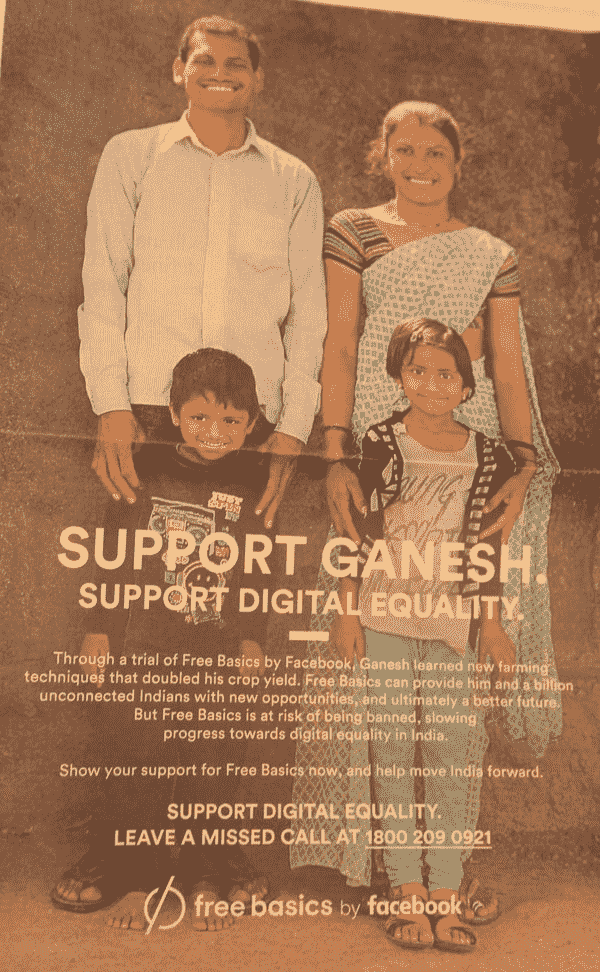
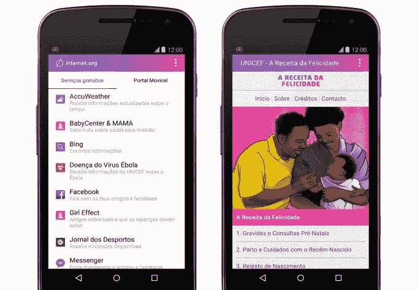
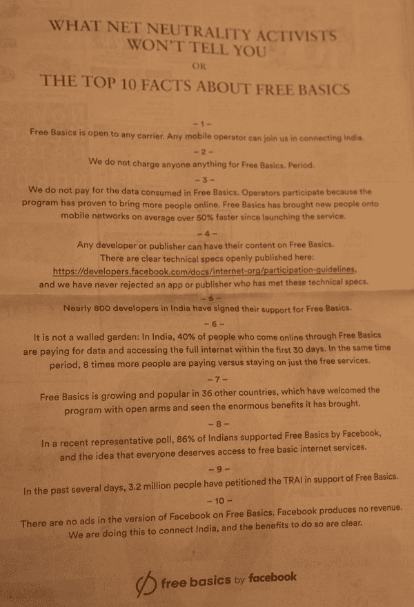
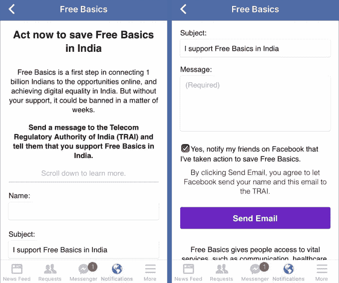
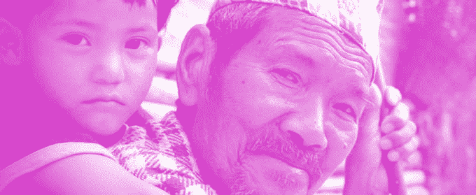

# 脸书面临免费互联网中立的困境

> 原文：<https://web.archive.org/web/https://techcrunch.com/2015/12/27/gatekeeper-or-stepping-stone/>

什么更重要？限制穷人免费上网？还是维护一个开放、中立、没有限制的互联网？这就是脸书通过向监管机构请愿、怀疑论坛以及今天的整版报纸广告与世界展开的辩论。

争论的主题是[免费基础](https://web.archive.org/web/20230403113545/https://techcrunch.com/2014/07/31/internet-org-app/)、脸书和[Internet.org](https://web.archive.org/web/20230403113545/https://info.internet.org/en)的应用提供免费数据访问，但只限于有限的互联网部分。通过脸书与移动运营商的合作，免费基础服务在大约 35 个国家可用，移动运营商认为这是说服人们购买数据套餐的一种方式。

但是脸书对什么有资格获得免费访问的技术指南的控制，以及它强调自己服务的能力，已经引发了网络中立倡导者的持续反弹。

脸书在今天的《星期日泰晤士报》上刊登了半个双整版的广告

本周，印度——该计划中最大的国家——的监管机构要求脸书当地的运营商合作伙伴 Reliance 暂时关闭免费基础服务。尽管脸书向其用户提交了一份请愿书，要求他们点击向印度电信监管机构发送一封电子邮件，以“[在印度保存免费基础知识](https://web.archive.org/web/20230403113545/https://techcrunch.com/2015/12/17/save-free-basics/)”。TRAI 将在下个月就是否允许免费基础教育做出最终决定。

这款免费的基础应用提供了脸书、信使、必应以及天气、儿童保健信息、新闻和健康资源

为了争取更多的支持，昨天 Internet.org 副总裁 Chris Daniels 在 Reddit 上做了一个“问我任何问题”的帖子，否认脸书正在成为互联网的看门人。[今天](https://web.archive.org/web/20230403113545/http://boingboing.net/2015/12/27/facebooks-fuddy-full-page-a.html)脸书在印度星期日泰晤士报做了一个[双整版广告](https://web.archive.org/web/20230403113545/https://twitter.com/reifman/status/681144960364621825)，请求读者承诺支持其公司运营的免费互联网版本，由[杰夫·雷夫曼](https://web.archive.org/web/20230403113545/https://twitter.com/reifman/status/681144960364621825)发现。这场战斗的结果可能会影响超过 12 亿印度公民的数字命运，并为其他国家如何监管免费基础服务开创先例。

[ **更新**:印度时报已经发表了马克·扎克伯格的博客文章，题为[“免费基础保护网络中立性”](https://web.archive.org/web/20230403113545/http://blogs.timesofindia.indiatimes.com/toi-edit-page/free-basics-protects-net-neutrality/)。他认为“我们有免费的基础书籍收藏。它们被称为图书馆。它们并不包含所有的书，但它们仍然提供了一个美好的世界。我们有免费的基本医疗保健。公立医院并不提供每一种治疗方法，但它们仍然可以拯救生命。”他怀疑地问，“谁会反对呢？”

扎克伯格继续称反对自由基础的论点是“错误的主张”，并提到研究表明“我们知道，每 10 个连接到互联网的人中，大约有一个人摆脱了贫困。”例如，扎克伯格引用了一位名叫 [Ganesh](https://web.archive.org/web/20230403113545/https://www.facebook.com/photo.php?fbid=10102490971619701&set=a.529237706231.2034669.4&type=3) 的农民的话，他利用免费基础知识查找天气信息和商品价格来改善他的生意，然后问道“Ganesh 能够更好地照料他的庄稼是如何伤害互联网的？”

为了公平起见，《印度时报》同时发布了一篇由 Nikhil Pahwa 从[save internet . in](https://web.archive.org/web/20230403113545/http://savetheinternet.in/)撰写的[反对博文](https://web.archive.org/web/20230403113545/http://blogs.timesofindia.indiatimes.com/toi-edit-page/its-a-battle-for-internet-freedom/)。他表示，对低收入群体的研究表明，“他们愿意做出的权衡是他们使用互联网的量，而不一定是他们可以使用多少互联网。”

Pahwa 建议脸书探索数据限制或临时试用的访问模式，尽管一旦试用或数据用完，这些可能会阻止用户使用关键服务。他反对免费基础知识的审批制度，这种制度可能会减缓及时信息的传播，并被用来阻止竞争对手。

前景可以分解为扎克伯格现在想帮助印度的穷人，而他的对手则试图避免未来潜在的权力滥用。

## 垫脚石和看门人

最初，脸书与几家主要电信公司合作推出了 Internet.org，目的是让仍未上网的数十亿人联系起来。它试图通过合作伙伴关系和[数据效率](https://web.archive.org/web/20230403113545/https://techcrunch.com/2015/06/04/download-facebook-lite/)使接入变得负担得起，并通过[未来技术](https://web.archive.org/web/20230403113545/https://techcrunch.com/2014/03/28/facebook-satellites-and-drones/)如[无人机](https://web.archive.org/web/20230403113545/https://techcrunch.com/2015/07/30/facebook-wont-be-an-isp-but-is-building-internet-shooting-drones-for-carriers/#.c09dfs:plXS)、[激光](https://web.archive.org/web/20230403113545/https://techcrunch.com/2014/03/27/facebook-drones/)和[卫星](https://web.archive.org/web/20230403113545/https://techcrunch.com/2015/10/06/facebook-eutelsat/)将信号传送到偏远地区，从而让人们上网。

脸书使用自由空间光学激光器、无人驾驶飞行器和无人机向偏远地区提供互联网接入

去年七月，Internet.org 为发展中国家发布了它的应用程序，允许没有足够的钱支付昂贵的数据计划的人访问“基本”的互联网服务，包括脸书和教育资源。

虽然被宣传为慈善事业，但许多人也看到了脸书的潜在长期利益，即它是人们对互联网的第一次体验，甚至会与他们对互联网的整个概念相混淆。如果脸书为接入铺平了道路，其服务可能会成为用户的首选目的地。

脸书的无人驾驶飞机 Aquila 可以将连接传输到偏远地区

起初，脸书为自己提供了信使服务、维基百科、教育资源、健康信息、新闻、工作列表，在某些情况下，还提供了谷歌搜索结果页面(但不包括网页的点击率)。但是脸书受到了严厉的批评，因为它控制了有资格免费访问的内容，排除了大部分互联网，没有提供像 Twitter 这样的竞争对手，并且伪装成互联网本身。

人们担心的是，穷人可能会受困于稀释版的互联网，而对脸书及其合作伙伴应用的优惠促销可能会阻止竞争对手的创新。

脸书在今天的《星期日泰晤士报》上刊登了半个双整版的广告

脸书[回应](https://web.archive.org/web/20230403113545/https://techcrunch.com/2015/05/04/facebooks-internet-org-project-is-now-a-platform/)将应用程序的名字改为“免费基础”，并将其开放为一个平台，任何网站都可以申请，所有符合其低带宽[技术准则](https://web.archive.org/web/20230403113545/https://developers.facebook.com/docs/internet-org/participation-guidelines)的网站都将获得批准。但是批评家认为脸书对这些指导方针的控制存在很大问题。由于免费基础版的开发者无法使用 JavaScript 或 flash 等交互式用户体验工具，因此很难开发出能够与不受这一限制的脸书自有服务竞争的消息或社交网络应用。

脸书自由基础——网络中立的争论可以归结为两个方面:

*   **脸书和免费基础支持者认为，对于那些负担不起的人来说，有互联网总比没有互联网好，因为他们认为接入互联网是通过知识经济实现经济流动性的入口。通过要求网站获得批准，并且不提供像视频这样快速燃烧数据的高带宽服务，脸书已经说服当地移动运营商为人们免费使用低带宽服务付费。作为交换，免费基础服务为运营商带来商机，运营商向那些想要接入整个互联网的人出售数据套餐。这样，每个人都可以可靠地访问信息、社交网络以及教育、求职、医疗和公民参与方面的资源。**
*   网络中立的倡导者和免费基础的反对者认为，Internet.org 有限的免费访问违反了网络中立，并创造了一个[“穷人的劣质互联网”](https://web.archive.org/web/20230403113545/http://qz.com/385821/poor-internet-for-poor-people-why-facebooks-internet-org-amounts-to-economic-racism/)他们认为脸书可以通过限制可以访问的网站类型、修改哪些网站有资格免费访问的技术指南以及侵犯隐私来实施恶意控制。因为脸书解密和重新加密流量，所以存在安全问题。如果脸书的服务或它选择的其他服务获得优先计费，新的竞争对手可能更难成长。对 JavaScript 和 flash 的禁令阻碍了开发者开发高度互动的免费基础应用，与脸书的产品竞争。鉴于脸书的规模、财富和政治影响力，反对者担心免费基础服务可能会让脸书在互联网上拥有太多权力。

一方认为这是在帮助弱势群体，另一方认为援助太危险，不能接受。

脸书要求用户向印度监管机构发送支持免费基础知识的电子邮件

## 有互联网比没有互联网好吗？

在 AMA 期间，丹尼尔斯试图用[反驳批评者](https://web.archive.org/web/20230403113545/https://www.reddit.com/r/india/comments/3ya52q/vp_internetorg/cybra12)。他的论点是免费基础是开放的，现在允许免费访问任何没有 JavaScript，VoIP，视频，高清图像或 flash 的网站。Daniels 写道，脸书愿意让第三方审计免费基础网站的批准过程，以确保它不会因为内容不符合脸书的口味或与社交网络有竞争力而武断地拒绝技术上合格的网站。

但是评论者仍然对丹尼尔斯不愿意直接回答网络中立问题感到沮丧。许多人呼吁脸书将免费基础服务转变为通过数据使用上限来限制访问，而不是限制可以访问的内容，或者让用户通过观看广告来获得无限制的访问权限。丹尼尔说，它对如何使免费基础服务可持续，而不是免费试用保持开放的选择，并保持核心的低带宽服务，如短信可用。

此前，脸书认为，大约一半使用免费基础服务的 T2 人选择在一个月内支付全部互联网费用，只有一小部分个位数的人最终继续使用免费基础服务。

丹尼尔斯在他的《AMA》中以此为基础作了最生动的回答。在回答为什么脸书应该被允许成为互联网的看门人，以及当免费基础服务只提供有限的网站，并由一家试图让用户加入其盈利性社交网络的公司控制时，它是否能创造真正的平等时，Daniels 写道:

> “我们真的开放了平台，除了遵守技术规范和当地法律，我们不会以任何理由拒绝应用程序。此外，如果人们很快转向整个互联网，这对互联网生态系统中的每个人都有利，那就不是真正的看门人了。
> 
> 讲一个小故事…当我们启动这个项目时，我们不知道免费基础是一个“薄层”,让人们接触到免费基础并迅速转移到整个互联网，还是一个“厚层”,让人们在继续前进之前在免费服务上停留很长时间。数据显示这是非常非常薄的一层。人们很快就进入了整个互联网，对于那些可能不理解互联网为什么有价值或者可能不愿意付费尝试的人来说，免费基础知识是一个很好的入门。b)我想我在上面的回答中已经回答了大部分问题。人们确实很快进入了整个互联网，这对每个人都有好处。

本质上，脸书声称，由于人们很快从免费的基本服务转移，它作为中立互联网的限制性替代物的威胁较小，而更像是它的垫脚石。但是由于信息获取的未来岌岌可危，许多人[担心](https://web.archive.org/web/20230403113545/http://www.nytimes.com/2015/10/26/technology/facebook-meets-skepticism-in-bid-to-expand-internet-in-india.html?_r=0)脸书竭尽全力连接世界的动机。

这种情况在某种程度上反映了脸书首席执行官[马克·扎克伯格承诺](https://web.archive.org/web/20230403113545/https://techcrunch.com/2015/12/11/the-chan-zuckerberg-initiative/)将他的 450 亿美元财富用于帮助人类的[分歧问题](https://web.archive.org/web/20230403113545/https://techcrunch.com/2015/12/03/zuckerberg-responds-to-critics-explains-how-hes-spending-45b/)。巨大的力量，即使是看似仁慈的力量，也遭到了互联网社区的极大质疑。由于事关重大，许多人宁愿拒绝援助也不愿后悔。