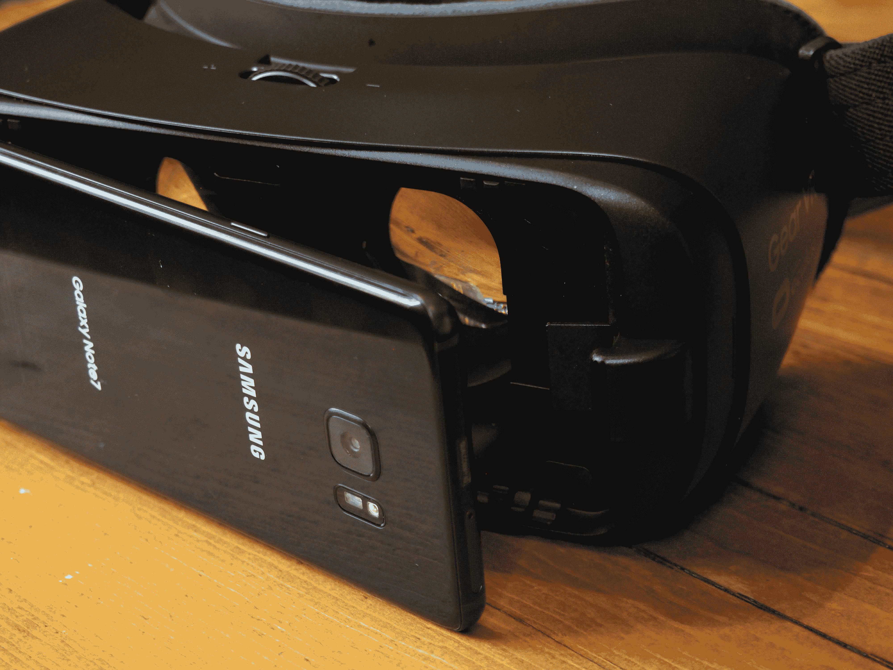

# 三星的低价 VR 耳机变得更好 

> 原文：<https://web.archive.org/web/https://techcrunch.com/2016/08/16/gear-vr-hands-on/>

如今，每个人都有一个虚拟现实耳机。至少苹果以外的人是这样。对于大多数公司来说，这主要是一个对冲赌注的问题——通过略微加强对谷歌 Cardboard 的使用来尝试一下。然而，对于三星来说，虚拟现实显然是该公司未来游戏计划中不可或缺的一部分。

这很难相信，但该公司在两年前的下个月推出了原始的 Gear VR。当时，硬件的重点是让开发者参与进来，在 2015 年底该设备首次面向消费者发布之前，有两个早期硬件版本已经发布给了感兴趣的各方。

这款耳机舒适地位于纸板和 Oculus Rift 和 HTC Vive 等高端产品之间的广阔空间，这些产品不仅价格高出数倍，而且需要游戏机或高端电脑。当然，三星在耳机硬件上确实有 Oculus 的输入，这大大有助于将其提升到其他入门级耳机之上。但 Gear VR 的价格不到 100 美元，只需要一部三星手机就能工作。

本月早些时候，当三星在 Note 7 的 Unpacked 活动中宣布这款第二代耳机时，它同时成为了焦点，有点像是主活动的后续活动。虽然该公司为其闪亮的新平板电脑保留了大部分的盛况和/或环境，但它将发布会的大部分时间用于其虚拟现实体验，通过向与会者分发的 Gear 耳机进行过滤，突出了外围设备的 ar 和 VR 产品，同时还推广了新的 Gear 360 相机。

很容易理解为什么三星没有对这款新耳机大肆宣扬。虽然该公司看起来只是增加了对这种格式的承诺，但新的 Gear VR 更多的是一种更新，而不是全面升级。事实上，该公司甚至没有将这个版本称为 Gear VR 2。不，它只是 Gear VR 又一次悄悄地取代了它的前身。

这里的升级大多是微调。对其前身的修复旨在保持其作为最佳 100 美元 VR 耳机的地位。最直接明显的变化是纯粹的美学，将第一代冲锋队的黑色和白色换成了深蓝色/黑色的设计。我实际上有点喜欢旧的配色方案，但新的深色方案确实给硬件带来了严肃的气氛(即使它突然与 Gear 360 不匹配)。

[gallery ids="1369624，1369625，1369627"]

三星也增加了填充量。事实上，这是相当舒适的，由于两者的升级设计和事实上，整个事情是相当轻，即使有一个手机插槽在前面。我可以看到自己戴了一段时间，老实说，这让我有点担心。